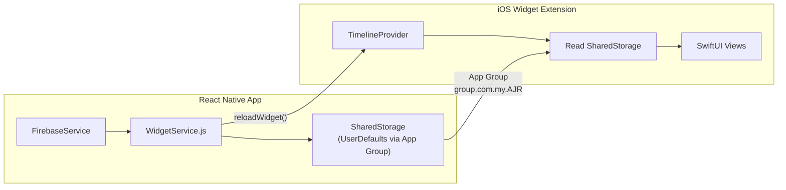

# AJR App - Home Screen Widgets

Build 3 native home screen widgets (Daily AJR Rings, Next Salah, Circle Progress) for the AJR app with iOS as the primary target, using `@bacons/apple-targets` for the Expo config plugin workflow, and native SwiftUI for the widget UI.

## User Review Required

> [!IMPORTANT]
> **iOS-first approach.** Widgets are native extensions that cannot use React Native/JavaScript — they must be written in native code (SwiftUI for iOS, Kotlin/Glance for Android). This plan covers **iOS fully**, with Android outlined as a Phase 2 follow-up. Building both simultaneously would roughly double the implementation effort.

> [!WARNING]
> **App Group required.** An App Group capability (e.g., `group.com.my.AJR`) must be added to your Apple Developer account and to both your main app target and the widget extension target. You will need to do this in the Apple Developer portal before building.

> [!IMPORTANT]
> **Development builds only.** Widgets cannot be tested in Expo Go. You must use `npx expo run:ios` or EAS Build to test.

---

## Architecture Overview



**Data flow:**
1. React Native app computes widget data (ring percentages, next salah, circle progress)
2. `WidgetService.js` serializes this data into JSON and writes it to `UserDefaults` via App Group
3. Widget extension reads the shared `UserDefaults` and renders SwiftUI views
4. Widget updates are triggered by the app + system timeline refreshes

---

## Proposed Changes

### Component 1: React Native Data Bridge

#### [NEW] [WidgetService.js](file:///Users/waleedahmad/Downloads/AJR_APP_V2_2/src/services/WidgetService.js)

Central service that:
- Collects widget data from existing services (FirebaseService, PrayerTimeService, StorageService)
- Structures it into a JSON payload:
  ```json
  {
    "salah": { "percentage": 60, "completed": 3, "total": 5 },
    "quran": { "percentage": 45 },
    "dhikr": { "percentage": 80 },
    "overallProgress": 62,
    "nextSalah": { "name": "Maghrib", "timeRemaining": "2h 15m", "timeString": "7:32 PM" },
    "circleProgress": { "percentage": 55 },
    "lastUpdated": "2026-04-18T17:24:00Z"
  }
  ```
- Writes to `UserDefaults` via `@bacons/apple-targets` `ExtensionStorage`
- Calls `reloadWidget()` to trigger widget refresh
- Exposes `updateWidgetData()` function to be called from key app moments

#### [MODIFY] [HomeScreen.js](file:///Users/waleedahmad/Downloads/AJR_APP_V2_2/src/screens/HomeScreen.js)

- Import and call `WidgetService.updateWidgetData()` when:
  - Screen gains focus (user opens app)
  - Activity completion changes (goal completed)
  - Overall progress changes

#### [MODIFY] [DailyGrowthScreen.js](file:///Users/waleedahmad/Downloads/AJR_APP_V2_2/src/screens/DailyGrowthScreen.js)

- Call `WidgetService.updateWidgetData()` when goals are completed

---

### Component 2: iOS Widget Extension (via @bacons/apple-targets)

#### [NEW] targets/widget/ — Widget Extension Target

This will contain the full native SwiftUI widget implementation:

##### Widget Entry & Timeline Provider
- `AJRWidget.swift` — Main widget bundle registering all 3 widgets
- `AJRWidgetEntry.swift` — TimelineEntry model matching the JSON data structure
- `SharedDataReader.swift` — Reads UserDefaults from App Group, parses JSON

##### Widget Views (SwiftUI)
- **`DailyRingsView.swift`** — 3 concentric Apple-style activity rings for Salah (green/sage), Quran (gold), Dhikr (warm brown). Uses SwiftUI `Circle` with `trim()` and `stroke(style: .init(lineCap: .round))`. Shows "% Complete" in center.
- **`NextSalahView.swift`** — Clean card showing next prayer name (e.g., "Maghrib") and countdown ("2h 15m"). Minimal typography, no clutter.
- **`CircleProgressView.swift`** — Single ring showing group overall completion %. No member breakdown.

##### Widget Families & Sizes
| Size | Content |
|------|---------|
| **Small** (`.systemSmall`) | Daily AJR Rings OR Next Salah (user chooses via Intent) |
| **Medium** (`.systemMedium`) | Daily AJR Rings OR (Circle Progress + Next Salah side-by-side) |
| **Large** (`.systemLarge`) | Daily AJR Rings + Next Salah + Circle Progress |

##### Deep Links (Tap Actions)
| Widget | URL Scheme | Navigates To |
|--------|-----------|-------------|
| Daily AJR Rings | `ajr://dashboard` | Home (Dashboard) |
| Next Salah | `ajr://salah` | Prayer Times page |
| Circle Progress | `ajr://mycircle` | My Circle tab |

##### Design Tokens (matching app theme)
```swift
// Colors matching src/theme/colors.js
static let salahRing = Color(hex: "#8FAF9A")   // rings.layer1
static let quranRing = Color(hex: "#E3C27A")   // rings.layer2
static let dhikrRing = Color(hex: "#D1AD73")   // rings.layer3
static let sage = Color(hex: "#7A9E7F")
static let background = Color(hex: "#F5F3E8")  // cards.cream
```

---

### Component 3: Configuration & Linking

#### [MODIFY] [app.json](file:///Users/waleedahmad/Downloads/AJR_APP_V2_2/app.json)

Add:
- `@bacons/apple-targets` plugin configuration
- App Group entitlement: `group.com.my.AJR`

#### [MODIFY] [AJR.entitlements](file:///Users/waleedahmad/Downloads/AJR_APP_V2_2/ios/AJR/AJR.entitlements)

Add App Group capability (will be done by the config plugin during prebuild).

#### [MODIFY] [AppNavigator.js](file:///Users/waleedahmad/Downloads/AJR_APP_V2_2/src/navigation/AppNavigator.js)

Handle deep link URLs (`ajr://dashboard`, `ajr://salah`, `ajr://mycircle`) to navigate to correct screens when widget is tapped.

---

### Component 4: Offline & Refresh Strategy

**Refresh triggers:**
1. App opened → `WidgetService.updateWidgetData()` called on HomeScreen focus
2. Goal completed → called after `FirebaseService.updateActivityCompletion()`
3. Salah time changes → called when prayer data refreshes
4. System refresh → Widget's `TimelineProvider` requests timeline with `after: .now + 900` (15-min intervals)

**Offline behavior:**
- Widget reads last-written data from UserDefaults — always shows last synced state
- `lastUpdated` timestamp stored so widget can optionally show "Last updated X ago"

---

## Open Questions

> [!IMPORTANT]
> **1. App Group ID.** I'll use `group.com.my.AJR`. Does this work with your Apple Developer account? You'll need to create this App Group in your Apple Developer portal under Certificates, Identifiers & Profiles → Identifiers → App Groups.

> [!IMPORTANT]  
> **2. URL Scheme.** I'd like to register `ajr://` as a custom URL scheme for deep linking from widgets. Is `ajr` acceptable, or do you have a preferred scheme?

> [!IMPORTANT]
> **3. Android timeline.** Building Android widgets (Kotlin/Glance + SharedPreferences) is a separate effort. Would you like me to tackle that as a Phase 2 after iOS is complete and tested?

> [!IMPORTANT]
> **4. Small widget default.** For the small widget, should the default view be Daily AJR Rings or Next Salah? (Users can change via widget configuration, but I need to know the default.)

---

## Verification Plan

### Automated Tests
- Run `npx expo prebuild -p ios --clean` to verify the config plugin generates the widget target correctly
- Verify the Xcode project compiles with both main app and widget extension targets
- Test deep link handling from widget taps

### Manual Verification
1. Install on a physical device or simulator
2. Long-press home screen → Add widget → Find "AJR" widgets
3. Verify all 3 sizes render correctly:
   - Small: shows rings or next salah
   - Medium: shows full rings or progress + next salah
   - Large: shows all 3 sections
4. Complete a goal in-app → verify widget updates
5. Tap each widget → verify correct screen opens
6. Kill app / go offline → verify widget still shows last data
