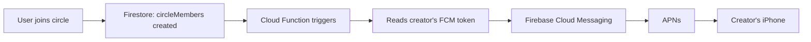

# Firebase Push Notifications Setup Guide

Complete setup guide for circle join request push notifications in the AJR app.

## Architecture



---

## Step 1: APNs Authentication Key (Apple Developer Portal)

Firebase needs an **APNs Authentication Key** to send push notifications to iOS devices.

> [!IMPORTANT]
> You only need ONE APNs key per Apple Developer account. If you already uploaded one for another project, you can reuse it.

### Create the Key

1. Go to [Apple Developer → Keys](https://developer.apple.com/account/resources/authkeys/list)
2. Click the **+** button to create a new key
3. Enter a name: `AJR Push Notifications`
4. Check ✅ **Apple Push Notifications service (APNs)**
5. Click **Continue** → **Register**
6. **Download the `.p8` file** — save it securely (you can only download it once!)
7. Note down:
   - **Key ID** (shown on the key details page, 10 characters)
   - **Team ID**: `886WD44FQB` (from your app.json)

---

## Step 2: Upload APNs Key to Firebase Console

1. Go to [Firebase Console](https://console.firebase.google.com)
2. Select your **AJR** project
3. Click the ⚙️ **gear icon** → **Project settings**
4. Go to the **Cloud Messaging** tab
5. Scroll to **Apple app configuration**
6. Under **APNs Authentication Key**, click **Upload**
7. Upload the `.p8` file you downloaded
8. Enter:
   - **Key ID**: (from Step 1)
   - **Team ID**: `886WD44FQB`
9. Click **Upload**

> [!TIP]
> If you see "APNs Certificates" section, ignore it — the Authentication Key method is newer and preferred.

---

## Step 3: Enable Cloud Messaging API

1. In Firebase Console → **Project settings** → **Cloud Messaging** tab
2. Make sure **Firebase Cloud Messaging API (V1)** is **Enabled**
3. If it shows "Disabled", click the three dots → **Manage API in Google Cloud Console** → **Enable**

---

## Step 4: Deploy Cloud Functions

The Cloud Function code is already written at `functions/index.js`. Dependencies are installed. Now deploy:

```bash
# From your project root
cd /Users/waleedahmad/Downloads/AJR_APP_V2_2

# Login to Firebase CLI (if not already)
firebase login

# Deploy ONLY the Cloud Function (NOT rules yet — deploy rules with V2 App Store release)
firebase deploy --only functions
```

> [!WARNING]
> **Do NOT deploy Firestore rules yet** (`firebase deploy --only firestore:rules`). Deploy rules only when V2 goes live on App Store, as discussed.

### If `firebase` CLI is not installed:

```bash
npm install -g firebase-tools
firebase login
```

### Expected Output:

```
✔ Deploy complete!

Function URL (onCircleJoinRequest): https://us-central1-YOUR_PROJECT.cloudfunctions.net/onCircleJoinRequest
```

---

## Step 5: Verify FCM Token Storage

The app already saves the push token on boot via `NotificationService.registerForPushNotifications()` in `App.js`. To verify it's working:

### Check in Firestore

1. Open [Firebase Console](https://console.firebase.google.com) → **Firestore Database**
2. Navigate to `users` → click your test user document
3. Look for the `fcmToken` field — it should contain an Expo push token like:
   ```
   ExponentPushToken[xxxxxxxxxxxxxxxxxxxx]
   ```
4. Also check `tokenUpdatedAt` timestamp exists

> [!IMPORTANT]
> **Simulator limitation**: Push notifications don't work on the iOS Simulator. You must test on a **physical device** to verify the full flow. The FCM token will still be stored, but the notification won't be delivered to the simulator.

---

## Step 6: Update Cloud Function for Expo Tokens

Our current Cloud Function uses Firebase Admin's `messaging.send()` which sends via **FCM**. However, since we're using `expo-notifications` to get tokens, the tokens are **Expo Push Tokens** (format: `ExponentPushToken[...]`), not raw FCM tokens.

> [!CAUTION]
> Expo Push Tokens require the **Expo Push API** to deliver, not Firebase's native `messaging.send()`. We need to update the Cloud Function to use Expo's push service.

I'll update the Cloud Function now to handle this correctly:

---

## Step 7: Test the Full Flow

### On Physical Device:

1. **User A (Creator)**: Open app → Create a circle → Note the invite code
2. **User B (Joiner)**: Open app → My Circle → Join Circle → Enter code
3. **Expected Result**:
   - User B sees: "Your request to join has been sent."
   - User A receives push notification: "🔔 [User B name] wants to join [Circle Name]"
   - User A opens circle → sees Pending Requests section → Approve/Decline

### Check Cloud Function Logs:

```bash
firebase functions:log --only onCircleJoinRequest
```

This shows the execution log — you'll see if the function triggered and any errors.

---

## Troubleshooting

| Issue | Solution |
|-------|----------|
| No `fcmToken` in user doc | Open app on physical device → check console for `[NOTIFICATION] Expo push token:` |
| Cloud Function not triggering | Check `firebase functions:log` — verify function deployed correctly |
| Token format `ExponentPushToken[...]` | Need Expo Push API (see Step 6 update) |
| "messaging/registration-token-not-registered" | Token expired — re-open app to refresh |
| No notification on simulator | Expected — push only works on real devices |
| `firebase: command not found` | Install: `npm install -g firebase-tools` |

---

## Summary Checklist

- [ ] APNs Authentication Key created in Apple Developer Portal
- [ ] APNs Key uploaded to Firebase Console → Cloud Messaging
- [ ] Cloud Messaging API (V1) enabled in Firebase Console
- [ ] `firebase login` completed
- [ ] `firebase deploy --only functions` successful
- [ ] FCM token visible in Firestore user document
- [ ] Tested on physical device
- [ ] Firestore rules deployed (only when V2 goes live!)
