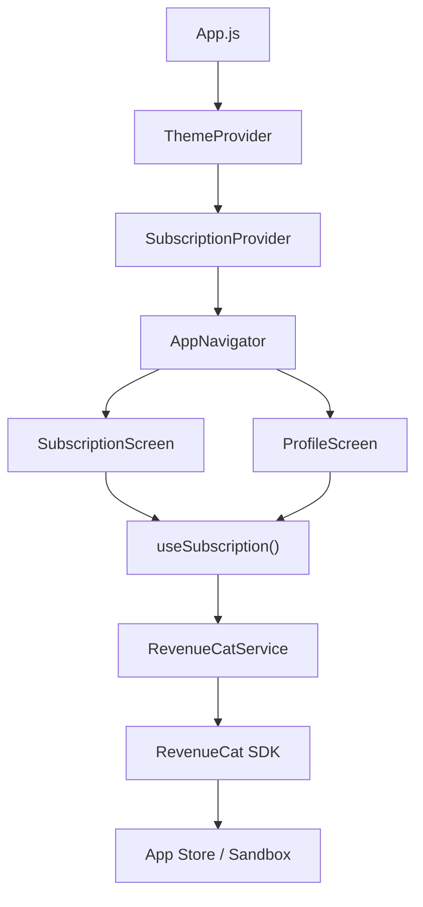

# RevenueCat Integration — Walkthrough

## Summary

Integrated RevenueCat (react-native-purchases v10.0.0) into the AJR app to support **AJR+** premium subscriptions with two plans:
- **Weekly:** $2.99/week
- **Yearly:** $31.99/year (save 80%)

---

## Files Created

### [RevenueCatService.js](file:///Users/waleedahmad/Downloads/AJR_APP_V2_2/src/services/RevenueCatService.js)
Singleton service layer handling:
- SDK initialization with platform-specific API keys
- Purchase flow (`purchasePackage`)
- Restore purchases
- Entitlement checking (`ajr_plus` entitlement)
- User identification (links to Firebase Auth UID)
- Logout cleanup

### [SubscriptionContext.js](file:///Users/waleedahmad/Downloads/AJR_APP_V2_2/src/context/SubscriptionContext.js)
React context provider exposing:
- `isProUser` — reactive boolean for gating features
- `offerings` — live offerings from RevenueCat
- `purchaseWeekly()` / `purchaseYearly()` — one-tap purchase functions
- `restorePurchases()` — restore with user feedback
- Auto-links RevenueCat user to Firebase Auth UID on login

---

## Files Modified

### [App.js](file:///Users/waleedahmad/Downloads/AJR_APP_V2_2/App.js)
- Wrapped app with `<SubscriptionProvider>` inside `<ThemeProvider>`

### [SubscriptionScreen.js](file:///Users/waleedahmad/Downloads/AJR_APP_V2_2/src/screens/SubscriptionScreen.js)
Complete redesign as AJR+ paywall:
- Golden AJR+ badge with gradient
- Feature list showing premium benefits
- Selectable plan cards with radio buttons (yearly default)
- "SAVE 80%" badge on yearly plan
- Subscribe button connected to RevenueCat
- Restore purchases link
- "Continue with free plan" skip option (onboarding only)
- Apple-required legal disclaimers
- Active subscription state (when accessed from Profile)

### [ProfileScreen.js](file:///Users/waleedahmad/Downloads/AJR_APP_V2_2/src/screens/ProfileScreen.js)
- Added AJR+ card above Settings section
- Shows subscription status (Active / Upgrade)
- Diamond icon with golden theme
- Navigates to SubscriptionScreen with `fromSettings: true`

### [context/index.js](file:///Users/waleedahmad/Downloads/AJR_APP_V2_2/src/context/index.js)
- Added `SubscriptionProvider` and `useSubscription` exports

### [services/index.js](file:///Users/waleedahmad/Downloads/AJR_APP_V2_2/src/services/index.js)
- Added `RevenueCatService` export

### [package.json](file:///Users/waleedahmad/Downloads/AJR_APP_V2_2/package.json)
- Added `react-native-purchases@10.0.0`

---

## Architecture



---

## Tested

- ✅ `yarn add react-native-purchases` — installed v10.0.0
- ✅ `pod install --repo-update` — resolved all native dependencies
- ✅ `npx expo run:ios --no-bundler` — Build Succeeded (0 errors)
- ✅ App installed and launched on iPhone 17 Pro simulator

---

## Next Steps (Your Action Required)

### 1. Replace API Key
Open [RevenueCatService.js](file:///Users/waleedahmad/Downloads/AJR_APP_V2_2/src/services/RevenueCatService.js) and replace:
```
const REVENUECAT_API_KEY_IOS = 'YOUR_REVENUECAT_IOS_API_KEY';
```
with your real key from RevenueCat Dashboard (starts with `appl_`).

### 2. App Store Connect Setup
Follow the detailed steps in the [implementation plan](file:///Users/waleedahmad/.gemini/antigravity/brain/2a07a4bc-a40f-4342-87ad-3429bacb5984/implementation_plan.md) — Part B:
1. Verify Paid Applications agreement is signed
2. Create subscription group: `AJR+ Premium`
3. Create weekly product: `com.my.AJR.ajrplus.weekly` ($2.99, 1 Week)
4. Create yearly product: `com.my.AJR.ajrplus.yearly` ($31.99, 1 Year)
5. Add localizations and review screenshots
6. Generate App-Specific Shared Secret

### 3. RevenueCat Dashboard Setup
Follow Part C in the implementation plan:
1. Create project "AJR" 
2. Add Apple App Store app with bundle ID `com.my.AJR`
3. Copy the public API key → paste into code
4. Add both products
5. Create entitlement `ajr_plus` → attach both products
6. Create offering `default` with weekly + yearly packages

### 4. Sandbox Testing
Follow Part D in the implementation plan:
1. Create a sandbox tester in App Store Connect
2. Sign in on device Settings → App Store → Sandbox Account
3. Run app → subscribe → verify in RevenueCat dashboard

### 5. Production (When Ready)
- Change log level to `LOG_LEVEL.INFO` in RevenueCatService.js
- Submit app v2 to App Store — subscriptions are reviewed alongside the binary
