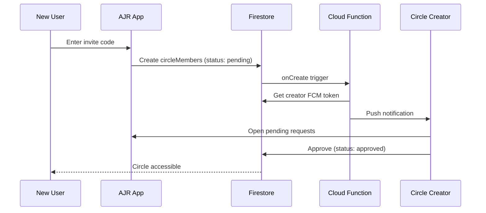

# Circle Module Upgrade — Walkthrough

## Overview

Upgraded the Circle module with production-ready features for membership management, private invitations with creator approval, and proper ring interaction scoping.

---

## Changes Made

### 1. Firebase Service — 7 New Methods + 3 Modified

**[FirebaseService.js](file:///Users/waleedahmad/Downloads/AJR_APP_V2_2/src/services/FirebaseService.js)**

```diff:FirebaseService.js
/**
 * FirebaseService.js
 * Centralized Firebase/Firestore operations for user data management
 * 
 * Database Structure:
 * users/{uid}
 *   ├── name: string
 *   ├── onboarding-process: boolean
 *   ├── createdAt: timestamp
 *   ├── updatedAt: timestamp
 *   │
 *   ├── onboarding-info/{uid} (single doc)
 *   │   ├── prayer: {
 *   │   │     ├── fajr: boolean
 *   │   │     ├── dhuhr: boolean
 *   │   │     ├── asr: boolean
 *   │   │     ├── maghrib: boolean
 *   │   │     ├── isha: boolean
 *   │   │     └── soundMode: string (athan|silent|vibrate)
 *   │   ├── quran: {
 *   │   │     └── minutesDay: number (1-500)
 *   │   ├── dikar: [
 *   │   │     {
 *   │   │       word: string,
 *   │   │       counter: number (1-1000)
 *   │   │     },
 *   │   │     ... (multiple dhikrs)
 *   │   │   ]
 *   │   └── journaling: {
 *   │         └── prompts: boolean
 *   │
 *   ├── journals/{uid} (single doc with 100-entry array)
 *   │   └── entries: [
 *   │         {
 *   │           title: string,
 *   │           description: string
 *   │         },
 *   │         ... (up to 100 entries)
 *   │       ]
 *   │
 *   ├── donations/{uuids} (multiple docs)
 *   │   ├── name: string
 *   │   ├── amount: number
 *   │   ├── date: date
 *   │   └── note: string (optional)
 *   │
 *   └── organizations/{uuids} (multiple docs)
 *       ├── name: string
 *       └── link: string
 */

import firestore from '@react-native-firebase/firestore';
import auth from '@react-native-firebase/auth';
import { ensureFirebaseApp } from './FirebaseInit';

function ensureFirebaseInitialized() {
    ensureFirebaseApp();
}

class FirebaseService {
    static getLocalDateKey(date = new Date()) {
        return `${date.getFullYear()}-${String(date.getMonth() + 1).padStart(2, '0')}-${String(date.getDate()).padStart(2, '0')}`;
    }

    static getYesterdayDateKey() {
        const yesterday = new Date();
        yesterday.setDate(yesterday.getDate() - 1);
        return this.getLocalDateKey(yesterday);
    }

    /**
     * Initialize user profile after signup
     * Creates user root document and onboarding-info subcollection document
     */
    static async initializeUserProfile(name) {
        try {
            const user = auth().currentUser;
            if (!user) throw new Error('No authenticated user');

            // Initialize root user document
            const userData = {
                name: name.trim(),
                email: user.email,
                'onboarding-process': true,
                createdAt: firestore.FieldValue.serverTimestamp(),
            };

            await firestore().collection('users').doc(user.uid).set(userData, { merge: true });

            // Initialize onboarding-info subcollection with single document (using uid as doc id)
            const onboardingData = {
                prayer: {
                    fajr: { enabled: false, athanEnabled: true, reminderEnabled: true },
                    dhuhr: { enabled: false, athanEnabled: true, reminderEnabled: true },
                    asr: { enabled: false, athanEnabled: true, reminderEnabled: true },
                    maghrib: { enabled: false, athanEnabled: true, reminderEnabled: true },
                    isha: { enabled: false, athanEnabled: true, reminderEnabled: true },
                    soundMode: 'athan',
                },
                quran: {
                    minutesDay: null,
                },
                dikar: [],
                journaling: {
                    prompts: true,
                },
            };

            await firestore()
                .collection('users')
                .doc(user.uid)
                .collection('onboarding-info')
                .doc(user.uid)
                .set(onboardingData, { merge: true });

            return { userData, onboardingData };
        } catch (error) {
            console.error('FirebaseService: Error initializing user profile:', error);
            throw error;
        }
    }

    /**
     * Update prayer settings in onboarding-info
     */
    static async savePrayerSettings(prayerSettings) {
        try {
            const user = auth().currentUser;
            if (!user) throw new Error('No authenticated user');

            // prayerSettings shape:
            // { fajr, dhuhr, asr, maghrib, isha } — each: { enabled, athanEnabled, reminderEnabled, soundMode }
            // + soundMode (global string for backward compatibility)
            const prayerData = {
                fajr: {
                    enabled: prayerSettings.fajr?.enabled ?? false,
                    athanEnabled: prayerSettings.fajr?.athanEnabled ?? true,
                    reminderEnabled: prayerSettings.fajr?.reminderEnabled ?? true,
                    soundMode: prayerSettings.fajr?.soundMode || 'athan',
                },
                dhuhr: {
                    enabled: prayerSettings.dhuhr?.enabled ?? false,
                    athanEnabled: prayerSettings.dhuhr?.athanEnabled ?? true,
                    reminderEnabled: prayerSettings.dhuhr?.reminderEnabled ?? true,
                    soundMode: prayerSettings.dhuhr?.soundMode || 'athan',
                },
                asr: {
                    enabled: prayerSettings.asr?.enabled ?? false,
                    athanEnabled: prayerSettings.asr?.athanEnabled ?? true,
                    reminderEnabled: prayerSettings.asr?.reminderEnabled ?? true,
                    soundMode: prayerSettings.asr?.soundMode || 'athan',
                },
                maghrib: {
                    enabled: prayerSettings.maghrib?.enabled ?? false,
                    athanEnabled: prayerSettings.maghrib?.athanEnabled ?? true,
                    reminderEnabled: prayerSettings.maghrib?.reminderEnabled ?? true,
                    soundMode: prayerSettings.maghrib?.soundMode || 'athan',
                },
                isha: {
                    enabled: prayerSettings.isha?.enabled ?? false,
                    athanEnabled: prayerSettings.isha?.athanEnabled ?? true,
                    reminderEnabled: prayerSettings.isha?.reminderEnabled ?? true,
                    soundMode: prayerSettings.isha?.soundMode || 'athan',
                },
                soundMode: prayerSettings.soundMode || 'athan',
            };

            await firestore()
                .collection('users')
                .doc(user.uid)
                .collection('onboarding-info')
                .doc(user.uid)
                .update({
                    'prayer': prayerData,
                });
        } catch (error) {
            console.error('FirebaseService: Error saving prayer settings:', error);
            throw error;
        }
    }

    /**
     * Save Quran goals (minutes per day only)
     */
    static async saveQuranGoals(minutesDay) {
        try {
            const user = auth().currentUser;
            if (!user) throw new Error('No authenticated user');

            const quranData = {
                minutesDay: minutesDay ? parseInt(minutesDay, 10) : null,
            };

            await firestore()
                .collection('users')
                .doc(user.uid)
                .collection('onboarding-info')
                .doc(user.uid)
                .update({
                    'quran': quranData,
                });
        } catch (error) {
            console.error('FirebaseService: Error saving Quran goals:', error);
            throw error;
        }
    }


    static async saveDhikrGoals(selectedDhikrs) {
        try {
            const user = auth().currentUser;
            if (!user) throw new Error('No authenticated user');

            // Convert selected dhikrs object to array format for storage
            const dikarArray = Object.entries(selectedDhikrs).map(([word, counter]) => ({
                word: word.trim(),
                counter: parseInt(counter, 10),
            }));

            await firestore()
                .collection('users')
                .doc(user.uid)
                .collection('onboarding-info')
                .doc(user.uid)
                .update({
                    'dikar': dikarArray,
                });
        } catch (error) {
            console.error('FirebaseService: Error saving Dhikr goals:', error);
            throw error;
        }
    }

    /**
     * Save Journaling goals (prompts boolean)
     */
    static async saveJournalingGoals(enablePrompts) {
        try {
            const user = auth().currentUser;
            if (!user) throw new Error('No authenticated user');

            const journalingData = {
                prompts: enablePrompts || false,
            };

            await firestore()
                .collection('users')
                .doc(user.uid)
                .collection('onboarding-info')
                .doc(user.uid)
                .update({
                    'journaling': journalingData,
                });
        } catch (error) {
            console.error('FirebaseService: Error saving Journaling goals:', error);
            throw error;
        }
    }

    /**
     * Update selected activities (from SelectActivitiesScreen)
     */
    static async updateSelectedActivities(activities) {
        try {
            const user = auth().currentUser;
            if (!user) throw new Error('No authenticated user');

            const selectedActivitiesMap = {
                prayers: activities.prayers === 'yes',
                quran: activities.quran === 'yes',
                dhikr: activities.dhikr === 'yes',
                journaling: activities.journaling === 'yes',
            };

            await firestore()
                .collection('users')
                .doc(user.uid)
                .collection('onboarding-info')
                .doc(user.uid)
                .update({
                    'selectedActivities': selectedActivitiesMap,
                });
        } catch (error) {
            console.error('FirebaseService: Error updating selected activities:', error);
            throw error;
        }
    }

    /**
     * Mark onboarding as complete
     */
    static async completeOnboarding() {
        try {
            const user = auth().currentUser;
            if (!user) throw new Error('No authenticated user');

            await firestore()
                .collection('users')
                .doc(user.uid)
                .update({
                    'onboarding-process': false,
                });
        } catch (error) {
            console.error('FirebaseService: Error completing onboarding:', error);
            throw error;
        }
    }

    /**
     * Get user root document data
     */
    static async getUserRootData() {
        try {
            ensureFirebaseInitialized();
            const user = auth().currentUser;
            if (!user) throw new Error('No authenticated user');

            const doc = await firestore().collection('users').doc(user.uid).get();
            if (!doc.exists) {
                throw new Error('User document not found');
            }

            return doc.data();
        } catch (error) {
            console.error('FirebaseService: Error getting user root data:', error);
            throw error;
        }
    }

    /**
     * Get onboarding-info subcollection document
     * Fast direct access using user UID as document ID
     */
    static async getOnboardingInfo() {
        try {
            ensureFirebaseInitialized();
            const user = auth().currentUser;
            if (!user) throw new Error('No authenticated user');

            const doc = await firestore()
                .collection('users')
                .doc(user.uid)
                .collection('onboarding-info')
                .doc(user.uid)
                .get();

            if (!doc.exists) {
                throw new Error('Onboarding info not found');
            }

            return doc.data();
        } catch (error) {
            console.error('FirebaseService: Error getting onboarding info:', error);
            throw error;
        }
    }

    /**
     * Get combined user data (root + onboarding)
     */
    static async getCombinedUserData() {
        try {
            const rootData = await this.getUserRootData();
            const onboardingData = await this.getOnboardingInfo();

            return {
                ...rootData,
                onboarding: onboardingData,
            };
        } catch (error) {
            console.error('FirebaseService: Error getting combined user data:', error);
            throw error;
        }
    }

    /**
     * Initialize or create journals document with empty array
     */
    static async initializeJournals() {
        try {
            const user = auth().currentUser;
            if (!user) throw new Error('No authenticated user');

            const journalsData = {
                entries: [],
            };

            await firestore()
                .collection('users')
                .doc(user.uid)
                .collection('journals')
                .doc(user.uid)
                .set(journalsData, { merge: true });
        } catch (error) {
            console.error('FirebaseService: Error initializing journals:', error);
            throw error;
        }
    }

    /**
     * Add a journal entry to the 100-entry array
     * If array reaches 100, remove oldest and add new
     */
    static async addJournalEntry(title, description) {
        try {
            const user = auth().currentUser;
            if (!user) throw new Error('No authenticated user');

            const journalsRef = firestore()
                .collection('users')
                .doc(user.uid)
                .collection('journals')
                .doc(user.uid);

            // Get current entries
            const doc = await journalsRef.get();
            let entries = doc.exists ? doc.data().entries || [] : [];

            // Keep only last 99 entries if we're at 100
            if (entries.length >= 100) {
                entries = entries.slice(1);
            }

            // Add new entry
            entries.push({
                title: title.trim(),
                description: description.trim(),
            });

            // Update document
            await journalsRef.set({ entries }, { merge: true });
        } catch (error) {
            console.error('FirebaseService: Error adding journal entry:', error);
            throw error;
        }
    }

    /**
     * Get journals (100-entry array)
     */
    static async getJournals() {
        try {
            const user = auth().currentUser;
            if (!user) throw new Error('No authenticated user');

            const doc = await firestore()
                .collection('users')
                .doc(user.uid)
                .collection('journals')
                .doc(user.uid)
                .get();

            if (!doc.exists) {
                return { entries: [] };
            }

            return doc.data();
        } catch (error) {
            console.error('FirebaseService: Error getting journals:', error);
            throw error;
        }
    }

    /**
     * Get today's journal based on sequence
     * daysSinceCreated % 100 = current journal index
     */
    static async getTodayJournal(createdAtDate) {
        try {
            const journalsData = await this.getJournals();
            const entries = journalsData.entries || [];

            if (entries.length === 0) {
                return null;
            }

            // Calculate days since creation
            const createdDate = new Date(createdAtDate);
            const today = new Date();
            const diffTime = today - createdDate;
            const diffDays = Math.floor(diffTime / (1000 * 60 * 60 * 24));

            // Get index (loops back after 100)
            const index = diffDays % entries.length;

            return {
                entry: entries[index],
                index,
                dayInSequence: diffDays + 1,
            };
        } catch (error) {
            console.error('FirebaseService: Error getting today journal:', error);
            return null;
        }
    }

    /**
     * Add donation entry
     */
    static async addDonation(name, amount, date, note = null) {
        try {
            const user = auth().currentUser;
            if (!user) throw new Error('No authenticated user');

            const donationData = {
                name: name.trim(),
                amount: parseFloat(amount),
                date: firestore.Timestamp.fromDate(new Date(date)),
                note: note && note.trim() ? note.trim() : null,
            };

            await firestore()
                .collection('users')
                .doc(user.uid)
                .collection('donations')
                .add(donationData);
        } catch (error) {
            console.error('FirebaseService: Error adding donation:', error);
            throw error;
        }
    }

    /**
     * Get all donations
     */
    static async getDonations() {
        try {
            const user = auth().currentUser;
            if (!user) throw new Error('No authenticated user');

            const snapshot = await firestore()
                .collection('users')
                .doc(user.uid)
                .collection('donations')
                .orderBy('date', 'desc')
                .get();

            return snapshot.docs.map((doc) => ({
                id: doc.id,
                ...doc.data(),
            }));
        } catch (error) {
            console.error('FirebaseService: Error getting donations:', error);
            return [];
        }
    }

    /**
     * Add organization
     */
    static async addOrganization(name, link) {
        try {
            const user = auth().currentUser;
            if (!user) throw new Error('No authenticated user');

            const orgData = {
                name: name.trim(),
                link: link.trim(),
            };

            await firestore()
                .collection('users')
                .doc(user.uid)
                .collection('organizations')
                .add(orgData);
        } catch (error) {
            console.error('FirebaseService: Error adding organization:', error);
            throw error;
        }
    }

    /**
     * Get all organizations
     */
    static async getOrganizations() {
        try {
            const user = auth().currentUser;
            if (!user) throw new Error('No authenticated user');

            const snapshot = await firestore()
                .collection('users')
                .doc(user.uid)
                .collection('organizations')
                .get();

            return snapshot.docs.map((doc) => ({
                id: doc.id,
                ...doc.data(),
            }));
        } catch (error) {
            console.error('FirebaseService: Error getting organizations:', error);
            return [];
        }
    }

    /**
     * Listen to user root data changes (real-time)
     */
    static listenToUserRootData(callback, errorCallback) {
        try {
            const user = auth().currentUser;
            if (!user) {
                errorCallback(new Error('No authenticated user'));
                return () => { };
            }

            const unsubscribe = firestore()
                .collection('users')
                .doc(user.uid)
                .onSnapshot(
                    (doc) => {
                        if (doc.exists) {
                            callback(doc.data());
                        }
                    },
                    (error) => {
                        console.error('FirebaseService: Error listening to user data:', error);
                        errorCallback(error);
                    }
                );

            return unsubscribe;
        } catch (error) {
            console.error('FirebaseService: Error setting up listener:', error);
            errorCallback(error);
            return () => { };
        }
    }

    /**
     * Listen to onboarding info changes (real-time)
     */
    /**
     * Listen to onboarding-info changes (real-time)
     * Automatically resets Quran daily reading stats if data is from a previous day
     * This ensures HomeScreen and DailyGrowthScreen always show fresh data after midnight
     */
    static listenToOnboardingInfo(callback, errorCallback) {
        try {
            const user = auth().currentUser;
            if (!user) {
                errorCallback(new Error('No authenticated user'));
                return () => { };
            }

            const unsubscribe = firestore()
                .collection('users')
                .doc(user.uid)
                .collection('onboarding-info')
                .doc(user.uid)
                .onSnapshot(
                    (doc) => {
                        if (doc.exists) {
                            const data = doc.data();
                            if (!data) { callback({}); return; }

                            // Check if Quran reading data is from today
                            if (data.quran && data.quran.lastReadingDate) {
                                const lastReadingDate = data.quran.lastReadingDate.toDate();
                                const today = new Date();

                                // Compare dates (YYYY-MM-DD format) - LOCAL TIME
                                const getLocalYMD = (d) => `${d.getFullYear()}-${String(d.getMonth() + 1).padStart(2, '0')}-${String(d.getDate()).padStart(2, '0')}`;
                                const lastReadingDateStr = getLocalYMD(lastReadingDate);
                                const todayStr = getLocalYMD(today);

                                // If last reading was on a previous day, reset the daily stats
                                if (lastReadingDateStr !== todayStr) {
                                    console.log('Quran data is from previous day. Resetting daily stats in listener.');
                                    data.quran = {
                                        ...data.quran,
                                        actualSecondsDay: 0,
                                        actualMinutesDay: 0,
                                        actualMinutesInt: 0
                                    };
                                }
                            }

                            callback(data);
                        }
                    },
                    (error) => {
                        console.error('FirebaseService: Error listening to onboarding info:', error);
                        errorCallback(error);
                    }
                );

            return unsubscribe;
        } catch (error) {
            console.error('FirebaseService: Error setting up onboarding listener:', error);
            errorCallback(error);
            return () => { };
        }
    }

    /**
     * Listen to journals changes (real-time)
     */
    static listenToJournals(callback, errorCallback) {
        try {
            const user = auth().currentUser;
            if (!user) {
                errorCallback(new Error('No authenticated user'));
                return () => { };
            }

            const unsubscribe = firestore()
                .collection('users')
                .doc(user.uid)
                .collection('journals')
                .doc(user.uid)
                .onSnapshot(
                    (doc) => {
                        if (doc.exists) {
                            callback(doc.data());
                        }
                    },
                    (error) => {
                        console.error('FirebaseService: Error listening to journals:', error);
                        errorCallback(error);
                    }
                );

            return unsubscribe;
        } catch (error) {
            console.error('FirebaseService: Error setting up journals listener:', error);
            errorCallback(error);
            return () => { };
        }
    }

    /**
     * Update activity completion status (auto-save per ring)
     * Stores completion status in root user document
     * Also stores the ring's percentage in dailyProgress
     */
    static async updateActivityCompletion(activity, completed, percentage) {
        try {
            const user = auth().currentUser;
            if (!user) throw new Error('No authenticated user');

            // Map activity key to dailyProgress field name
            const percentageFieldMap = {
                prayers: 'dailyProgress.prayersPercentage',
                quran: 'dailyProgress.quranPercentage',
                dhikr: 'dailyProgress.dhikrPercentage',
                journaling: 'dailyProgress.journalPercentage',
            };

            const updateData = {
                [`activityProgress.${activity}`]: completed,
            };

            // Also write the ring's percentage if provided
            const percentageField = percentageFieldMap[activity];
            if (percentageField !== undefined && percentage !== undefined) {
                updateData[percentageField] = percentage;
                updateData['dailyProgress.lastUpdated'] = firestore.FieldValue.serverTimestamp();
            }

            await firestore()
                .collection('users')
                .doc(user.uid)
                .update(updateData);
        } catch (error) {
            console.error(`FirebaseService: Error updating ${activity} completion:`, error);
            throw error;
        }
    }

    /**
     * Get activity progress (completion status for each activity)
     */
    static async getActivityProgress() {
        try {
            const user = auth().currentUser;
            if (!user) throw new Error('No authenticated user');

            const doc = await firestore().collection('users').doc(user.uid).get();
            if (!doc.exists) {
                throw new Error('User document not found');
            }

            return doc.data().activityProgress || {};
        } catch (error) {
            console.error('FirebaseService: Error getting activity progress:', error);
            throw error;
        }
    }

    /**
     * Reset all activityProgress flags to false.
     * Called when the user saves updated preferences so that manual 100%
     * overrides don't persist after goals/activities have changed.
     */
    static async resetActivityProgress(todayStr) {
        try {
            const user = auth().currentUser;
            if (!user) throw new Error('No authenticated user');

            const resetData = {
                activityProgress: {
                    prayers: false,
                    quran: false,
                    dhikr: false,
                    journaling: false,
                },
                lastActivityResetDate: todayStr || this.getLocalDateKey(),
            };

            await firestore().collection('users').doc(user.uid).update(resetData);
            console.log('FirebaseService: activityProgress reset to false after preference change');
        } catch (error) {
            console.error('FirebaseService: Error resetting activityProgress:', error);
            throw error;
        }
    }

    /**
     * Listen to activity progress changes (real-time)
     * Auto-resets daily if lastActivityResetDate is not today
     */
    static listenToActivityProgress(callback, errorCallback) {
        try {
            const user = auth().currentUser;
            if (!user) {
                errorCallback(new Error('No authenticated user'));
                return () => { };
            }

            let lastCheckedDate = this.getLocalDateKey();
            const checkForReset = async () => {
                const todayStr = this.getLocalDateKey();
                if (todayStr !== lastCheckedDate) {
                    lastCheckedDate = todayStr;
                    console.log('ActivityProgress: local date changed, resetting all to false');
                    const resetData = {
                        activityProgress: {
                            prayers: false,
                            quran: false,
                            dhikr: false,
                            journaling: false,
                        },
                        lastActivityResetDate: todayStr,
                    };
                    try {
                        await firestore()
                            .collection('users')
                            .doc(user.uid)
                            .update(resetData);
                        callback({ prayers: false, quran: false, dhikr: false, journaling: false });
                    } catch (resetErr) {
                        console.error('ActivityProgress: reset error', resetErr);
                    }
                }
            };

            const unsubscribe = firestore()
                .collection('users')
                .doc(user.uid)
                .onSnapshot(
                    async (doc) => {
                        if (doc.exists) {
                            const userData = doc.data();
                            const progress = userData.activityProgress || {};
                            const lastReset = userData.lastActivityResetDate;
                            const todayStr = this.getLocalDateKey();

                            if (lastReset !== todayStr) {
                                console.log('ActivityProgress: new day detected in snapshot, resetting all to false');
                                const resetData = {
                                    activityProgress: {
                                        prayers: false,
                                        quran: false,
                                        dhikr: false,
                                        journaling: false,
                                    },
                                    lastActivityResetDate: todayStr,
                                };
                                try {
                                    await firestore()
                                        .collection('users')
                                        .doc(user.uid)
                                        .update(resetData);
                                } catch (resetErr) {
                                    console.error('ActivityProgress: reset error', resetErr);
                                }
                                callback({ prayers: false, quran: false, dhikr: false, journaling: false });
                            } else {
                                callback(progress);
                            }
                        }
                    },
                    (error) => {
                        console.error('FirebaseService: Error listening to activity progress:', error);
                        errorCallback(error);
                    }
                );

            const interval = setInterval(checkForReset, 60000);

            return () => {
                clearInterval(interval);
                unsubscribe();
            };
        } catch (error) {
            console.error('FirebaseService: Error setting up activity progress listener:', error);
            errorCallback(error);
            return () => { };
        }
    }

    /**
     * Save Dhikr goals to Firebase
     * @param {Object} dhikrGoals - Object with dhikr names as keys and counters as values
     * Example: { "SubhanAllah": 33, "Alhamdulillah": 100 }
     */
    static async saveDhikrGoals(dhikrGoals) {
        try {
            const user = auth().currentUser;
            if (!user) throw new Error('No authenticated user');

            // Transform object to array format for database
            // { "SubhanAllah": 33 } => [{ word: "SubhanAllah", counter: 33 }]
            const dhikrArray = Object.entries(dhikrGoals).map(([word, counter]) => ({
                word,
                counter
            }));

            await firestore()
                .collection('users')
                .doc(user.uid)
                .collection('onboarding-info')
                .doc(user.uid)
                .set({
                    dikar: dhikrArray
                }, { merge: true });

            console.log(`Saved Dhikr goals: ${dhikrArray.length} dhikrs`);
        } catch (error) {
            console.error('FirebaseService: Error saving Dhikr goals:', error);
            throw error;
        }
    }

    // Old saveDhikrProgress removed


    /**
     * Get all dhikr progress
     * @returns {Object} Object with dhikr names as keys and counts as values
     * Example: { "SubhanAllah": 5, "Alhamdulillah": 10 }
     */
    static async getDhikrProgress() {
        try {
            const user = auth().currentUser;
            if (!user) throw new Error('No authenticated user');

            const doc = await firestore()
                .collection('users')
                .doc(user.uid)
                .collection('onboarding-info')
                .doc(user.uid)
                .get();

            if (!doc.exists) {
                return {};
            }

            const data = doc.data();
            const lastDhikrDate = data?.lastDhikrDate ? data.lastDhikrDate.toDate() : null;

            // Check for daily reset
            if (lastDhikrDate) {
                const today = new Date();
                if (lastDhikrDate.toDateString() !== today.toDateString()) {
                    console.log('New day detected for Dhikr. Resetting progress.');

                    // Reset in DB asynchronously
                    firestore()
                        .collection('users')
                        .doc(user.uid)
                        .collection('onboarding-info')
                        .doc(user.uid)
                        .set({
                            dhikrProgress: {},
                            lastDhikrDate: firestore.FieldValue.serverTimestamp()
                        }, { merge: true })
                        .catch(err => console.error('Failed to reset dhikr progress:', err));

                    return {};
                }
            }

            return data?.dhikrProgress || {};
        } catch (error) {
            console.error('FirebaseService: Error getting dhikr progress:', error);
            throw error;
        }
    }

    /**
     * Save a dua to user's favorites collection
     * @param {Object} dua - Dua object with arabic, english, transliteration, etc.
     */
        static async saveFavoriteDua(dua) {
            try {
                const user = auth().currentUser;
                if (!user) throw new Error('No authenticated user');

                // Use custom ID if provided (to prevent duplicates), otherwise fallback
                const duaId = dua.id || (dua.hadithNumber ? `hadith_${dua.hadithNumber}` : `dua_${Date.now()}`);
                
                await firestore()
                    .collection('users')
                    .doc(user.uid)
                    .collection('saved-duas')
                    .doc(duaId)
                    .set({
                        ...dua,
                        id: duaId, // Store ID inside the doc as well
                        savedAt: firestore.FieldValue.serverTimestamp()
                    }, { merge: true });

                console.log('Saved favored item to collection with ID:', duaId);
                return duaId;
            } catch (error) {
                console.error('FirebaseService: Error saving favorite item:', error);
                throw error;
            }
        }

    /**
     * Remove a dua from user's favorites
     * @param {string} duaId - ID of the dua to remove
     */
    static async removeFavoriteDua(duaId) {
        try {
            const user = auth().currentUser;
            if (!user) throw new Error('No authenticated user');

            await firestore()
                .collection('users')
                .doc(user.uid)
                .collection('saved-duas')
                .doc(duaId)
                .delete();

            console.log('Removed dua from collection');
        } catch (error) {
            console.error('FirebaseService: Error removing favorite dua:', error);
            throw error;
        }
    }

    /**
     * Get all saved duas for the user
     * @returns {Array} Array of saved dua objects
     */
    static async getSavedDuas() {
        try {
            const user = auth().currentUser;
            if (!user) throw new Error('No authenticated user');

            const snapshot = await firestore()
                .collection('users')
                .doc(user.uid)
                .collection('saved-duas')
                .orderBy('savedAt', 'desc')
                .get();

            const duas = [];
            snapshot.forEach(doc => {
                duas.push({
                    id: doc.id,
                    ...doc.data()
                });
            });

            return duas;
        } catch (error) {
            console.error('FirebaseService: Error getting saved duas:', error);
            throw error;
        }
    }

    /**
     * Save daily reading time (in seconds) to 'daily-quran' collection
     * Structure: users/{uid}/daily-quran/{date}
     * @param {number} seconds - Reading time in seconds
     */
    static async saveDailyReadingTime(seconds) {
        try {
            const user = auth().currentUser;
            if (!user) throw new Error('No authenticated user');

            // 1. Get User's Goal from Settings (onboarding-info)
            let goalMinutes = 15; // Default
            try {
                const onboardingDoc = await firestore()
                    .collection('users')
                    .doc(user.uid)
                    .collection('onboarding-info')
                    .doc(user.uid)
                    .get();

                if (onboardingDoc.exists && onboardingDoc.data().quran) {
                    goalMinutes = onboardingDoc.data().quran.minutesDay || 15;
                }
            } catch (err) {
                console.log('Error fetching goal, using default:', err);
            }

            // 2. Prepare Data
            const minutesFloat = parseFloat((seconds / 60).toFixed(2));
            const minutesInt = Math.floor(seconds / 60);
            const goalSeconds = goalMinutes * 60;

            const todayDate = new Date();
            const today = `${todayDate.getFullYear()}-${String(todayDate.getMonth() + 1).padStart(2, '0')}-${String(todayDate.getDate()).padStart(2, '0')}`;

            const docRef = firestore()
                .collection('users')
                .doc(user.uid)
                .collection('daily-quran')
                .doc(today);

            // 3. Update Reading Stats (Without Streak first)
            await docRef.set({
                actualSecondsDay: seconds,
                actualMinutesDay: minutesFloat,
                actualMinutesInt: minutesInt,
                goalMinutes: goalMinutes,
                lastUpdated: firestore.FieldValue.serverTimestamp()
            }, { merge: true });

            console.log(`Saved Quran time: ${seconds}s / ${goalSeconds}s (Goal: ${goalMinutes}m)`);

            // 4. Streak Logic (If Goal Reached)
            if (seconds >= goalSeconds) {
                const docSnap = await docRef.get();
                const data = docSnap.data();

                // Check if streak already recorded TODAY
                if (data && data.streak !== undefined) {
                    console.log('Quran streak already recorded for today:', data.streak);
                    return;
                }

                // Check Yesterday's Streak
                const yesterdayDate = new Date();
                yesterdayDate.setDate(yesterdayDate.getDate() - 1);
                const yesterday = `${yesterdayDate.getFullYear()}-${String(yesterdayDate.getMonth() + 1).padStart(2, '0')}-${String(yesterdayDate.getDate()).padStart(2, '0')}`;

                const yesterdayDoc = await firestore()
                    .collection('users')
                    .doc(user.uid)
                    .collection('daily-quran')
                    .doc(yesterday)
                    .get();

                let prevStreak = 0;
                if (yesterdayDoc.exists) {
                    const yData = yesterdayDoc.data();
                    if (yData && yData.streak !== undefined) {
                        prevStreak = yData.streak;
                    }
                }

                const newStreak = prevStreak + 1;
                console.log(`Updating Quran Streak: ${prevStreak} -> ${newStreak}`);

                // Save Streak Update
                await docRef.set({
                    streak: newStreak,
                    streakUpdatedAt: firestore.FieldValue.serverTimestamp()
                }, { merge: true });

                // Clean up root user fields if they exist
                try {
                    await firestore().collection('users').doc(user.uid).update({
                        'onboarding-info.quran.currentStreak': firestore.FieldValue.delete(),
                        'onboarding-info.quran.lastStreakUpdate': firestore.FieldValue.delete()
                    });
                } catch (cleanupError) {
                    // Ignore
                }
            }
        } catch (error) {
            console.error('FirebaseService: Error saving daily reading time:', error);
            throw error;
        }
    }

    /**
     * Get daily reading time from 'daily-quran' collection
     * @returns {number} Reading time in SECONDS
     */
    static async getDailyReadingTime() {
        try {
            const user = auth().currentUser;
            if (!user) throw new Error('No authenticated user');

            const todayDate = new Date();
            const today = `${todayDate.getFullYear()}-${String(todayDate.getMonth() + 1).padStart(2, '0')}-${String(todayDate.getDate()).padStart(2, '0')}`;

            const doc = await firestore()
                .collection('users')
                .doc(user.uid)
                .collection('daily-quran')
                .doc(today)
                .get();

            if (!doc.exists) {
                return 0;
            }

            const data = doc.data();
            return data.actualSecondsDay || 0;
        } catch (error) {
            console.error('FirebaseService: Error getting daily reading time:', error);
            return 0;
        }
    }

    /**
     * Get Quran stats for UI (Current Progress + Streak)
     */
    static async getQuranStats() {
        try {
            const user = auth().currentUser;
            if (!user) return { seconds: 0, streak: 0 };

            const todayDate = new Date();
            const today = `${todayDate.getFullYear()}-${String(todayDate.getMonth() + 1).padStart(2, '0')}-${String(todayDate.getDate()).padStart(2, '0')}`;
            const yesterdayDate = new Date();
            yesterdayDate.setDate(yesterdayDate.getDate() - 1);
            const yesterday = `${yesterdayDate.getFullYear()}-${String(yesterdayDate.getMonth() + 1).padStart(2, '0')}-${String(yesterdayDate.getDate()).padStart(2, '0')}`;

            // Get Today
            const todayDoc = await firestore()
                .collection('users')
                .doc(user.uid)
                .collection('daily-quran')
                .doc(today)
                .get();

            let seconds = 0;
            let streak = 0;

            if (todayDoc.exists) {
                const data = todayDoc.data();
                seconds = data.actualSecondsDay || 0;
                if (data.streak !== undefined) {
                    streak = data.streak;
                }
            }

            // If no streak today, check if active from yesterday
            if (streak === 0) {
                const yesterdayDoc = await firestore()
                    .collection('users')
                    .doc(user.uid)
                    .collection('daily-quran')
                    .doc(yesterday)
                    .get();

                if (yesterdayDoc.exists) {
                    const yData = yesterdayDoc.data();
                    if (yData && yData.streak !== undefined) {
                        streak = yData.streak; // Show current active streak even if not incremented yet
                    }
                }
            }

            return { seconds, streak };
        } catch (error) {
            console.error('Error getting quran stats:', error);
            return { seconds: 0, streak: 0 };
        }
    }

    /**
     * Reset daily reading time
     * No-op now as we use date-based documents
     */
    static async resetDailyReadingTime() {
        // No longer needed with new structure, keeping for compatibility
        console.log('resetDailyReadingTime called (No-op for daily-quran structure)');
    }

    /**
     * Save a journal entry to Firestore
     * Stores entries in a single document with an array field
     * @param {Object} entry - Journal entry data
     * @param {string} entry.mode - 'Guided' or 'Free write'
     * @param {string} entry.themeTitle - Theme title (for guided mode)
     * @param {string} entry.themeDescription - Theme description (for guided mode)
     * @param {string} entry.content - User's written content
     */
    /**
     * Save a journal entry to Firestore
     * Stores entries in 'daily-journals/{date}' collection
     * @param {Object} entry - Journal entry data
     */
    static async saveJournalEntry(entry) {
        try {
            const user = auth().currentUser;
            if (!user) throw new Error('No authenticated user');

            const todayDate = new Date();
            const today = `${todayDate.getFullYear()}-${String(todayDate.getMonth() + 1).padStart(2, '0')}-${String(todayDate.getDate()).padStart(2, '0')}`;

            const journalEntry = {
                id: `journal_${Date.now()}`,
                mode: entry.mode,
                themeTitle: entry.themeTitle || null,
                themeDescription: entry.themeDescription || null,
                content: entry.content,
                isArchived: entry.isArchived || false,
                createdAt: new Date().toISOString(),
            };

            const docRef = firestore()
                .collection('users')
                .doc(user.uid)
                .collection('daily-journals')
                .doc(today);

            // Save entry to array in daily doc
            await docRef.set({
                entries: firestore.FieldValue.arrayUnion(journalEntry),
                lastUpdated: firestore.FieldValue.serverTimestamp()
            }, { merge: true });

            console.log('Saved journal entry to daily-journals');

            // --- Streak Logic ---
            const docSnap = await docRef.get();
            const data = docSnap.data();

            // Only update streak if not already updated for today
            if (data && data.streak === undefined) {
                // Check Yesterday's Streak
                const yesterdayDate = new Date();
                yesterdayDate.setDate(yesterdayDate.getDate() - 1);
                const yesterday = `${yesterdayDate.getFullYear()}-${String(yesterdayDate.getMonth() + 1).padStart(2, '0')}-${String(yesterdayDate.getDate()).padStart(2, '0')}`;

                const yesterdayDoc = await firestore()
                    .collection('users')
                    .doc(user.uid)
                    .collection('daily-journals')
                    .doc(yesterday)
                    .get();

                let prevStreak = 0;
                if (yesterdayDoc.exists) {
                    const yData = yesterdayDoc.data();
                    if (yData && yData.streak !== undefined) {
                        prevStreak = yData.streak;
                    }
                }

                const newStreak = prevStreak + 1;
                console.log(`Updating Journal Streak: ${prevStreak} -> ${newStreak}`);

                // Save Streak Update
                await docRef.set({
                    streak: newStreak,
                    streakUpdatedAt: firestore.FieldValue.serverTimestamp()
                }, { merge: true });
            }

            // Cleanup old journals collection (if it exists)
            try {
                // We cannot delete a collection directly in client SDK, but we can delete the main doc
                // assuming users/{uid}/journals/{uid} was the only doc
                await firestore()
                    .collection('users')
                    .doc(user.uid)
                    .collection('journals')
                    .doc(user.uid)
                    .delete();
            } catch (err) {
                // Ignore if already deleted or doesn't exist
            }

            return journalEntry.id;

        } catch (error) {
            console.error('FirebaseService: Error saving journal entry:', error);
            throw error;
        }
    }

    /**
     * Get all journal entries for the current user (Aggregated from daily collections)
     * @returns {Array} Array of journal entries
     */
    static async getJournalEntries() {
        try {
            const user = auth().currentUser;
            if (!user) throw new Error('No authenticated user');

            // For now, we will query all docs in daily-journals
            // In a production app with years of data, you might want to limit this query (e.g. last 30 days)
            const snapshot = await firestore()
                .collection('users')
                .doc(user.uid)
                .collection('daily-journals')
                .get();

            let allEntries = [];
            snapshot.forEach(doc => {
                const data = doc.data();
                if (data.entries && Array.isArray(data.entries)) {
                    allEntries = [...allEntries, ...data.entries];
                }
            });

            // Sort by createdAt descending (newest first)
            return allEntries.sort((a, b) => {
                return new Date(b.createdAt) - new Date(a.createdAt);
            });
        } catch (error) {
            console.error('FirebaseService: Error getting journal entries:', error);
            throw error;
        }
    }

    /**
     * Delete a journal entry
     * Needs to find which daily document contains the entry
     * @param {string} entryId - ID of the entry to delete
     * @param {string} entryDate - Optional: Date of the entry to optimize search
     */
    static async deleteJournalEntry(entryId, entryDate) {
        try {
            const user = auth().currentUser;
            if (!user) throw new Error('No authenticated user');

            let querySnapshot;
            if (entryDate) {
                const d = new Date(entryDate);
                const dateKey = `${d.getFullYear()}-${String(d.getMonth() + 1).padStart(2, '0')}-${String(d.getDate()).padStart(2, '0')}`;

                // Directly get that document
                const docRef = firestore().collection('users').doc(user.uid).collection('daily-journals').doc(dateKey);
                const doc = await docRef.get();
                if (doc.exists) {
                    const data = doc.data();
                    const newEntries = (data.entries || []).filter(e => e.id !== entryId);
                    await docRef.update({ entries: newEntries });
                    console.log('Deleted journal entry from specific date');
                    return;
                }
            }

            // Fallback: search all (expensive but safe if date missing)
            querySnapshot = await firestore()
                .collection('users')
                .doc(user.uid)
                .collection('daily-journals')
                .get();

            for (const doc of querySnapshot.docs) {
                const data = doc.data();
                if (data.entries && Array.isArray(data.entries)) {
                    const entryExists = data.entries.some(e => e.id === entryId);
                    if (entryExists) {
                        const newEntries = data.entries.filter(e => e.id !== entryId);
                        await doc.ref.update({ entries: newEntries });
                        console.log('Deleted journal entry found in doc:', doc.id);
                        break;
                    }
                }
            }

        } catch (error) {
            console.error('FirebaseService: Error deleting journal entry:', error);
            throw error;
        }
    }

    static async markJournalComplete() {
        // This function is now deprecated - completion is tracked automatically
        // when entries are saved in the journals collection
        console.log('markJournalComplete called (now automatic via entries)');
    }

    /**
     * Get journal completion stats (today's status and streak)
     * Checks the journals collection entries array
     * @returns {Object} { completedToday: boolean, streak: number }
     */

    static async getJournalStats() {
        try {
            const user = auth().currentUser;
            if (!user) throw new Error('No authenticated user');

            const todayDate = new Date();
            const today = `${todayDate.getFullYear()}-${String(todayDate.getMonth() + 1).padStart(2, '0')}-${String(todayDate.getDate()).padStart(2, '0')}`;
            const yesterdayDate = new Date();
            yesterdayDate.setDate(yesterdayDate.getDate() - 1);
            const yesterday = `${yesterdayDate.getFullYear()}-${String(yesterdayDate.getMonth() + 1).padStart(2, '0')}-${String(yesterdayDate.getDate()).padStart(2, '0')}`;

            // Check Today
            const todayDoc = await firestore()
                .collection('users')
                .doc(user.uid)
                .collection('daily-journals')
                .doc(today)
                .get();

            let completedToday = false;
            let streak = 0;

            if (todayDoc.exists) {
                const data = todayDoc.data();
                if (data) {
                    if (data.entries && data.entries.length > 0) {
                        completedToday = true;
                    }
                    if (data.streak !== undefined) {
                        streak = data.streak;
                    }
                }
            }

            // If no streak today, check if active from yesterday
            if (streak === 0) {
                const yesterdayDoc = await firestore()
                    .collection('users')
                    .doc(user.uid)
                    .collection('daily-journals')
                    .doc(yesterday)
                    .get();

                if (yesterdayDoc.exists) {
                    const yData = yesterdayDoc.data();
                    if (yData && yData.streak !== undefined) {
                        streak = yData.streak; // Active streak
                    }
                }
            }

            return { completedToday, streak };
        } catch (error) {
            console.error('FirebaseService: Error getting journal stats:', error);
            return { completedToday: false, streak: 0 };
        }
    }

    /**
     * Listen to Today's Daily Journal Stats
     */
    static listenToDailyJournal(onUpdate) {
        try {
            const user = auth().currentUser;
            if (!user) return () => { };

            let currentDateKey = this.getLocalDateKey();
            let unsubscribe = null;

            const getYesterdayKey = (dateKey) => {
                const [year, month, day] = dateKey.split('-').map(Number);
                const date = new Date(year, month - 1, day);
                date.setDate(date.getDate() - 1);
                return this.getLocalDateKey(date);
            };

            const subscribeToDate = (dateKey) => {
                if (unsubscribe) unsubscribe();

                const yesterdayKey = getYesterdayKey(dateKey);
                unsubscribe = firestore()
                    .collection('users')
                    .doc(user.uid)
                    .collection('daily-journals')
                    .doc(dateKey)
                    .onSnapshot(async (doc) => {
                        let completedToday = false;
                        let streak = 0;

                        if (doc.exists) {
                            const data = doc.data();
                            if (data) {
                                if (data.entries && data.entries.length > 0) {
                                    completedToday = true;
                                }
                                streak = data.streak || 0;
                            }
                        }

                        if (streak === 0) {
                            try {
                                const yesterdayDoc = await firestore()
                                    .collection('users')
                                    .doc(user.uid)
                                    .collection('daily-journals')
                                    .doc(yesterdayKey)
                                    .get();

                                if (yesterdayDoc.exists) {
                                    const yData = yesterdayDoc.data();
                                    if (yData && yData.streak !== undefined) {
                                        streak = yData.streak;
                                    }
                                }
                            } catch (e) {
                                console.error(e);
                            }
                        }

                        onUpdate({ completedToday, streak });
                    });
            };

            const resetCheckInterval = setInterval(() => {
                const newDateKey = this.getLocalDateKey();
                if (newDateKey !== currentDateKey) {
                    currentDateKey = newDateKey;
                    subscribeToDate(currentDateKey);
                }
            }, 60000);

            subscribeToDate(currentDateKey);

            return () => {
                clearInterval(resetCheckInterval);
                if (unsubscribe) unsubscribe();
            };
        } catch (error) {
            console.error('Error listening to daily journal:', error);
            return () => { };
        }
    }


    /**
     * Save a new organization
     * @param {Object} org - Organization data
     * @param {string} org.name - Organization name
     * @param {string} org.url - Organization website URL
     * @param {string} org.color - Organization display color
     */
    static async saveOrganization(org) {
        try {
            const user = auth().currentUser;
            if (!user) throw new Error('No authenticated user');

            const orgId = `org_${Date.now()}`;
            await firestore()
                .collection('users')
                .doc(user.uid)
                .collection('organizations')
                .doc(orgId)
                .set({
                    name: org.name,
                    url: org.url,
                    color: org.color || '#7A9181',
                    createdAt: firestore.FieldValue.serverTimestamp(),
                });

            console.log('Saved organization with color:', org.color, '| orgId:', orgId);
            return orgId;
        } catch (error) {
            console.error('FirebaseService: Error saving organization:', error);
            throw error;
        }
    }

    /**
     * Get all organizations for the current user
     * @returns {Array} Array of organizations
     */
    static async getOrganizations() {
        try {
            const user = auth().currentUser;
            if (!user) throw new Error('No authenticated user');

            const snapshot = await firestore()
                .collection('users')
                .doc(user.uid)
                .collection('organizations')
                .orderBy('createdAt', 'desc')
                .get();

            const organizations = [];
            snapshot.forEach(doc => {
                organizations.push({
                    id: doc.id,
                    ...doc.data()
                });
            });

            return organizations;
        } catch (error) {
            console.error('FirebaseService: Error getting organizations:', error);
            return [];
        }
    }

    /**
     * Delete an organization
     * @param {string} orgId - Organization ID to delete
     */
    static async deleteOrganization(orgId) {
        try {
            const user = auth().currentUser;
            if (!user) throw new Error('No authenticated user');

            await firestore()
                .collection('users')
                .doc(user.uid)
                .collection('organizations')
                .doc(orgId)
                .delete();

            console.log('Deleted organization');
        } catch (error) {
            console.error('FirebaseService: Error deleting organization:', error);
            throw error;
        }
    }

    /**
     * Save a new donation
     * @param {Object} donation - Donation data
     * @param {string} donation.organizationName - Name of organization
     * @param {number} donation.amount - Donation amount
     * @param {string} donation.date - Donation date (ISO string)
     * @param {string} donation.category - Donation category
     */
    static async saveDonation(donation) {
        try {
            const user = auth().currentUser;
            if (!user) throw new Error('No authenticated user');

            const donationId = `donation_${Date.now()}`;
            await firestore()
                .collection('users')
                .doc(user.uid)
                .collection('donations')
                .doc(donationId)
                .set({
                    organizationName: donation.organizationName,
                    amount: donation.amount,
                    date: donation.date,
                    category: donation.category || '',
                    createdAt: firestore.FieldValue.serverTimestamp(),
                });

            console.log('Saved donation');
            return donationId;
        } catch (error) {
            console.error('FirebaseService: Error saving donation:', error);
            throw error;
        }
    }

    /**
     * Get all donations for the current user
     * @returns {Array} Array of donations
     */
    static async getDonations() {
        try {
            const user = auth().currentUser;
            if (!user) throw new Error('No authenticated user');

            const snapshot = await firestore()
                .collection('users')
                .doc(user.uid)
                .collection('donations')
                .orderBy('createdAt', 'desc')
                .get();

            const donations = [];
            snapshot.forEach(doc => {
                donations.push({
                    id: doc.id,
                    ...doc.data()
                });
            });

            return donations;
        } catch (error) {
            console.error('FirebaseService: Error getting donations:', error);
            return [];
        }
    }

    /**
     * Delete a donation
     * @param {string} donationId - Donation ID to delete
     */
    static async deleteDonation(donationId) {
        try {
            const user = auth().currentUser;
            if (!user) throw new Error('No authenticated user');

            await firestore()
                .collection('users')
                .doc(user.uid)
                .collection('donations')
                .doc(donationId)
                .delete();

            console.log('Deleted donation');
        } catch (error) {
            console.error('FirebaseService: Error deleting donation:', error);
            throw error;
        }
    }

    /**
     * Get donation statistics (this month and this year)
     * @returns {Object} { thisMonth: number, thisYear: number }
     */
    static async getDonationStats() {
        try {
            const user = auth().currentUser;
            if (!user) throw new Error('No authenticated user');

            const donations = await this.getDonations();

            const now = new Date();
            const currentMonth = now.getMonth();
            const currentYear = now.getFullYear();

            let thisMonth = 0;
            let thisYear = 0;

            donations.forEach(donation => {
                const donationDate = new Date(donation.date);
                const amount = parseFloat(donation.amount) || 0;

                if (donationDate.getFullYear() === currentYear) {
                    thisYear += amount;
                    if (donationDate.getMonth() === currentMonth) {
                        thisMonth += amount;
                    }
                }
            });

            return { thisMonth, thisYear };
        } catch (error) {
            console.error('FirebaseService: Error getting donation stats:', error);
            return { thisMonth: 0, thisYear: 0 };
        }
    }

    /**
     * Save prayer completion status for today
     * @param {Object} prayerCompletion - { Fajr: boolean, Dhuhr: boolean, Asr: boolean, Maghrib: boolean, Isha: boolean }
     */
    static async savePrayerCompletion(prayerCompletion) {
        try {
            const user = auth().currentUser;
            if (!user) throw new Error('No authenticated user');

            // Get today's date in YYYY-MM-DD format
            const today = new Date();
            const dateKey = `${today.getFullYear()}-${String(today.getMonth() + 1).padStart(2, '0')}-${String(today.getDate()).padStart(2, '0')}`;

            await firestore()
                .collection('users')
                .doc(user.uid)
                .collection('daily-prayers')
                .doc(dateKey)
                .set({
                    date: dateKey,
                    Fajr: prayerCompletion.Fajr || false,
                    Dhuhr: prayerCompletion.Dhuhr || false,
                    Asr: prayerCompletion.Asr || false,
                    Maghrib: prayerCompletion.Maghrib || false,
                    Isha: prayerCompletion.Isha || false,
                    updatedAt: firestore.FieldValue.serverTimestamp(),
                }, { merge: true });

            console.log('Prayer completion saved for', dateKey);
        } catch (error) {
            console.error('FirebaseService: Error saving prayer completion:', error);
            throw error;
        }
    }

    /**
     * Get prayer completion status for today
     * @returns {Object} { Fajr: boolean, Dhuhr: boolean, Asr: boolean, Maghrib: boolean, Isha: boolean }
     */
    static async getPrayerCompletion() {
        try {
            const user = auth().currentUser;
            if (!user) throw new Error('No authenticated user');

            // Get today's date in YYYY-MM-DD format
            const today = new Date();
            const dateKey = `${today.getFullYear()}-${String(today.getMonth() + 1).padStart(2, '0')}-${String(today.getDate()).padStart(2, '0')}`;

            const doc = await firestore()
                .collection('users')
                .doc(user.uid)
                .collection('daily-prayers')
                .doc(dateKey)
                .get();

            if (doc.exists) {
                const data = doc.data();
                if (data) {
                    return {
                        Fajr: data.Fajr || false,
                        Dhuhr: data.Dhuhr || false,
                        Asr: data.Asr || false,
                        Maghrib: data.Maghrib || false,
                        Isha: data.Isha || false,
                    };
                }
            }

            // Return all false if no data for today
            return {
                Fajr: false,
                Dhuhr: false,
                Asr: false,
                Maghrib: false,
                Isha: false,
            };
        } catch (error) {
            console.error('FirebaseService: Error getting prayer completion:', error);
            return {
                Fajr: false,
                Dhuhr: false,
                Asr: false,
                Maghrib: false,
                Isha: false,
            };
        }
    }

    /**
     * Listen to prayer completion changes in real-time
     * @param {Function} onUpdate - Callback when prayer completion changes
     * @param {Function} onError - Callback when error occurs
     * @returns {Function} Unsubscribe function
     */
    static listenToPrayerCompletion(onUpdate, onError) {
        try {
            const user = auth().currentUser;
            if (!user) throw new Error('No authenticated user');

            let currentDateKey = this.getLocalDateKey();
            let unsubscribe = null;

            const subscribeToDate = (dateKey) => {
                if (unsubscribe) unsubscribe();
                unsubscribe = firestore()
                    .collection('users')
                    .doc(user.uid)
                    .collection('daily-prayers')
                    .doc(dateKey)
                    .onSnapshot(
                        (doc) => {
                            if (doc.exists) {
                                const data = doc.data();
                                if (data) {
                                    onUpdate({
                                        Fajr: data.Fajr || false,
                                        Dhuhr: data.Dhuhr || false,
                                        Asr: data.Asr || false,
                                        Maghrib: data.Maghrib || false,
                                        Isha: data.Isha || false,
                                    });
                                } else {
                                    onUpdate({
                                        Fajr: false,
                                        Dhuhr: false,
                                        Asr: false,
                                        Maghrib: false,
                                        Isha: false,
                                    });
                                }
                            } else {
                                onUpdate({
                                    Fajr: false,
                                    Dhuhr: false,
                                    Asr: false,
                                    Maghrib: false,
                                    Isha: false,
                                });
                            }
                        },
                        (error) => {
                            console.error('Error listening to prayer completion:', error);
                            if (onError) onError(error);
                        }
                    );
            };

            const resetCheckInterval = setInterval(() => {
                const newDateKey = this.getLocalDateKey();
                if (newDateKey !== currentDateKey) {
                    currentDateKey = newDateKey;
                    subscribeToDate(currentDateKey);
                }
            }, 60000);

            subscribeToDate(currentDateKey);

            return () => {
                clearInterval(resetCheckInterval);
                if (unsubscribe) unsubscribe();
            };
        } catch (error) {
            console.error('FirebaseService: Error setting up prayer completion listener:', error);
            if (onError) onError(error);
            return () => { }; // Return empty unsubscribe function
        }
    }

    /**
     * Listen to Today's Daily Quran Stats
     */
    static listenToDailyQuran(onUpdate) {
        try {
            const user = auth().currentUser;
            if (!user) return () => { };

            let currentDateKey = this.getLocalDateKey();
            let unsubscribe = null;

            const getYesterdayKey = (dateKey) => {
                const [year, month, day] = dateKey.split('-').map(Number);
                const date = new Date(year, month - 1, day);
                date.setDate(date.getDate() - 1);
                return this.getLocalDateKey(date);
            };

            const subscribeToDate = (dateKey) => {
                if (unsubscribe) unsubscribe();

                const yesterdayKey = getYesterdayKey(dateKey);
                unsubscribe = firestore()
                    .collection('users')
                    .doc(user.uid)
                    .collection('daily-quran')
                    .doc(dateKey)
                    .onSnapshot(async (doc) => {
                        let seconds = 0;
                        let streak = 0;

                        if (doc.exists) {
                            const data = doc.data();
                            seconds = data.actualSecondsDay || 0;
                            streak = data.streak || 0;
                        }

                        if (streak === 0) {
                            try {
                                const yesterdayDoc = await firestore()
                                    .collection('users')
                                    .doc(user.uid)
                                    .collection('daily-quran')
                                    .doc(yesterdayKey)
                                    .get();

                                if (yesterdayDoc.exists) {
                                    const yData = yesterdayDoc.data();
                                    if (yData && yData.streak !== undefined) {
                                        streak = yData.streak;
                                    }
                                }
                            } catch (e) {
                                console.error('Error fetching yesterday streak in listener:', e);
                            }
                        }

                        onUpdate({ seconds, streak });
                    });
            };

            const resetCheckInterval = setInterval(() => {
                const newDateKey = this.getLocalDateKey();
                if (newDateKey !== currentDateKey) {
                    currentDateKey = newDateKey;
                    subscribeToDate(currentDateKey);
                }
            }, 60000);

            subscribeToDate(currentDateKey);

            return () => {
                clearInterval(resetCheckInterval);
                if (unsubscribe) unsubscribe();
            };
        } catch (error) {
            console.error('Error listening to daily quran:', error);
            return () => { };
        }
    }

    /**
     * Save dhikr progress for a specific dhikr
     * @param {string} dhikrName - Name of the dhikr
     * @param {number} count - Current count
     */
    static async saveDhikrProgress(dhikrName, count) {
        try {
            const user = auth().currentUser;
            if (!user) throw new Error('No authenticated user');

            // Get today's date in YYYY-MM-DD format
            const today = new Date();
            const dateKey = `${today.getFullYear()}-${String(today.getMonth() + 1).padStart(2, '0')}-${String(today.getDate()).padStart(2, '0')}`;

            await firestore()
                .collection('users')
                .doc(user.uid)
                .collection('daily-dhikr')
                .doc(dateKey)
                .set({
                    [dhikrName]: count,
                    lastUpdated: firestore.FieldValue.serverTimestamp(),
                }, { merge: true });

            console.log(`✅ Dhikr saved locally & queued for sync: ${dhikrName} = ${count}`);
        } catch (error) {
            // If offline, Firestore persistence will queue this write automatically
            console.warn(`⚠️ Dhikr progress save (will sync when online): ${dhikrName} = ${count}`, error?.message);
            // Don't throw - let Firestore handle offline persistence
        }
    }

    /**
     * Get dhikr progress for today
     * @returns {Object} Object with dhikr names as keys and counts as values
     */
    static async getDhikrProgress() {
        try {
            const user = auth().currentUser;
            if (!user) throw new Error('No authenticated user');

            // Get today's date in YYYY-MM-DD format
            const today = new Date();
            const dateKey = `${today.getFullYear()}-${String(today.getMonth() + 1).padStart(2, '0')}-${String(today.getDate()).padStart(2, '0')}`;

            const doc = await firestore()
                .collection('users')
                .doc(user.uid)
                .collection('daily-dhikr')
                .doc(dateKey)
                .get();

            if (doc.exists) {
                const data = doc.data();
                if (data) {
                    // Remove metadata fields from the returned object so only dhikr counts remain
                    const { lastUpdated, streak, streakUpdatedAt, ...dhikrCounts } = data;
                    return dhikrCounts;
                }
            }

            // Return empty object if no data for today
            return {};
        } catch (error) {
            console.error('FirebaseService: Error getting dhikr progress:', error);
            return {};
        }
    }

    static async updateDhikrStreak() {
        try {
            const user = auth().currentUser;
            if (!user) throw new Error('No authenticated user');

            const todayDate = new Date();
            const today = `${todayDate.getFullYear()}-${String(todayDate.getMonth() + 1).padStart(2, '0')}-${String(todayDate.getDate()).padStart(2, '0')}`;

            const yesterdayDate = new Date();
            yesterdayDate.setDate(yesterdayDate.getDate() - 1);
            const yesterday = `${yesterdayDate.getFullYear()}-${String(yesterdayDate.getMonth() + 1).padStart(2, '0')}-${String(yesterdayDate.getDate()).padStart(2, '0')}`;

            // Check if streak already recorded for today
            const todayDocRef = firestore()
                .collection('users')
                .doc(user.uid)
                .collection('daily-dhikr')
                .doc(today);

            const todayDoc = await todayDocRef.get();
            if (todayDoc.exists) {
                const docData = todayDoc.data();
                if (docData && docData.streak !== undefined) {
                    console.log('Dhikr streak already updated for today:', docData.streak);
                    return docData.streak;
                }
            }

            // Get yesterday's streak
            const yesterdayDocRef = firestore()
                .collection('users')
                .doc(user.uid)
                .collection('daily-dhikr')
                .doc(yesterday);

            const yesterdayDoc = await yesterdayDocRef.get();
            let prevStreak = 0;

            if (yesterdayDoc.exists) {
                const docData = yesterdayDoc.data();
                if (docData && docData.streak !== undefined) {
                    prevStreak = docData.streak;
                }
            }

            const currentStreak = prevStreak + 1;
            console.log(`Dhikr Streak: Yesterday=${prevStreak}, Today=${currentStreak}`);

            // Save updated streak to today's document
            await todayDocRef.set({
                streak: currentStreak,
                streakUpdatedAt: firestore.FieldValue.serverTimestamp()
            }, { merge: true });

            // Clean up root user fields if they exist
            try {
                await firestore().collection('users').doc(user.uid).update({
                    dhikrStreak: firestore.FieldValue.delete(),
                    dhikrLastCompletedDate: firestore.FieldValue.delete(),
                    dhikrLastStreakUpdate: firestore.FieldValue.delete()
                });
            } catch (cleanupError) {

            }

            return currentStreak;
        } catch (error) {
            console.error('Error updating dhikr streak:', error);
            throw error;
        }
    }

    static async getDhikrStreak() {
        try {
            const user = auth().currentUser;
            if (!user) return 0;

            const todayDate = new Date();
            const today = `${todayDate.getFullYear()}-${String(todayDate.getMonth() + 1).padStart(2, '0')}-${String(todayDate.getDate()).padStart(2, '0')}`;

            const yesterdayDate = new Date();
            yesterdayDate.setDate(yesterdayDate.getDate() - 1);
            const yesterday = `${yesterdayDate.getFullYear()}-${String(yesterdayDate.getMonth() + 1).padStart(2, '0')}-${String(yesterdayDate.getDate()).padStart(2, '0')}`;

            // Check today
            const todayDoc = await firestore()
                .collection('users')
                .doc(user.uid)
                .collection('daily-dhikr')
                .doc(today)
                .get();

            if (todayDoc.exists) {
                const data = todayDoc.data();
                if (data && data.streak !== undefined) {
                    return data.streak;
                }
            }

            // Check yesterday
            const yesterdayDoc = await firestore()
                .collection('users')
                .doc(user.uid)
                .collection('daily-dhikr')
                .doc(yesterday)
                .get();

            if (yesterdayDoc.exists) {
                const data = yesterdayDoc.data();
                if (data && data.streak !== undefined) {
                    return data.streak;
                }
            }

            return 0;
        } catch (error) {
            console.error('Error getting dhikr streak:', error);
            return 0;
        }
    }

    /**
     * Update overall daily progress (from DailyGrowthScreen)
     */
    static async updateOverallProgress(percentage, ringPercentages = {}) {
        try {
            const user = auth().currentUser;
            if (!user) throw new Error('No authenticated user');

            const today = new Date();
            today.setHours(0, 0, 0, 0);

            const updateData = {
                'dailyProgress.overallPercentage': percentage,
                'dailyProgress.prayersPercentage': ringPercentages.prayers ?? 0,
                'dailyProgress.quranPercentage': ringPercentages.quran ?? 0,
                'dailyProgress.dhikrPercentage': ringPercentages.dhikr ?? 0,
                'dailyProgress.journalPercentage': ringPercentages.journal ?? 0,
                'dailyProgress.lastUpdated': firestore.FieldValue.serverTimestamp(),
            };

            await firestore()
                .collection('users')
                .doc(user.uid)
                .update(updateData);
        } catch (error) {
            console.error('FirebaseService: Error updating overall progress:', error);
            throw error;
        }
    }

    /**
     * Listen to overall daily progress (real-time)
     */
    static listenToOverallProgress(callback, errorCallback = () => { }) {
        try {
            const user = auth().currentUser;
            if (!user) {
                errorCallback(new Error('No authenticated user'));
                return () => { };
            }

            const unsubscribe = firestore()
                .collection('users')
                .doc(user.uid)
                .onSnapshot(
                    (doc) => {
                        if (doc.exists) {
                            const progress = doc.data()?.dailyProgress?.overallPercentage || 0;
                            const ringPercentages = {
                                prayers: doc.data()?.dailyProgress?.prayersPercentage || 0,
                                quran: doc.data()?.dailyProgress?.quranPercentage || 0,
                                dhikr: doc.data()?.dailyProgress?.dhikrPercentage || 0,
                                journal: doc.data()?.dailyProgress?.journalPercentage || 0,
                            };
                            callback(progress, ringPercentages);
                        }
                    },
                    (error) => {
                        console.error('FirebaseService: Error listening to overall progress:', error);
                        errorCallback(error);
                    }
                );

            return unsubscribe;
        } catch (error) {
            console.error('FirebaseService: Error setting up overall progress listener:', error);
            errorCallback(error);
            return () => { };
        }
    }
    // ==================== CIRCLE MODULE ====================

    /**
     * Generate a unique invite code in XXX-XXXX format
     * @returns {string} Unique invite code
     */
    static _generateInviteCode() {
        const chars = 'ABCDEFGHJKLMNPQRSTUVWXYZ23456789'; // Exclude confusing chars O/0/I/1
        const part1 = Array.from({ length: 3 }, () => chars[Math.floor(Math.random() * chars.length)]).join('');
        const part2 = Array.from({ length: 4 }, () => chars[Math.floor(Math.random() * chars.length)]).join('');
        return `${part1}-${part2}`;
    }

    /**
     * Create a new circle
     * 1. Check user hasn't exceeded 3 circles
     * 2. Generate unique invite code
     * 3. Create circles document
     * 4. Create circleMembers document with role=admin
     * @param {string} name - Circle name
     * @param {string} type - 'named' or 'anonymous'
     * @returns {Object} { circleId, inviteCode }
     */
    static async createCircle(name, type) {
        try {
            const user = auth().currentUser;
            if (!user) throw new Error('No authenticated user');

            // 1. Check user's circle count (max 5)
            const membershipSnapshot = await firestore()
                .collection('circleMembers')
                .where('userId', '==', user.uid)
                .get();

            if (membershipSnapshot.size >= 5) {
                throw new Error('You can be part of up to 5 circles. Please leave a circle before creating a new one.');
            }

            // 2. Generate unique invite code
            let inviteCode;
            let isUnique = false;
            while (!isUnique) {
                inviteCode = this._generateInviteCode();
                const existing = await firestore()
                    .collection('circles')
                    .where('inviteCode', '==', inviteCode)
                    .get();
                if (existing.empty) isUnique = true;
            }

            // 3. Create circle document
            const circleRef = await firestore()
                .collection('circles')
                .add({
                    name,
                    type,
                    inviteCode,
                    createdBy: user.uid,
                    createdAt: firestore.FieldValue.serverTimestamp(),
                    memberCount: 1,
                });

            // 4. Create circleMembers document (creator = admin)
            await firestore()
                .collection('circleMembers')
                .add({
                    circleId: circleRef.id,
                    userId: user.uid,
                    joinedAt: firestore.FieldValue.serverTimestamp(),
                    role: 'admin',
                });

            console.log('Circle created:', circleRef.id, 'Invite code:', inviteCode);
            return { circleId: circleRef.id, inviteCode };
        } catch (error) {
            console.error('FirebaseService: Error creating circle:', error);
            throw error;
        }
    }

    /**
     * Join a circle using an invite code
     * 1. Find circle by inviteCode
     * 2. Check circle member count < 10
     * 3. Check user circle count < 3
     * 4. Check user not already a member
     * 5. Create circleMembers document
     * 6. Increment circles.memberCount
     * @param {string} inviteCode - Circle invite code
     * @returns {Object} { circleId, circleName }
     */
    static async joinCircle(inviteCode) {
        try {
            const user = auth().currentUser;
            if (!user) throw new Error('No authenticated user');

            const code = inviteCode.trim().toUpperCase();

            // 1. Find circle by invite code
            const circleSnapshot = await firestore()
                .collection('circles')
                .where('inviteCode', '==', code)
                .get();

            if (circleSnapshot.empty) {
                throw new Error('No circle found with this invite code. Please check and try again.');
            }

            const circleDoc = circleSnapshot.docs[0];
            const circleId = circleDoc.id;
            const circleData = circleDoc.data();

            // 2. Check circle member count < 10
            const circleMembersSnapshot = await firestore()
                .collection('circleMembers')
                .where('circleId', '==', circleId)
                .get();

            if (circleMembersSnapshot.size >= 10) {
                throw new Error('This circle is full (10 members max). Ask the admin to create a new one.');
            }

            // 3. Check user's total circle count < 5
            const userMembershipsSnapshot = await firestore()
                .collection('circleMembers')
                .where('userId', '==', user.uid)
                .get();

            if (userMembershipsSnapshot.size >= 5) {
                throw new Error('You can be part of up to 5 circles. Please leave a circle before joining a new one.');
            }

            // 4. Check user is not already a member
            const existingMembership = await firestore()
                .collection('circleMembers')
                .where('circleId', '==', circleId)
                .where('userId', '==', user.uid)
                .get();

            if (!existingMembership.empty) {
                throw new Error('You are already a member of this circle.');
            }

            // 5. Create circleMembers document
            await firestore()
                .collection('circleMembers')
                .add({
                    circleId,
                    userId: user.uid,
                    joinedAt: firestore.FieldValue.serverTimestamp(),
                    role: 'member',
                });

            // 6. Increment circle memberCount
            await firestore()
                .collection('circles')
                .doc(circleId)
                .update({
                    memberCount: firestore.FieldValue.increment(1),
                });

            console.log('Joined circle:', circleId);
            return { circleId, circleName: circleData.name };
        } catch (error) {
            console.error('FirebaseService: Error joining circle:', error);
            throw error;
        }
    }

    /**
     * Get all circles the current user belongs to
     * @returns {Array} Array of circle objects with membership info
     */
    static async getUserCircles() {
        try {
            const user = auth().currentUser;
            if (!user) throw new Error('No authenticated user');

            // Get all memberships for this user
            const membershipsSnapshot = await firestore()
                .collection('circleMembers')
                .where('userId', '==', user.uid)
                .get();

            if (membershipsSnapshot.empty) return [];

            // Fetch each circle document
            const circles = [];
            for (const memberDoc of membershipsSnapshot.docs) {
                const membership = memberDoc.data();
                const circleDoc = await firestore()
                    .collection('circles')
                    .doc(membership.circleId)
                    .get();

                if (circleDoc.exists) {
                    const circleData = circleDoc.data();
                    // Calculate streak (days since creation)
                    let streak = 0;
                    if (circleData.createdAt) {
                        const created = circleData.createdAt.toDate();
                        const now = new Date();
                        streak = Math.floor((now - created) / (1000 * 60 * 60 * 24));
                    }

                    circles.push({
                        id: circleDoc.id,
                        name: circleData.name,
                        type: circleData.type,
                        members: circleData.memberCount || 1,
                        streak,
                        inviteCode: circleData.inviteCode,
                        role: membership.role,
                        progress: 0, // Placeholder for future progress tracking
                    });
                }
            }

            return circles;
        } catch (error) {
            console.error('FirebaseService: Error getting user circles:', error);
            return [];
        }
    }

    /**
     * Get detailed circle info including members with user data
     * @param {string} circleId - Circle document ID
     * @returns {Object} { circle, members, streak }
     */
    static async getCircleDetails(circleId) {
        try {
            const user = auth().currentUser;
            if (!user) throw new Error('No authenticated user');

            // 1. Fetch the circle document
            const circleDoc = await firestore()
                .collection('circles')
                .doc(circleId)
                .get();

            if (!circleDoc.exists) {
                throw new Error('Circle not found');
            }

            const circleData = circleDoc.data();

            // 2. Calculate streak
            let streak = 0;
            if (circleData.createdAt) {
                const created = circleData.createdAt.toDate();
                const now = new Date();
                streak = Math.floor((now - created) / (1000 * 60 * 60 * 24));
            }

            // 3. Fetch all circle members
            const membersSnapshot = await firestore()
                .collection('circleMembers')
                .where('circleId', '==', circleId)
                .get();

            // 4. Fetch user data for each member (skip deleted users)
            const members = [];
            for (const memberDoc of membersSnapshot.docs) {
                const memberData = memberDoc.data();

                try {
                    const userDoc = await firestore()
                        .collection('users')
                        .doc(memberData.userId)
                        .get();

                    if (userDoc.exists) {
                        const userData = userDoc.data();
                        members.push({
                            id: memberDoc.id,
                            userId: memberData.userId,
                            name: userData?.name || 'Member',
                            role: memberData.role,
                            joinedAt: memberData.joinedAt,
                        });
                    }
                    // If user doc doesn't exist (deleted account), skip this member
                } catch (e) {
                    console.warn('Could not fetch user data for:', memberData.userId);
                }
            }

            return {
                circle: {
                    id: circleDoc.id,
                    name: circleData.name,
                    type: circleData.type,
                    inviteCode: circleData.inviteCode,
                    memberCount: circleData.memberCount || members.length,
                    createdBy: circleData.createdBy,
                    createdAt: circleData.createdAt,
                },
                members,
                streak,
            };
        } catch (error) {
            console.error('FirebaseService: Error getting circle details:', error);
            throw error;
        }
    }

    /**
     * Get today's date as YYYY-MM-DD string
     */
    static getTodayDateString() {
        const now = new Date();
        return `${now.getFullYear()}-${String(now.getMonth() + 1).padStart(2, '0')}-${String(now.getDate()).padStart(2, '0')}`;
    }

    /**
     * Update the current user's daily activity for a circle
     * Writes to circles/{circleId}/dailyActivity/{date}_{userId}
     * @param {string} circleId - Circle document ID
     * @param {string} activity - Activity key (prayers, quran, dhikr, journaling)
     * @param {boolean} completed - Whether the activity was completed
     */
    static async updateCircleDailyActivity(circleId, activity, completed) {
        try {
            const user = auth().currentUser;
            if (!user) throw new Error('No authenticated user');

            const today = FirebaseService.getTodayDateString();
            const docId = `${today}_${user.uid}`;

            // Get user's display name
            const userDoc = await firestore().collection('users').doc(user.uid).get();
            const userName = userDoc.exists ? (userDoc.data()?.name || 'Unknown') : 'Unknown';

            await firestore()
                .collection('circles')
                .doc(circleId)
                .collection('dailyActivity')
                .doc(docId)
                .set({
                    date: today,
                    userId: user.uid,
                    userName,
                    [activity]: completed,
                    updatedAt: firestore.FieldValue.serverTimestamp(),
                }, { merge: true });
        } catch (error) {
            console.error('FirebaseService: Error updating circle daily activity:', error);
            // Don't throw - this is a secondary write, shouldn't block the main activity toggle
        }
    }

    /**
     * Get activity stats for all members of a circle
     * Reads each member's activityProgress from their user document
     * @param {string} circleId - Circle document ID
     * @returns {Object} { prayers: { count, members }, quran: { count, members }, dhikr: { count, members }, journaling: { count, members } }
     */
    static async getCircleMemberActivityStats(circleId) {
        try {
            const user = auth().currentUser;
            if (!user) throw new Error('No authenticated user');

            // Fetch all circle members
            const membersSnapshot = await firestore()
                .collection('circleMembers')
                .where('circleId', '==', circleId)
                .get();

            const stats = {
                prayers: { count: 0, members: [] },
                quran: { count: 0, members: [] },
                dhikr: { count: 0, members: [] },
                journaling: { count: 0, members: [] },
            };

            // Fetch user data + activityProgress for each member
            for (const memberDoc of membersSnapshot.docs) {
                const memberData = memberDoc.data();
                try {
                    const userDoc = await firestore()
                        .collection('users')
                        .doc(memberData.userId)
                        .get();

                    if (userDoc.exists) {
                        const userData = userDoc.data();
                        const name = userData?.name || 'Unknown';
                        const progress = userData?.activityProgress || {};

                        if (progress.prayers) {
                            stats.prayers.count++;
                            stats.prayers.members.push({ name, userId: memberData.userId });
                        }
                        if (progress.quran) {
                            stats.quran.count++;
                            stats.quran.members.push({ name, userId: memberData.userId });
                        }
                        if (progress.dhikr) {
                            stats.dhikr.count++;
                            stats.dhikr.members.push({ name, userId: memberData.userId });
                        }
                        if (progress.journaling) {
                            stats.journaling.count++;
                            stats.journaling.members.push({ name, userId: memberData.userId });
                        }
                    }
                } catch (e) {
                    console.warn('Could not fetch activity progress for:', memberData.userId);
                }
            }

            return stats;
        } catch (error) {
            console.error('FirebaseService: Error getting circle member activity stats:', error);
            return {
                prayers: { count: 0, members: [] },
                quran: { count: 0, members: [] },
                dhikr: { count: 0, members: [] },
                journaling: { count: 0, members: [] },
            };
        }
    }

    /**
     * Get averaged ring percentages across all members of a circle
     * Reads each member's dailyProgress from their user document
     * @param {string} circleId - Circle document ID
     * @returns {Object} { prayers, quran, dhikr, journal, overall } — averaged percentages
     */
    static async getCircleMemberRingAverages(circleId) {
        try {
            const user = auth().currentUser;
            if (!user) throw new Error('No authenticated user');

            // Fetch all circle members
            const membersSnapshot = await firestore()
                .collection('circleMembers')
                .where('circleId', '==', circleId)
                .get();

            let totalPrayers = 0, totalQuran = 0, totalDhikr = 0, totalJournal = 0;
            let memberCount = 0;

            for (const memberDoc of membersSnapshot.docs) {
                const memberData = memberDoc.data();
                try {
                    const userDoc = await firestore()
                        .collection('users')
                        .doc(memberData.userId)
                        .get();

                    if (userDoc.exists) {
                        const dp = userDoc.data()?.dailyProgress || {};
                        totalPrayers += dp.prayersPercentage || 0;
                        totalQuran += dp.quranPercentage || 0;
                        totalDhikr += dp.dhikrPercentage || 0;
                        totalJournal += dp.journalPercentage || 0;
                        memberCount++;
                    }
                } catch (e) {
                    console.warn('Could not fetch ring percentages for:', memberData.userId);
                }
            }

            if (memberCount === 0) {
                return { prayers: 0, quran: 0, dhikr: 0, journal: 0, overall: 0 };
            }

            const prayers = Math.round(totalPrayers / memberCount);
            const quran = Math.round(totalQuran / memberCount);
            const dhikr = Math.round(totalDhikr / memberCount);
            const journal = Math.round(totalJournal / memberCount);
            const overall = Math.round((prayers + quran + dhikr + journal) / 4);

            return { prayers, quran, dhikr, journal, overall };
        } catch (error) {
            console.error('FirebaseService: Error getting circle member ring averages:', error);
            return { prayers: 0, quran: 0, dhikr: 0, journal: 0, overall: 0 };
        }
    }

    // ==================== CIRCLE CHALLENGE TRACKING ====================

    /**
     * Initialize or get a circle challenge document
     * Creates circleChallenges/{circleId}_{challengeIndex} if it doesn't exist
     * @param {string} circleId - Circle document ID
     * @param {number} challengeIndex - 0-based index into challenges.json
     * @param {number} totalMembers - Total members in the circle
     * @returns {Object} Challenge document data
     */
    static async initOrGetCircleChallenge(circleId, challengeIndex, totalMembers) {
        try {
            const user = auth().currentUser;
            if (!user) throw new Error('No authenticated user');

            const docId = `${circleId}_${challengeIndex}`;
            const docRef = firestore().collection('circleChallenges').doc(docId);
            const doc = await docRef.get({ source: 'server' });

            if (doc.exists) {
                const data = doc.data();
                if (data) {
                    // Recount actual participants to ensure joinedCount is accurate (force server to avoid stale cache)
                    const participantsSnap = await docRef.collection('participants').get({ source: 'server' });
                    const actualJoinedCount = participantsSnap.size;

                    // Update totalMembers and joinedCount if they changed
                    const updates = {};
                    if (data.totalMembers !== totalMembers) updates.totalMembers = totalMembers;
                    if (data.joinedCount !== actualJoinedCount) updates.joinedCount = actualJoinedCount;

                    if (Object.keys(updates).length > 0) {
                        await docRef.update(updates);
                    }

                    return { id: doc.id, ...data, totalMembers, joinedCount: actualJoinedCount };
                }
            }

            // Calculate start/end dates based on circle creation + challenge week offset
            const circleDoc = await firestore().collection('circles').doc(circleId).get();
            let startDate = new Date();
            if (circleDoc.exists && circleDoc.data().createdAt) {
                const created = circleDoc.data().createdAt.toDate();
                startDate = new Date(created.getTime() + challengeIndex * 7 * 24 * 60 * 60 * 1000);
            }
            const endDate = new Date(startDate.getTime() + 7 * 24 * 60 * 60 * 1000);

            const challengeData = {
                circleId,
                challengeIndex,
                joinedCount: 0,
                totalMembers,
                startDate: firestore.Timestamp.fromDate(startDate),
                endDate: firestore.Timestamp.fromDate(endDate),
                createdAt: firestore.FieldValue.serverTimestamp(),
            };

            await docRef.set(challengeData);
            console.log('✅ Circle challenge doc created:', docId);
            return { id: docId, ...challengeData };
        } catch (error) {
            console.error('FirebaseService: Error initializing circle challenge:', error);
            throw error;
        }
    }

    /**
     * Join a weekly challenge
     * Writes directly without checking cache (to avoid stale persistence issues)
     * Uses waitForPendingWrites() to ensure server sync
     * @param {string} circleId - Circle document ID
     * @param {number} challengeIndex - 0-based index into challenges.json
     */
    static async joinWeeklyChallenge(circleId, challengeIndex) {
        try {
            const user = auth().currentUser;
            if (!user) throw new Error('No authenticated user');

            const docId = `${circleId}_${challengeIndex}`;
            const challengeRef = firestore().collection('circleChallenges').doc(docId);
            const participantRef = challengeRef.collection('participants').doc(user.uid);

            // Ensure challenge doc exists (set with merge is safe for existing docs)
            await challengeRef.set({
                circleId,
                challengeIndex,
            }, { merge: true });

            // Write participant entry (set overwrites any stale cached data)
            await participantRef.set({
                joinedAt: firestore.FieldValue.serverTimestamp(),
            });

            // Wait for all pending writes to reach the server
            await firestore().waitForPendingWrites();

            // Count actual participants from server and update joinedCount
            const snap = await challengeRef
                .collection('participants')
                .get({ source: 'server' });
            const actualCount = snap.size;

            await challengeRef.set({
                joinedCount: actualCount,
            }, { merge: true });

            console.log('✅ Joined weekly challenge:', docId, '| Participants:', actualCount);
        } catch (error) {
            console.error('FirebaseService: Error joining weekly challenge:', error);
            throw error;
        }
    }

    /**
     * Get all participant user IDs for a circle challenge
     * @param {string} circleId - Circle document ID
     * @param {number} challengeIndex - 0-based index into challenges.json
     * @returns {Array<string>} Array of user IDs who joined
     */
    static async getChallengeParticipants(circleId, challengeIndex) {
        try {
            const user = auth().currentUser;
            if (!user) throw new Error('No authenticated user');

            const docId = `${circleId}_${challengeIndex}`;
            const participantsSnapshot = await firestore()
                .collection('circleChallenges')
                .doc(docId)
                .collection('participants')
                .get({ source: 'server' });

            return participantsSnapshot.docs.map(doc => doc.id);
        } catch (error) {
            console.error('FirebaseService: Error getting challenge participants:', error);
            return [];
        }
    }

    // ==================== ACCOUNT DELETION ====================

    /**
     * Helper: delete all documents in a subcollection of a user document
     * @param {string} userId - User ID
     * @param {string} subcollectionName - Name of the subcollection under users/{userId}
     */
    static async _deleteUserSubcollection(userId, subcollectionName) {
        try {
            const snapshot = await firestore()
                .collection('users')
                .doc(userId)
                .collection(subcollectionName)
                .get();

            const batch = firestore().batch();
            snapshot.docs.forEach(doc => batch.delete(doc.ref));
            if (snapshot.docs.length > 0) {
                await batch.commit();
                console.log(`🗑️ Deleted ${snapshot.docs.length} docs from users/${userId}/${subcollectionName}`);
            }
        } catch (error) {
            console.warn(`Could not delete subcollection ${subcollectionName}:`, error.message);
        }
    }

    /**
     * Remove a user from all circles they belong to, updating circle data properly:
     * - Remove circleMembers documents for the user
     * - Decrement memberCount on circle documents
     * - Remove user from circleChallenges participants and update counts
     * - Remove user's dailyActivity entries from circles
     * @param {string} userId - User ID being deleted
     * @returns {Array} Array of circleIds the user was removed from
     */
    static async _removeUserFromAllCircles(userId) {
        const removedFromCircleIds = [];

        try {
            // 1. Find all circleMembers documents for this user
            const membershipsSnapshot = await firestore()
                .collection('circleMembers')
                .where('userId', '==', userId)
                .get();

            if (membershipsSnapshot.empty) {
                console.log('👤 User is not in any circles');
                return removedFromCircleIds;
            }

            for (const memberDoc of membershipsSnapshot.docs) {
                const memberData = memberDoc.data();
                const circleId = memberData.circleId;

                try {
                    // 2. Delete the circleMembers document
                    await firestore().collection('circleMembers').doc(memberDoc.id).delete();
                    await firestore().waitForPendingWrites();
                    console.log(`🗑️ Deleted circleMembers doc ${memberDoc.id} for circle: ${circleId}`);

                    // 3. Update memberCount on the circle document using actual recount
                    const circleRef = firestore().collection('circles').doc(circleId);
                    const circleDoc = await circleRef.get();

                    if (circleDoc.exists) {
                        // Recount actual members from server
                        const actualMembersSnap = await firestore()
                            .collection('circleMembers')
                            .where('circleId', '==', circleId)
                            .get({ source: 'server' });
                        const actualCount = actualMembersSnap.size;
                        await circleRef.update({ memberCount: actualCount });
                        console.log(`📉 Circle ${circleId} memberCount updated to: ${actualCount}`);
                    }

                    // 4. Remove user from dailyActivity subcollection of this circle
                    try {
                        const dailyActivitySnapshot = await firestore()
                            .collection('circles')
                            .doc(circleId)
                            .collection('dailyActivity')
                            .get();

                        const activityBatch = firestore().batch();
                        let activityDeleteCount = 0;
                        dailyActivitySnapshot.docs.forEach(doc => {
                            // dailyActivity docs are named {date}_{userId}
                            if (doc.id.endsWith(`_${userId}`)) {
                                activityBatch.delete(doc.ref);
                                activityDeleteCount++;
                            }
                        });
                        if (activityDeleteCount > 0) {
                            await activityBatch.commit();
                            console.log(`🗑️ Deleted ${activityDeleteCount} dailyActivity entries for user in circle ${circleId}`);
                        }
                    } catch (e) {
                        console.warn('Could not clean dailyActivity for circle:', circleId, e.message);
                    }

                    // 5. Handle circleChallenges: find all challenge docs for this circle
                    try {
                        const challengesSnapshot = await firestore()
                            .collection('circleChallenges')
                            .where('circleId', '==', circleId)
                            .get();

                        for (const challengeDoc of challengesSnapshot.docs) {
                            const challengeData = challengeDoc.data();
                            const challengeRef = challengeDoc.ref;

                            // Check if this user is a participant in this challenge
                            const participantRef = challengeRef.collection('participants').doc(userId);
                            const participantDoc = await participantRef.get({ source: 'server' });

                            let userJoinedThisChallenge = false;

                            if (participantDoc.exists) {
                                // User joined this challenge - remove participant doc
                                await participantRef.delete();
                                await firestore().waitForPendingWrites();
                                userJoinedThisChallenge = true;
                                console.log(`🗑️ Deleted participant doc: ${challengeDoc.id}/participants/${userId}`);
                            }

                            // Now recount actual participants from server to get accurate count
                            const remainingParticipants = await challengeRef.collection('participants').get({ source: 'server' });
                            const actualRemainingCount = remainingParticipants.size;

                            // Get actual circleMembers count for this circle (after our deletion)
                            const remainingMembers = await firestore()
                                .collection('circleMembers')
                                .where('circleId', '==', circleId)
                                .get({ source: 'server' });
                            const actualMemberCount = remainingMembers.size;

                            // Set absolute counts instead of decrementing to avoid drift
                            await challengeRef.update({
                                totalMembers: actualMemberCount,
                                joinedCount: actualRemainingCount,
                            });
                            console.log(`📉 Updated circleChallenges ${challengeDoc.id}: totalMembers -> ${actualMemberCount}, joinedCount -> ${actualRemainingCount}`);
                        }
                    } catch (e) {
                        console.warn('Could not clean circleChallenges for circle:', circleId, e.message);
                    }

                    removedFromCircleIds.push(circleId);
                } catch (e) {
                    console.warn('Error removing user from circle:', circleId, e.message);
                }
            }

            console.log(`✅ User removed from ${removedFromCircleIds.length} circle(s)`);
            return removedFromCircleIds;
        } catch (error) {
            console.error('FirebaseService: Error removing user from circles:', error);
            return removedFromCircleIds;
        }
    }

    /**
     * Fully delete a user's account and all associated data:
     * 1. Remove user from all circles (with proper cleanup)
     * 2. Delete all user subcollections
     * 3. Delete the user root document
     * 4. Delete Firebase Auth account
     */
    static async deleteAccountAndCleanup() {
        try {
            const user = auth().currentUser;
            if (!user) throw new Error('No authenticated user');
            const userId = user.uid;

            console.log('🚨 Starting account deletion for user:', userId);

            // Step 1: Remove user from all circles (updates circle data, challenges, etc.)
            await FirebaseService._removeUserFromAllCircles(userId);

            // Step 2: Delete all user subcollections
            const subcollections = [
                'onboarding-info',
                'journals',
                'daily-journals',
                'daily-quran',
                'daily-prayers',
                'daily-dhikr',
                'donations',
                'organizations',
                'saved-duas',
            ];

            for (const sub of subcollections) {
                await FirebaseService._deleteUserSubcollection(userId, sub);
            }

            // Step 3: Delete the user root document from Firestore
            await firestore().collection('users').doc(userId).delete();
            console.log('🗑️ Deleted user root document');

            // Step 4: Delete Firebase Auth account
            await user.delete();
            console.log('✅ Firebase Auth account deleted');

            return { success: true };
        } catch (error) {
            console.error('FirebaseService: Error deleting account:', error);
            throw error;
        }
    }

}

export default FirebaseService;
===
/**
 * FirebaseService.js
 * Centralized Firebase/Firestore operations for user data management
 * 
 * Database Structure:
 * users/{uid}
 *   ├── name: string
 *   ├── onboarding-process: boolean
 *   ├── createdAt: timestamp
 *   ├── updatedAt: timestamp
 *   │
 *   ├── onboarding-info/{uid} (single doc)
 *   │   ├── prayer: {
 *   │   │     ├── fajr: boolean
 *   │   │     ├── dhuhr: boolean
 *   │   │     ├── asr: boolean
 *   │   │     ├── maghrib: boolean
 *   │   │     ├── isha: boolean
 *   │   │     └── soundMode: string (athan|silent|vibrate)
 *   │   ├── quran: {
 *   │   │     └── minutesDay: number (1-500)
 *   │   ├── dikar: [
 *   │   │     {
 *   │   │       word: string,
 *   │   │       counter: number (1-1000)
 *   │   │     },
 *   │   │     ... (multiple dhikrs)
 *   │   │   ]
 *   │   └── journaling: {
 *   │         └── prompts: boolean
 *   │
 *   ├── journals/{uid} (single doc with 100-entry array)
 *   │   └── entries: [
 *   │         {
 *   │           title: string,
 *   │           description: string
 *   │         },
 *   │         ... (up to 100 entries)
 *   │       ]
 *   │
 *   ├── donations/{uuids} (multiple docs)
 *   │   ├── name: string
 *   │   ├── amount: number
 *   │   ├── date: date
 *   │   └── note: string (optional)
 *   │
 *   └── organizations/{uuids} (multiple docs)
 *       ├── name: string
 *       └── link: string
 */

import firestore from '@react-native-firebase/firestore';
import auth from '@react-native-firebase/auth';
import { ensureFirebaseApp } from './FirebaseInit';

function ensureFirebaseInitialized() {
    ensureFirebaseApp();
}

class FirebaseService {
    static getLocalDateKey(date = new Date()) {
        return `${date.getFullYear()}-${String(date.getMonth() + 1).padStart(2, '0')}-${String(date.getDate()).padStart(2, '0')}`;
    }

    static getYesterdayDateKey() {
        const yesterday = new Date();
        yesterday.setDate(yesterday.getDate() - 1);
        return this.getLocalDateKey(yesterday);
    }

    /**
     * Initialize user profile after signup
     * Creates user root document and onboarding-info subcollection document
     */
    static async initializeUserProfile(name) {
        try {
            const user = auth().currentUser;
            if (!user) throw new Error('No authenticated user');

            // Initialize root user document
            const userData = {
                name: name.trim(),
                email: user.email,
                'onboarding-process': true,
                createdAt: firestore.FieldValue.serverTimestamp(),
            };

            await firestore().collection('users').doc(user.uid).set(userData, { merge: true });

            // Initialize onboarding-info subcollection with single document (using uid as doc id)
            const onboardingData = {
                prayer: {
                    fajr: { enabled: false, athanEnabled: true, reminderEnabled: true },
                    dhuhr: { enabled: false, athanEnabled: true, reminderEnabled: true },
                    asr: { enabled: false, athanEnabled: true, reminderEnabled: true },
                    maghrib: { enabled: false, athanEnabled: true, reminderEnabled: true },
                    isha: { enabled: false, athanEnabled: true, reminderEnabled: true },
                    soundMode: 'athan',
                },
                quran: {
                    minutesDay: null,
                },
                dikar: [],
                journaling: {
                    prompts: true,
                },
            };

            await firestore()
                .collection('users')
                .doc(user.uid)
                .collection('onboarding-info')
                .doc(user.uid)
                .set(onboardingData, { merge: true });

            return { userData, onboardingData };
        } catch (error) {
            console.error('FirebaseService: Error initializing user profile:', error);
            throw error;
        }
    }

    /**
     * Update prayer settings in onboarding-info
     */
    static async savePrayerSettings(prayerSettings) {
        try {
            const user = auth().currentUser;
            if (!user) throw new Error('No authenticated user');

            // prayerSettings shape:
            // { fajr, dhuhr, asr, maghrib, isha } — each: { enabled, athanEnabled, reminderEnabled, soundMode }
            // + soundMode (global string for backward compatibility)
            const prayerData = {
                fajr: {
                    enabled: prayerSettings.fajr?.enabled ?? false,
                    athanEnabled: prayerSettings.fajr?.athanEnabled ?? true,
                    reminderEnabled: prayerSettings.fajr?.reminderEnabled ?? true,
                    soundMode: prayerSettings.fajr?.soundMode || 'athan',
                },
                dhuhr: {
                    enabled: prayerSettings.dhuhr?.enabled ?? false,
                    athanEnabled: prayerSettings.dhuhr?.athanEnabled ?? true,
                    reminderEnabled: prayerSettings.dhuhr?.reminderEnabled ?? true,
                    soundMode: prayerSettings.dhuhr?.soundMode || 'athan',
                },
                asr: {
                    enabled: prayerSettings.asr?.enabled ?? false,
                    athanEnabled: prayerSettings.asr?.athanEnabled ?? true,
                    reminderEnabled: prayerSettings.asr?.reminderEnabled ?? true,
                    soundMode: prayerSettings.asr?.soundMode || 'athan',
                },
                maghrib: {
                    enabled: prayerSettings.maghrib?.enabled ?? false,
                    athanEnabled: prayerSettings.maghrib?.athanEnabled ?? true,
                    reminderEnabled: prayerSettings.maghrib?.reminderEnabled ?? true,
                    soundMode: prayerSettings.maghrib?.soundMode || 'athan',
                },
                isha: {
                    enabled: prayerSettings.isha?.enabled ?? false,
                    athanEnabled: prayerSettings.isha?.athanEnabled ?? true,
                    reminderEnabled: prayerSettings.isha?.reminderEnabled ?? true,
                    soundMode: prayerSettings.isha?.soundMode || 'athan',
                },
                soundMode: prayerSettings.soundMode || 'athan',
            };

            await firestore()
                .collection('users')
                .doc(user.uid)
                .collection('onboarding-info')
                .doc(user.uid)
                .update({
                    'prayer': prayerData,
                });
        } catch (error) {
            console.error('FirebaseService: Error saving prayer settings:', error);
            throw error;
        }
    }

    /**
     * Save Quran goals (minutes per day only)
     */
    static async saveQuranGoals(minutesDay) {
        try {
            const user = auth().currentUser;
            if (!user) throw new Error('No authenticated user');

            const quranData = {
                minutesDay: minutesDay ? parseInt(minutesDay, 10) : null,
            };

            await firestore()
                .collection('users')
                .doc(user.uid)
                .collection('onboarding-info')
                .doc(user.uid)
                .update({
                    'quran': quranData,
                });
        } catch (error) {
            console.error('FirebaseService: Error saving Quran goals:', error);
            throw error;
        }
    }


    static async saveDhikrGoals(selectedDhikrs) {
        try {
            const user = auth().currentUser;
            if (!user) throw new Error('No authenticated user');

            // Convert selected dhikrs object to array format for storage
            const dikarArray = Object.entries(selectedDhikrs).map(([word, counter]) => ({
                word: word.trim(),
                counter: parseInt(counter, 10),
            }));

            await firestore()
                .collection('users')
                .doc(user.uid)
                .collection('onboarding-info')
                .doc(user.uid)
                .update({
                    'dikar': dikarArray,
                });
        } catch (error) {
            console.error('FirebaseService: Error saving Dhikr goals:', error);
            throw error;
        }
    }

    /**
     * Save Journaling goals (prompts boolean)
     */
    static async saveJournalingGoals(enablePrompts) {
        try {
            const user = auth().currentUser;
            if (!user) throw new Error('No authenticated user');

            const journalingData = {
                prompts: enablePrompts || false,
            };

            await firestore()
                .collection('users')
                .doc(user.uid)
                .collection('onboarding-info')
                .doc(user.uid)
                .update({
                    'journaling': journalingData,
                });
        } catch (error) {
            console.error('FirebaseService: Error saving Journaling goals:', error);
            throw error;
        }
    }

    /**
     * Update selected activities (from SelectActivitiesScreen)
     */
    static async updateSelectedActivities(activities) {
        try {
            const user = auth().currentUser;
            if (!user) throw new Error('No authenticated user');

            const selectedActivitiesMap = {
                prayers: activities.prayers === 'yes',
                quran: activities.quran === 'yes',
                dhikr: activities.dhikr === 'yes',
                journaling: activities.journaling === 'yes',
            };

            await firestore()
                .collection('users')
                .doc(user.uid)
                .collection('onboarding-info')
                .doc(user.uid)
                .update({
                    'selectedActivities': selectedActivitiesMap,
                });
        } catch (error) {
            console.error('FirebaseService: Error updating selected activities:', error);
            throw error;
        }
    }

    /**
     * Mark onboarding as complete
     */
    static async completeOnboarding() {
        try {
            const user = auth().currentUser;
            if (!user) throw new Error('No authenticated user');

            await firestore()
                .collection('users')
                .doc(user.uid)
                .update({
                    'onboarding-process': false,
                });
        } catch (error) {
            console.error('FirebaseService: Error completing onboarding:', error);
            throw error;
        }
    }

    /**
     * Get user root document data
     */
    static async getUserRootData() {
        try {
            ensureFirebaseInitialized();
            const user = auth().currentUser;
            if (!user) throw new Error('No authenticated user');

            const doc = await firestore().collection('users').doc(user.uid).get();
            if (!doc.exists) {
                throw new Error('User document not found');
            }

            return doc.data();
        } catch (error) {
            console.error('FirebaseService: Error getting user root data:', error);
            throw error;
        }
    }

    /**
     * Get onboarding-info subcollection document
     * Fast direct access using user UID as document ID
     */
    static async getOnboardingInfo() {
        try {
            ensureFirebaseInitialized();
            const user = auth().currentUser;
            if (!user) throw new Error('No authenticated user');

            const doc = await firestore()
                .collection('users')
                .doc(user.uid)
                .collection('onboarding-info')
                .doc(user.uid)
                .get();

            if (!doc.exists) {
                throw new Error('Onboarding info not found');
            }

            return doc.data();
        } catch (error) {
            console.error('FirebaseService: Error getting onboarding info:', error);
            throw error;
        }
    }

    /**
     * Get combined user data (root + onboarding)
     */
    static async getCombinedUserData() {
        try {
            const rootData = await this.getUserRootData();
            const onboardingData = await this.getOnboardingInfo();

            return {
                ...rootData,
                onboarding: onboardingData,
            };
        } catch (error) {
            console.error('FirebaseService: Error getting combined user data:', error);
            throw error;
        }
    }

    /**
     * Initialize or create journals document with empty array
     */
    static async initializeJournals() {
        try {
            const user = auth().currentUser;
            if (!user) throw new Error('No authenticated user');

            const journalsData = {
                entries: [],
            };

            await firestore()
                .collection('users')
                .doc(user.uid)
                .collection('journals')
                .doc(user.uid)
                .set(journalsData, { merge: true });
        } catch (error) {
            console.error('FirebaseService: Error initializing journals:', error);
            throw error;
        }
    }

    /**
     * Add a journal entry to the 100-entry array
     * If array reaches 100, remove oldest and add new
     */
    static async addJournalEntry(title, description) {
        try {
            const user = auth().currentUser;
            if (!user) throw new Error('No authenticated user');

            const journalsRef = firestore()
                .collection('users')
                .doc(user.uid)
                .collection('journals')
                .doc(user.uid);

            // Get current entries
            const doc = await journalsRef.get();
            let entries = doc.exists ? doc.data().entries || [] : [];

            // Keep only last 99 entries if we're at 100
            if (entries.length >= 100) {
                entries = entries.slice(1);
            }

            // Add new entry
            entries.push({
                title: title.trim(),
                description: description.trim(),
            });

            // Update document
            await journalsRef.set({ entries }, { merge: true });
        } catch (error) {
            console.error('FirebaseService: Error adding journal entry:', error);
            throw error;
        }
    }

    /**
     * Get journals (100-entry array)
     */
    static async getJournals() {
        try {
            const user = auth().currentUser;
            if (!user) throw new Error('No authenticated user');

            const doc = await firestore()
                .collection('users')
                .doc(user.uid)
                .collection('journals')
                .doc(user.uid)
                .get();

            if (!doc.exists) {
                return { entries: [] };
            }

            return doc.data();
        } catch (error) {
            console.error('FirebaseService: Error getting journals:', error);
            throw error;
        }
    }

    /**
     * Get today's journal based on sequence
     * daysSinceCreated % 100 = current journal index
     */
    static async getTodayJournal(createdAtDate) {
        try {
            const journalsData = await this.getJournals();
            const entries = journalsData.entries || [];

            if (entries.length === 0) {
                return null;
            }

            // Calculate days since creation
            const createdDate = new Date(createdAtDate);
            const today = new Date();
            const diffTime = today - createdDate;
            const diffDays = Math.floor(diffTime / (1000 * 60 * 60 * 24));

            // Get index (loops back after 100)
            const index = diffDays % entries.length;

            return {
                entry: entries[index],
                index,
                dayInSequence: diffDays + 1,
            };
        } catch (error) {
            console.error('FirebaseService: Error getting today journal:', error);
            return null;
        }
    }

    /**
     * Add donation entry
     */
    static async addDonation(name, amount, date, note = null) {
        try {
            const user = auth().currentUser;
            if (!user) throw new Error('No authenticated user');

            const donationData = {
                name: name.trim(),
                amount: parseFloat(amount),
                date: firestore.Timestamp.fromDate(new Date(date)),
                note: note && note.trim() ? note.trim() : null,
            };

            await firestore()
                .collection('users')
                .doc(user.uid)
                .collection('donations')
                .add(donationData);
        } catch (error) {
            console.error('FirebaseService: Error adding donation:', error);
            throw error;
        }
    }

    /**
     * Get all donations
     */
    static async getDonations() {
        try {
            const user = auth().currentUser;
            if (!user) throw new Error('No authenticated user');

            const snapshot = await firestore()
                .collection('users')
                .doc(user.uid)
                .collection('donations')
                .orderBy('date', 'desc')
                .get();

            return snapshot.docs.map((doc) => ({
                id: doc.id,
                ...doc.data(),
            }));
        } catch (error) {
            console.error('FirebaseService: Error getting donations:', error);
            return [];
        }
    }

    /**
     * Add organization
     */
    static async addOrganization(name, link) {
        try {
            const user = auth().currentUser;
            if (!user) throw new Error('No authenticated user');

            const orgData = {
                name: name.trim(),
                link: link.trim(),
            };

            await firestore()
                .collection('users')
                .doc(user.uid)
                .collection('organizations')
                .add(orgData);
        } catch (error) {
            console.error('FirebaseService: Error adding organization:', error);
            throw error;
        }
    }

    /**
     * Get all organizations
     */
    static async getOrganizations() {
        try {
            const user = auth().currentUser;
            if (!user) throw new Error('No authenticated user');

            const snapshot = await firestore()
                .collection('users')
                .doc(user.uid)
                .collection('organizations')
                .get();

            return snapshot.docs.map((doc) => ({
                id: doc.id,
                ...doc.data(),
            }));
        } catch (error) {
            console.error('FirebaseService: Error getting organizations:', error);
            return [];
        }
    }

    /**
     * Listen to user root data changes (real-time)
     */
    static listenToUserRootData(callback, errorCallback) {
        try {
            const user = auth().currentUser;
            if (!user) {
                errorCallback(new Error('No authenticated user'));
                return () => { };
            }

            const unsubscribe = firestore()
                .collection('users')
                .doc(user.uid)
                .onSnapshot(
                    (doc) => {
                        if (doc.exists) {
                            callback(doc.data());
                        }
                    },
                    (error) => {
                        console.error('FirebaseService: Error listening to user data:', error);
                        errorCallback(error);
                    }
                );

            return unsubscribe;
        } catch (error) {
            console.error('FirebaseService: Error setting up listener:', error);
            errorCallback(error);
            return () => { };
        }
    }

    /**
     * Listen to onboarding info changes (real-time)
     */
    /**
     * Listen to onboarding-info changes (real-time)
     * Automatically resets Quran daily reading stats if data is from a previous day
     * This ensures HomeScreen and DailyGrowthScreen always show fresh data after midnight
     */
    static listenToOnboardingInfo(callback, errorCallback) {
        try {
            const user = auth().currentUser;
            if (!user) {
                errorCallback(new Error('No authenticated user'));
                return () => { };
            }

            const unsubscribe = firestore()
                .collection('users')
                .doc(user.uid)
                .collection('onboarding-info')
                .doc(user.uid)
                .onSnapshot(
                    (doc) => {
                        if (doc.exists) {
                            const data = doc.data();
                            if (!data) { callback({}); return; }

                            // Check if Quran reading data is from today
                            if (data.quran && data.quran.lastReadingDate) {
                                const lastReadingDate = data.quran.lastReadingDate.toDate();
                                const today = new Date();

                                // Compare dates (YYYY-MM-DD format) - LOCAL TIME
                                const getLocalYMD = (d) => `${d.getFullYear()}-${String(d.getMonth() + 1).padStart(2, '0')}-${String(d.getDate()).padStart(2, '0')}`;
                                const lastReadingDateStr = getLocalYMD(lastReadingDate);
                                const todayStr = getLocalYMD(today);

                                // If last reading was on a previous day, reset the daily stats
                                if (lastReadingDateStr !== todayStr) {
                                    console.log('Quran data is from previous day. Resetting daily stats in listener.');
                                    data.quran = {
                                        ...data.quran,
                                        actualSecondsDay: 0,
                                        actualMinutesDay: 0,
                                        actualMinutesInt: 0
                                    };
                                }
                            }

                            callback(data);
                        }
                    },
                    (error) => {
                        console.error('FirebaseService: Error listening to onboarding info:', error);
                        errorCallback(error);
                    }
                );

            return unsubscribe;
        } catch (error) {
            console.error('FirebaseService: Error setting up onboarding listener:', error);
            errorCallback(error);
            return () => { };
        }
    }

    /**
     * Listen to journals changes (real-time)
     */
    static listenToJournals(callback, errorCallback) {
        try {
            const user = auth().currentUser;
            if (!user) {
                errorCallback(new Error('No authenticated user'));
                return () => { };
            }

            const unsubscribe = firestore()
                .collection('users')
                .doc(user.uid)
                .collection('journals')
                .doc(user.uid)
                .onSnapshot(
                    (doc) => {
                        if (doc.exists) {
                            callback(doc.data());
                        }
                    },
                    (error) => {
                        console.error('FirebaseService: Error listening to journals:', error);
                        errorCallback(error);
                    }
                );

            return unsubscribe;
        } catch (error) {
            console.error('FirebaseService: Error setting up journals listener:', error);
            errorCallback(error);
            return () => { };
        }
    }

    /**
     * Update activity completion status (auto-save per ring)
     * Stores completion status in root user document
     * Also stores the ring's percentage in dailyProgress
     */
    static async updateActivityCompletion(activity, completed, percentage) {
        try {
            const user = auth().currentUser;
            if (!user) throw new Error('No authenticated user');

            // Map activity key to dailyProgress field name
            const percentageFieldMap = {
                prayers: 'dailyProgress.prayersPercentage',
                quran: 'dailyProgress.quranPercentage',
                dhikr: 'dailyProgress.dhikrPercentage',
                journaling: 'dailyProgress.journalPercentage',
            };

            const updateData = {
                [`activityProgress.${activity}`]: completed,
            };

            // Also write the ring's percentage if provided
            const percentageField = percentageFieldMap[activity];
            if (percentageField !== undefined && percentage !== undefined) {
                updateData[percentageField] = percentage;
                updateData['dailyProgress.lastUpdated'] = firestore.FieldValue.serverTimestamp();
            }

            await firestore()
                .collection('users')
                .doc(user.uid)
                .update(updateData);
        } catch (error) {
            console.error(`FirebaseService: Error updating ${activity} completion:`, error);
            throw error;
        }
    }

    /**
     * Get activity progress (completion status for each activity)
     */
    static async getActivityProgress() {
        try {
            const user = auth().currentUser;
            if (!user) throw new Error('No authenticated user');

            const doc = await firestore().collection('users').doc(user.uid).get();
            if (!doc.exists) {
                throw new Error('User document not found');
            }

            return doc.data().activityProgress || {};
        } catch (error) {
            console.error('FirebaseService: Error getting activity progress:', error);
            throw error;
        }
    }

    /**
     * Reset all activityProgress flags to false.
     * Called when the user saves updated preferences so that manual 100%
     * overrides don't persist after goals/activities have changed.
     */
    static async resetActivityProgress(todayStr) {
        try {
            const user = auth().currentUser;
            if (!user) throw new Error('No authenticated user');

            const resetData = {
                activityProgress: {
                    prayers: false,
                    quran: false,
                    dhikr: false,
                    journaling: false,
                },
                lastActivityResetDate: todayStr || this.getLocalDateKey(),
            };

            await firestore().collection('users').doc(user.uid).update(resetData);
            console.log('FirebaseService: activityProgress reset to false after preference change');
        } catch (error) {
            console.error('FirebaseService: Error resetting activityProgress:', error);
            throw error;
        }
    }

    /**
     * Listen to activity progress changes (real-time)
     * Auto-resets daily if lastActivityResetDate is not today
     */
    static listenToActivityProgress(callback, errorCallback) {
        try {
            const user = auth().currentUser;
            if (!user) {
                errorCallback(new Error('No authenticated user'));
                return () => { };
            }

            let lastCheckedDate = this.getLocalDateKey();
            const checkForReset = async () => {
                const todayStr = this.getLocalDateKey();
                if (todayStr !== lastCheckedDate) {
                    lastCheckedDate = todayStr;
                    console.log('ActivityProgress: local date changed, resetting all to false');
                    const resetData = {
                        activityProgress: {
                            prayers: false,
                            quran: false,
                            dhikr: false,
                            journaling: false,
                        },
                        lastActivityResetDate: todayStr,
                    };
                    try {
                        await firestore()
                            .collection('users')
                            .doc(user.uid)
                            .update(resetData);
                        callback({ prayers: false, quran: false, dhikr: false, journaling: false });
                    } catch (resetErr) {
                        console.error('ActivityProgress: reset error', resetErr);
                    }
                }
            };

            const unsubscribe = firestore()
                .collection('users')
                .doc(user.uid)
                .onSnapshot(
                    async (doc) => {
                        if (doc.exists) {
                            const userData = doc.data();
                            const progress = userData.activityProgress || {};
                            const lastReset = userData.lastActivityResetDate;
                            const todayStr = this.getLocalDateKey();

                            if (lastReset !== todayStr) {
                                console.log('ActivityProgress: new day detected in snapshot, resetting all to false');
                                const resetData = {
                                    activityProgress: {
                                        prayers: false,
                                        quran: false,
                                        dhikr: false,
                                        journaling: false,
                                    },
                                    lastActivityResetDate: todayStr,
                                };
                                try {
                                    await firestore()
                                        .collection('users')
                                        .doc(user.uid)
                                        .update(resetData);
                                } catch (resetErr) {
                                    console.error('ActivityProgress: reset error', resetErr);
                                }
                                callback({ prayers: false, quran: false, dhikr: false, journaling: false });
                            } else {
                                callback(progress);
                            }
                        }
                    },
                    (error) => {
                        console.error('FirebaseService: Error listening to activity progress:', error);
                        errorCallback(error);
                    }
                );

            const interval = setInterval(checkForReset, 60000);

            return () => {
                clearInterval(interval);
                unsubscribe();
            };
        } catch (error) {
            console.error('FirebaseService: Error setting up activity progress listener:', error);
            errorCallback(error);
            return () => { };
        }
    }

    /**
     * Save Dhikr goals to Firebase
     * @param {Object} dhikrGoals - Object with dhikr names as keys and counters as values
     * Example: { "SubhanAllah": 33, "Alhamdulillah": 100 }
     */
    static async saveDhikrGoals(dhikrGoals) {
        try {
            const user = auth().currentUser;
            if (!user) throw new Error('No authenticated user');

            // Transform object to array format for database
            // { "SubhanAllah": 33 } => [{ word: "SubhanAllah", counter: 33 }]
            const dhikrArray = Object.entries(dhikrGoals).map(([word, counter]) => ({
                word,
                counter
            }));

            await firestore()
                .collection('users')
                .doc(user.uid)
                .collection('onboarding-info')
                .doc(user.uid)
                .set({
                    dikar: dhikrArray
                }, { merge: true });

            console.log(`Saved Dhikr goals: ${dhikrArray.length} dhikrs`);
        } catch (error) {
            console.error('FirebaseService: Error saving Dhikr goals:', error);
            throw error;
        }
    }

    // Old saveDhikrProgress removed


    /**
     * Get all dhikr progress
     * @returns {Object} Object with dhikr names as keys and counts as values
     * Example: { "SubhanAllah": 5, "Alhamdulillah": 10 }
     */
    static async getDhikrProgress() {
        try {
            const user = auth().currentUser;
            if (!user) throw new Error('No authenticated user');

            const doc = await firestore()
                .collection('users')
                .doc(user.uid)
                .collection('onboarding-info')
                .doc(user.uid)
                .get();

            if (!doc.exists) {
                return {};
            }

            const data = doc.data();
            const lastDhikrDate = data?.lastDhikrDate ? data.lastDhikrDate.toDate() : null;

            // Check for daily reset
            if (lastDhikrDate) {
                const today = new Date();
                if (lastDhikrDate.toDateString() !== today.toDateString()) {
                    console.log('New day detected for Dhikr. Resetting progress.');

                    // Reset in DB asynchronously
                    firestore()
                        .collection('users')
                        .doc(user.uid)
                        .collection('onboarding-info')
                        .doc(user.uid)
                        .set({
                            dhikrProgress: {},
                            lastDhikrDate: firestore.FieldValue.serverTimestamp()
                        }, { merge: true })
                        .catch(err => console.error('Failed to reset dhikr progress:', err));

                    return {};
                }
            }

            return data?.dhikrProgress || {};
        } catch (error) {
            console.error('FirebaseService: Error getting dhikr progress:', error);
            throw error;
        }
    }

    /**
     * Save a dua to user's favorites collection
     * @param {Object} dua - Dua object with arabic, english, transliteration, etc.
     */
        static async saveFavoriteDua(dua) {
            try {
                const user = auth().currentUser;
                if (!user) throw new Error('No authenticated user');

                // Use custom ID if provided (to prevent duplicates), otherwise fallback
                const duaId = dua.id || (dua.hadithNumber ? `hadith_${dua.hadithNumber}` : `dua_${Date.now()}`);
                
                await firestore()
                    .collection('users')
                    .doc(user.uid)
                    .collection('saved-duas')
                    .doc(duaId)
                    .set({
                        ...dua,
                        id: duaId, // Store ID inside the doc as well
                        savedAt: firestore.FieldValue.serverTimestamp()
                    }, { merge: true });

                console.log('Saved favored item to collection with ID:', duaId);
                return duaId;
            } catch (error) {
                console.error('FirebaseService: Error saving favorite item:', error);
                throw error;
            }
        }

    /**
     * Remove a dua from user's favorites
     * @param {string} duaId - ID of the dua to remove
     */
    static async removeFavoriteDua(duaId) {
        try {
            const user = auth().currentUser;
            if (!user) throw new Error('No authenticated user');

            await firestore()
                .collection('users')
                .doc(user.uid)
                .collection('saved-duas')
                .doc(duaId)
                .delete();

            console.log('Removed dua from collection');
        } catch (error) {
            console.error('FirebaseService: Error removing favorite dua:', error);
            throw error;
        }
    }

    /**
     * Get all saved duas for the user
     * @returns {Array} Array of saved dua objects
     */
    static async getSavedDuas() {
        try {
            const user = auth().currentUser;
            if (!user) throw new Error('No authenticated user');

            const snapshot = await firestore()
                .collection('users')
                .doc(user.uid)
                .collection('saved-duas')
                .orderBy('savedAt', 'desc')
                .get();

            const duas = [];
            snapshot.forEach(doc => {
                duas.push({
                    id: doc.id,
                    ...doc.data()
                });
            });

            return duas;
        } catch (error) {
            console.error('FirebaseService: Error getting saved duas:', error);
            throw error;
        }
    }

    /**
     * Save daily reading time (in seconds) to 'daily-quran' collection
     * Structure: users/{uid}/daily-quran/{date}
     * @param {number} seconds - Reading time in seconds
     */
    static async saveDailyReadingTime(seconds) {
        try {
            const user = auth().currentUser;
            if (!user) throw new Error('No authenticated user');

            // 1. Get User's Goal from Settings (onboarding-info)
            let goalMinutes = 15; // Default
            try {
                const onboardingDoc = await firestore()
                    .collection('users')
                    .doc(user.uid)
                    .collection('onboarding-info')
                    .doc(user.uid)
                    .get();

                if (onboardingDoc.exists && onboardingDoc.data().quran) {
                    goalMinutes = onboardingDoc.data().quran.minutesDay || 15;
                }
            } catch (err) {
                console.log('Error fetching goal, using default:', err);
            }

            // 2. Prepare Data
            const minutesFloat = parseFloat((seconds / 60).toFixed(2));
            const minutesInt = Math.floor(seconds / 60);
            const goalSeconds = goalMinutes * 60;

            const todayDate = new Date();
            const today = `${todayDate.getFullYear()}-${String(todayDate.getMonth() + 1).padStart(2, '0')}-${String(todayDate.getDate()).padStart(2, '0')}`;

            const docRef = firestore()
                .collection('users')
                .doc(user.uid)
                .collection('daily-quran')
                .doc(today);

            // 3. Update Reading Stats (Without Streak first)
            await docRef.set({
                actualSecondsDay: seconds,
                actualMinutesDay: minutesFloat,
                actualMinutesInt: minutesInt,
                goalMinutes: goalMinutes,
                lastUpdated: firestore.FieldValue.serverTimestamp()
            }, { merge: true });

            console.log(`Saved Quran time: ${seconds}s / ${goalSeconds}s (Goal: ${goalMinutes}m)`);

            // 4. Streak Logic (If Goal Reached)
            if (seconds >= goalSeconds) {
                const docSnap = await docRef.get();
                const data = docSnap.data();

                // Check if streak already recorded TODAY
                if (data && data.streak !== undefined) {
                    console.log('Quran streak already recorded for today:', data.streak);
                    return;
                }

                // Check Yesterday's Streak
                const yesterdayDate = new Date();
                yesterdayDate.setDate(yesterdayDate.getDate() - 1);
                const yesterday = `${yesterdayDate.getFullYear()}-${String(yesterdayDate.getMonth() + 1).padStart(2, '0')}-${String(yesterdayDate.getDate()).padStart(2, '0')}`;

                const yesterdayDoc = await firestore()
                    .collection('users')
                    .doc(user.uid)
                    .collection('daily-quran')
                    .doc(yesterday)
                    .get();

                let prevStreak = 0;
                if (yesterdayDoc.exists) {
                    const yData = yesterdayDoc.data();
                    if (yData && yData.streak !== undefined) {
                        prevStreak = yData.streak;
                    }
                }

                const newStreak = prevStreak + 1;
                console.log(`Updating Quran Streak: ${prevStreak} -> ${newStreak}`);

                // Save Streak Update
                await docRef.set({
                    streak: newStreak,
                    streakUpdatedAt: firestore.FieldValue.serverTimestamp()
                }, { merge: true });

                // Clean up root user fields if they exist
                try {
                    await firestore().collection('users').doc(user.uid).update({
                        'onboarding-info.quran.currentStreak': firestore.FieldValue.delete(),
                        'onboarding-info.quran.lastStreakUpdate': firestore.FieldValue.delete()
                    });
                } catch (cleanupError) {
                    // Ignore
                }
            }
        } catch (error) {
            console.error('FirebaseService: Error saving daily reading time:', error);
            throw error;
        }
    }

    /**
     * Get daily reading time from 'daily-quran' collection
     * @returns {number} Reading time in SECONDS
     */
    static async getDailyReadingTime() {
        try {
            const user = auth().currentUser;
            if (!user) throw new Error('No authenticated user');

            const todayDate = new Date();
            const today = `${todayDate.getFullYear()}-${String(todayDate.getMonth() + 1).padStart(2, '0')}-${String(todayDate.getDate()).padStart(2, '0')}`;

            const doc = await firestore()
                .collection('users')
                .doc(user.uid)
                .collection('daily-quran')
                .doc(today)
                .get();

            if (!doc.exists) {
                return 0;
            }

            const data = doc.data();
            return data.actualSecondsDay || 0;
        } catch (error) {
            console.error('FirebaseService: Error getting daily reading time:', error);
            return 0;
        }
    }

    /**
     * Get Quran stats for UI (Current Progress + Streak)
     */
    static async getQuranStats() {
        try {
            const user = auth().currentUser;
            if (!user) return { seconds: 0, streak: 0 };

            const todayDate = new Date();
            const today = `${todayDate.getFullYear()}-${String(todayDate.getMonth() + 1).padStart(2, '0')}-${String(todayDate.getDate()).padStart(2, '0')}`;
            const yesterdayDate = new Date();
            yesterdayDate.setDate(yesterdayDate.getDate() - 1);
            const yesterday = `${yesterdayDate.getFullYear()}-${String(yesterdayDate.getMonth() + 1).padStart(2, '0')}-${String(yesterdayDate.getDate()).padStart(2, '0')}`;

            // Get Today
            const todayDoc = await firestore()
                .collection('users')
                .doc(user.uid)
                .collection('daily-quran')
                .doc(today)
                .get();

            let seconds = 0;
            let streak = 0;

            if (todayDoc.exists) {
                const data = todayDoc.data();
                seconds = data.actualSecondsDay || 0;
                if (data.streak !== undefined) {
                    streak = data.streak;
                }
            }

            // If no streak today, check if active from yesterday
            if (streak === 0) {
                const yesterdayDoc = await firestore()
                    .collection('users')
                    .doc(user.uid)
                    .collection('daily-quran')
                    .doc(yesterday)
                    .get();

                if (yesterdayDoc.exists) {
                    const yData = yesterdayDoc.data();
                    if (yData && yData.streak !== undefined) {
                        streak = yData.streak; // Show current active streak even if not incremented yet
                    }
                }
            }

            return { seconds, streak };
        } catch (error) {
            console.error('Error getting quran stats:', error);
            return { seconds: 0, streak: 0 };
        }
    }

    /**
     * Reset daily reading time
     * No-op now as we use date-based documents
     */
    static async resetDailyReadingTime() {
        // No longer needed with new structure, keeping for compatibility
        console.log('resetDailyReadingTime called (No-op for daily-quran structure)');
    }

    /**
     * Save a journal entry to Firestore
     * Stores entries in a single document with an array field
     * @param {Object} entry - Journal entry data
     * @param {string} entry.mode - 'Guided' or 'Free write'
     * @param {string} entry.themeTitle - Theme title (for guided mode)
     * @param {string} entry.themeDescription - Theme description (for guided mode)
     * @param {string} entry.content - User's written content
     */
    /**
     * Save a journal entry to Firestore
     * Stores entries in 'daily-journals/{date}' collection
     * @param {Object} entry - Journal entry data
     */
    static async saveJournalEntry(entry) {
        try {
            const user = auth().currentUser;
            if (!user) throw new Error('No authenticated user');

            const todayDate = new Date();
            const today = `${todayDate.getFullYear()}-${String(todayDate.getMonth() + 1).padStart(2, '0')}-${String(todayDate.getDate()).padStart(2, '0')}`;

            const journalEntry = {
                id: `journal_${Date.now()}`,
                mode: entry.mode,
                themeTitle: entry.themeTitle || null,
                themeDescription: entry.themeDescription || null,
                content: entry.content,
                isArchived: entry.isArchived || false,
                createdAt: new Date().toISOString(),
            };

            const docRef = firestore()
                .collection('users')
                .doc(user.uid)
                .collection('daily-journals')
                .doc(today);

            // Save entry to array in daily doc
            await docRef.set({
                entries: firestore.FieldValue.arrayUnion(journalEntry),
                lastUpdated: firestore.FieldValue.serverTimestamp()
            }, { merge: true });

            console.log('Saved journal entry to daily-journals');

            // --- Streak Logic ---
            const docSnap = await docRef.get();
            const data = docSnap.data();

            // Only update streak if not already updated for today
            if (data && data.streak === undefined) {
                // Check Yesterday's Streak
                const yesterdayDate = new Date();
                yesterdayDate.setDate(yesterdayDate.getDate() - 1);
                const yesterday = `${yesterdayDate.getFullYear()}-${String(yesterdayDate.getMonth() + 1).padStart(2, '0')}-${String(yesterdayDate.getDate()).padStart(2, '0')}`;

                const yesterdayDoc = await firestore()
                    .collection('users')
                    .doc(user.uid)
                    .collection('daily-journals')
                    .doc(yesterday)
                    .get();

                let prevStreak = 0;
                if (yesterdayDoc.exists) {
                    const yData = yesterdayDoc.data();
                    if (yData && yData.streak !== undefined) {
                        prevStreak = yData.streak;
                    }
                }

                const newStreak = prevStreak + 1;
                console.log(`Updating Journal Streak: ${prevStreak} -> ${newStreak}`);

                // Save Streak Update
                await docRef.set({
                    streak: newStreak,
                    streakUpdatedAt: firestore.FieldValue.serverTimestamp()
                }, { merge: true });
            }

            // Cleanup old journals collection (if it exists)
            try {
                // We cannot delete a collection directly in client SDK, but we can delete the main doc
                // assuming users/{uid}/journals/{uid} was the only doc
                await firestore()
                    .collection('users')
                    .doc(user.uid)
                    .collection('journals')
                    .doc(user.uid)
                    .delete();
            } catch (err) {
                // Ignore if already deleted or doesn't exist
            }

            return journalEntry.id;

        } catch (error) {
            console.error('FirebaseService: Error saving journal entry:', error);
            throw error;
        }
    }

    /**
     * Get all journal entries for the current user (Aggregated from daily collections)
     * @returns {Array} Array of journal entries
     */
    static async getJournalEntries() {
        try {
            const user = auth().currentUser;
            if (!user) throw new Error('No authenticated user');

            // For now, we will query all docs in daily-journals
            // In a production app with years of data, you might want to limit this query (e.g. last 30 days)
            const snapshot = await firestore()
                .collection('users')
                .doc(user.uid)
                .collection('daily-journals')
                .get();

            let allEntries = [];
            snapshot.forEach(doc => {
                const data = doc.data();
                if (data.entries && Array.isArray(data.entries)) {
                    allEntries = [...allEntries, ...data.entries];
                }
            });

            // Sort by createdAt descending (newest first)
            return allEntries.sort((a, b) => {
                return new Date(b.createdAt) - new Date(a.createdAt);
            });
        } catch (error) {
            console.error('FirebaseService: Error getting journal entries:', error);
            throw error;
        }
    }

    /**
     * Delete a journal entry
     * Needs to find which daily document contains the entry
     * @param {string} entryId - ID of the entry to delete
     * @param {string} entryDate - Optional: Date of the entry to optimize search
     */
    static async deleteJournalEntry(entryId, entryDate) {
        try {
            const user = auth().currentUser;
            if (!user) throw new Error('No authenticated user');

            let querySnapshot;
            if (entryDate) {
                const d = new Date(entryDate);
                const dateKey = `${d.getFullYear()}-${String(d.getMonth() + 1).padStart(2, '0')}-${String(d.getDate()).padStart(2, '0')}`;

                // Directly get that document
                const docRef = firestore().collection('users').doc(user.uid).collection('daily-journals').doc(dateKey);
                const doc = await docRef.get();
                if (doc.exists) {
                    const data = doc.data();
                    const newEntries = (data.entries || []).filter(e => e.id !== entryId);
                    await docRef.update({ entries: newEntries });
                    console.log('Deleted journal entry from specific date');
                    return;
                }
            }

            // Fallback: search all (expensive but safe if date missing)
            querySnapshot = await firestore()
                .collection('users')
                .doc(user.uid)
                .collection('daily-journals')
                .get();

            for (const doc of querySnapshot.docs) {
                const data = doc.data();
                if (data.entries && Array.isArray(data.entries)) {
                    const entryExists = data.entries.some(e => e.id === entryId);
                    if (entryExists) {
                        const newEntries = data.entries.filter(e => e.id !== entryId);
                        await doc.ref.update({ entries: newEntries });
                        console.log('Deleted journal entry found in doc:', doc.id);
                        break;
                    }
                }
            }

        } catch (error) {
            console.error('FirebaseService: Error deleting journal entry:', error);
            throw error;
        }
    }

    static async markJournalComplete() {
        // This function is now deprecated - completion is tracked automatically
        // when entries are saved in the journals collection
        console.log('markJournalComplete called (now automatic via entries)');
    }

    /**
     * Get journal completion stats (today's status and streak)
     * Checks the journals collection entries array
     * @returns {Object} { completedToday: boolean, streak: number }
     */

    static async getJournalStats() {
        try {
            const user = auth().currentUser;
            if (!user) throw new Error('No authenticated user');

            const todayDate = new Date();
            const today = `${todayDate.getFullYear()}-${String(todayDate.getMonth() + 1).padStart(2, '0')}-${String(todayDate.getDate()).padStart(2, '0')}`;
            const yesterdayDate = new Date();
            yesterdayDate.setDate(yesterdayDate.getDate() - 1);
            const yesterday = `${yesterdayDate.getFullYear()}-${String(yesterdayDate.getMonth() + 1).padStart(2, '0')}-${String(yesterdayDate.getDate()).padStart(2, '0')}`;

            // Check Today
            const todayDoc = await firestore()
                .collection('users')
                .doc(user.uid)
                .collection('daily-journals')
                .doc(today)
                .get();

            let completedToday = false;
            let streak = 0;

            if (todayDoc.exists) {
                const data = todayDoc.data();
                if (data) {
                    if (data.entries && data.entries.length > 0) {
                        completedToday = true;
                    }
                    if (data.streak !== undefined) {
                        streak = data.streak;
                    }
                }
            }

            // If no streak today, check if active from yesterday
            if (streak === 0) {
                const yesterdayDoc = await firestore()
                    .collection('users')
                    .doc(user.uid)
                    .collection('daily-journals')
                    .doc(yesterday)
                    .get();

                if (yesterdayDoc.exists) {
                    const yData = yesterdayDoc.data();
                    if (yData && yData.streak !== undefined) {
                        streak = yData.streak; // Active streak
                    }
                }
            }

            return { completedToday, streak };
        } catch (error) {
            console.error('FirebaseService: Error getting journal stats:', error);
            return { completedToday: false, streak: 0 };
        }
    }

    /**
     * Listen to Today's Daily Journal Stats
     */
    static listenToDailyJournal(onUpdate) {
        try {
            const user = auth().currentUser;
            if (!user) return () => { };

            let currentDateKey = this.getLocalDateKey();
            let unsubscribe = null;

            const getYesterdayKey = (dateKey) => {
                const [year, month, day] = dateKey.split('-').map(Number);
                const date = new Date(year, month - 1, day);
                date.setDate(date.getDate() - 1);
                return this.getLocalDateKey(date);
            };

            const subscribeToDate = (dateKey) => {
                if (unsubscribe) unsubscribe();

                const yesterdayKey = getYesterdayKey(dateKey);
                unsubscribe = firestore()
                    .collection('users')
                    .doc(user.uid)
                    .collection('daily-journals')
                    .doc(dateKey)
                    .onSnapshot(async (doc) => {
                        let completedToday = false;
                        let streak = 0;

                        if (doc.exists) {
                            const data = doc.data();
                            if (data) {
                                if (data.entries && data.entries.length > 0) {
                                    completedToday = true;
                                }
                                streak = data.streak || 0;
                            }
                        }

                        if (streak === 0) {
                            try {
                                const yesterdayDoc = await firestore()
                                    .collection('users')
                                    .doc(user.uid)
                                    .collection('daily-journals')
                                    .doc(yesterdayKey)
                                    .get();

                                if (yesterdayDoc.exists) {
                                    const yData = yesterdayDoc.data();
                                    if (yData && yData.streak !== undefined) {
                                        streak = yData.streak;
                                    }
                                }
                            } catch (e) {
                                console.error(e);
                            }
                        }

                        onUpdate({ completedToday, streak });
                    });
            };

            const resetCheckInterval = setInterval(() => {
                const newDateKey = this.getLocalDateKey();
                if (newDateKey !== currentDateKey) {
                    currentDateKey = newDateKey;
                    subscribeToDate(currentDateKey);
                }
            }, 60000);

            subscribeToDate(currentDateKey);

            return () => {
                clearInterval(resetCheckInterval);
                if (unsubscribe) unsubscribe();
            };
        } catch (error) {
            console.error('Error listening to daily journal:', error);
            return () => { };
        }
    }


    /**
     * Save a new organization
     * @param {Object} org - Organization data
     * @param {string} org.name - Organization name
     * @param {string} org.url - Organization website URL
     * @param {string} org.color - Organization display color
     */
    static async saveOrganization(org) {
        try {
            const user = auth().currentUser;
            if (!user) throw new Error('No authenticated user');

            const orgId = `org_${Date.now()}`;
            await firestore()
                .collection('users')
                .doc(user.uid)
                .collection('organizations')
                .doc(orgId)
                .set({
                    name: org.name,
                    url: org.url,
                    color: org.color || '#7A9181',
                    createdAt: firestore.FieldValue.serverTimestamp(),
                });

            console.log('Saved organization with color:', org.color, '| orgId:', orgId);
            return orgId;
        } catch (error) {
            console.error('FirebaseService: Error saving organization:', error);
            throw error;
        }
    }

    /**
     * Get all organizations for the current user
     * @returns {Array} Array of organizations
     */
    static async getOrganizations() {
        try {
            const user = auth().currentUser;
            if (!user) throw new Error('No authenticated user');

            const snapshot = await firestore()
                .collection('users')
                .doc(user.uid)
                .collection('organizations')
                .orderBy('createdAt', 'desc')
                .get();

            const organizations = [];
            snapshot.forEach(doc => {
                organizations.push({
                    id: doc.id,
                    ...doc.data()
                });
            });

            return organizations;
        } catch (error) {
            console.error('FirebaseService: Error getting organizations:', error);
            return [];
        }
    }

    /**
     * Delete an organization
     * @param {string} orgId - Organization ID to delete
     */
    static async deleteOrganization(orgId) {
        try {
            const user = auth().currentUser;
            if (!user) throw new Error('No authenticated user');

            await firestore()
                .collection('users')
                .doc(user.uid)
                .collection('organizations')
                .doc(orgId)
                .delete();

            console.log('Deleted organization');
        } catch (error) {
            console.error('FirebaseService: Error deleting organization:', error);
            throw error;
        }
    }

    /**
     * Save a new donation
     * @param {Object} donation - Donation data
     * @param {string} donation.organizationName - Name of organization
     * @param {number} donation.amount - Donation amount
     * @param {string} donation.date - Donation date (ISO string)
     * @param {string} donation.category - Donation category
     */
    static async saveDonation(donation) {
        try {
            const user = auth().currentUser;
            if (!user) throw new Error('No authenticated user');

            const donationId = `donation_${Date.now()}`;
            await firestore()
                .collection('users')
                .doc(user.uid)
                .collection('donations')
                .doc(donationId)
                .set({
                    organizationName: donation.organizationName,
                    amount: donation.amount,
                    date: donation.date,
                    category: donation.category || '',
                    createdAt: firestore.FieldValue.serverTimestamp(),
                });

            console.log('Saved donation');
            return donationId;
        } catch (error) {
            console.error('FirebaseService: Error saving donation:', error);
            throw error;
        }
    }

    /**
     * Get all donations for the current user
     * @returns {Array} Array of donations
     */
    static async getDonations() {
        try {
            const user = auth().currentUser;
            if (!user) throw new Error('No authenticated user');

            const snapshot = await firestore()
                .collection('users')
                .doc(user.uid)
                .collection('donations')
                .orderBy('createdAt', 'desc')
                .get();

            const donations = [];
            snapshot.forEach(doc => {
                donations.push({
                    id: doc.id,
                    ...doc.data()
                });
            });

            return donations;
        } catch (error) {
            console.error('FirebaseService: Error getting donations:', error);
            return [];
        }
    }

    /**
     * Delete a donation
     * @param {string} donationId - Donation ID to delete
     */
    static async deleteDonation(donationId) {
        try {
            const user = auth().currentUser;
            if (!user) throw new Error('No authenticated user');

            await firestore()
                .collection('users')
                .doc(user.uid)
                .collection('donations')
                .doc(donationId)
                .delete();

            console.log('Deleted donation');
        } catch (error) {
            console.error('FirebaseService: Error deleting donation:', error);
            throw error;
        }
    }

    /**
     * Get donation statistics (this month and this year)
     * @returns {Object} { thisMonth: number, thisYear: number }
     */
    static async getDonationStats() {
        try {
            const user = auth().currentUser;
            if (!user) throw new Error('No authenticated user');

            const donations = await this.getDonations();

            const now = new Date();
            const currentMonth = now.getMonth();
            const currentYear = now.getFullYear();

            let thisMonth = 0;
            let thisYear = 0;

            donations.forEach(donation => {
                const donationDate = new Date(donation.date);
                const amount = parseFloat(donation.amount) || 0;

                if (donationDate.getFullYear() === currentYear) {
                    thisYear += amount;
                    if (donationDate.getMonth() === currentMonth) {
                        thisMonth += amount;
                    }
                }
            });

            return { thisMonth, thisYear };
        } catch (error) {
            console.error('FirebaseService: Error getting donation stats:', error);
            return { thisMonth: 0, thisYear: 0 };
        }
    }

    /**
     * Save prayer completion status for today
     * @param {Object} prayerCompletion - { Fajr: boolean, Dhuhr: boolean, Asr: boolean, Maghrib: boolean, Isha: boolean }
     */
    static async savePrayerCompletion(prayerCompletion) {
        try {
            const user = auth().currentUser;
            if (!user) throw new Error('No authenticated user');

            // Get today's date in YYYY-MM-DD format
            const today = new Date();
            const dateKey = `${today.getFullYear()}-${String(today.getMonth() + 1).padStart(2, '0')}-${String(today.getDate()).padStart(2, '0')}`;

            await firestore()
                .collection('users')
                .doc(user.uid)
                .collection('daily-prayers')
                .doc(dateKey)
                .set({
                    date: dateKey,
                    Fajr: prayerCompletion.Fajr || false,
                    Dhuhr: prayerCompletion.Dhuhr || false,
                    Asr: prayerCompletion.Asr || false,
                    Maghrib: prayerCompletion.Maghrib || false,
                    Isha: prayerCompletion.Isha || false,
                    updatedAt: firestore.FieldValue.serverTimestamp(),
                }, { merge: true });

            console.log('Prayer completion saved for', dateKey);
        } catch (error) {
            console.error('FirebaseService: Error saving prayer completion:', error);
            throw error;
        }
    }

    /**
     * Get prayer completion status for today
     * @returns {Object} { Fajr: boolean, Dhuhr: boolean, Asr: boolean, Maghrib: boolean, Isha: boolean }
     */
    static async getPrayerCompletion() {
        try {
            const user = auth().currentUser;
            if (!user) throw new Error('No authenticated user');

            // Get today's date in YYYY-MM-DD format
            const today = new Date();
            const dateKey = `${today.getFullYear()}-${String(today.getMonth() + 1).padStart(2, '0')}-${String(today.getDate()).padStart(2, '0')}`;

            const doc = await firestore()
                .collection('users')
                .doc(user.uid)
                .collection('daily-prayers')
                .doc(dateKey)
                .get();

            if (doc.exists) {
                const data = doc.data();
                if (data) {
                    return {
                        Fajr: data.Fajr || false,
                        Dhuhr: data.Dhuhr || false,
                        Asr: data.Asr || false,
                        Maghrib: data.Maghrib || false,
                        Isha: data.Isha || false,
                    };
                }
            }

            // Return all false if no data for today
            return {
                Fajr: false,
                Dhuhr: false,
                Asr: false,
                Maghrib: false,
                Isha: false,
            };
        } catch (error) {
            console.error('FirebaseService: Error getting prayer completion:', error);
            return {
                Fajr: false,
                Dhuhr: false,
                Asr: false,
                Maghrib: false,
                Isha: false,
            };
        }
    }

    /**
     * Listen to prayer completion changes in real-time
     * @param {Function} onUpdate - Callback when prayer completion changes
     * @param {Function} onError - Callback when error occurs
     * @returns {Function} Unsubscribe function
     */
    static listenToPrayerCompletion(onUpdate, onError) {
        try {
            const user = auth().currentUser;
            if (!user) throw new Error('No authenticated user');

            let currentDateKey = this.getLocalDateKey();
            let unsubscribe = null;

            const subscribeToDate = (dateKey) => {
                if (unsubscribe) unsubscribe();
                unsubscribe = firestore()
                    .collection('users')
                    .doc(user.uid)
                    .collection('daily-prayers')
                    .doc(dateKey)
                    .onSnapshot(
                        (doc) => {
                            if (doc.exists) {
                                const data = doc.data();
                                if (data) {
                                    onUpdate({
                                        Fajr: data.Fajr || false,
                                        Dhuhr: data.Dhuhr || false,
                                        Asr: data.Asr || false,
                                        Maghrib: data.Maghrib || false,
                                        Isha: data.Isha || false,
                                    });
                                } else {
                                    onUpdate({
                                        Fajr: false,
                                        Dhuhr: false,
                                        Asr: false,
                                        Maghrib: false,
                                        Isha: false,
                                    });
                                }
                            } else {
                                onUpdate({
                                    Fajr: false,
                                    Dhuhr: false,
                                    Asr: false,
                                    Maghrib: false,
                                    Isha: false,
                                });
                            }
                        },
                        (error) => {
                            console.error('Error listening to prayer completion:', error);
                            if (onError) onError(error);
                        }
                    );
            };

            const resetCheckInterval = setInterval(() => {
                const newDateKey = this.getLocalDateKey();
                if (newDateKey !== currentDateKey) {
                    currentDateKey = newDateKey;
                    subscribeToDate(currentDateKey);
                }
            }, 60000);

            subscribeToDate(currentDateKey);

            return () => {
                clearInterval(resetCheckInterval);
                if (unsubscribe) unsubscribe();
            };
        } catch (error) {
            console.error('FirebaseService: Error setting up prayer completion listener:', error);
            if (onError) onError(error);
            return () => { }; // Return empty unsubscribe function
        }
    }

    /**
     * Listen to Today's Daily Quran Stats
     */
    static listenToDailyQuran(onUpdate) {
        try {
            const user = auth().currentUser;
            if (!user) return () => { };

            let currentDateKey = this.getLocalDateKey();
            let unsubscribe = null;

            const getYesterdayKey = (dateKey) => {
                const [year, month, day] = dateKey.split('-').map(Number);
                const date = new Date(year, month - 1, day);
                date.setDate(date.getDate() - 1);
                return this.getLocalDateKey(date);
            };

            const subscribeToDate = (dateKey) => {
                if (unsubscribe) unsubscribe();

                const yesterdayKey = getYesterdayKey(dateKey);
                unsubscribe = firestore()
                    .collection('users')
                    .doc(user.uid)
                    .collection('daily-quran')
                    .doc(dateKey)
                    .onSnapshot(async (doc) => {
                        let seconds = 0;
                        let streak = 0;

                        if (doc.exists) {
                            const data = doc.data();
                            seconds = data.actualSecondsDay || 0;
                            streak = data.streak || 0;
                        }

                        if (streak === 0) {
                            try {
                                const yesterdayDoc = await firestore()
                                    .collection('users')
                                    .doc(user.uid)
                                    .collection('daily-quran')
                                    .doc(yesterdayKey)
                                    .get();

                                if (yesterdayDoc.exists) {
                                    const yData = yesterdayDoc.data();
                                    if (yData && yData.streak !== undefined) {
                                        streak = yData.streak;
                                    }
                                }
                            } catch (e) {
                                console.error('Error fetching yesterday streak in listener:', e);
                            }
                        }

                        onUpdate({ seconds, streak });
                    });
            };

            const resetCheckInterval = setInterval(() => {
                const newDateKey = this.getLocalDateKey();
                if (newDateKey !== currentDateKey) {
                    currentDateKey = newDateKey;
                    subscribeToDate(currentDateKey);
                }
            }, 60000);

            subscribeToDate(currentDateKey);

            return () => {
                clearInterval(resetCheckInterval);
                if (unsubscribe) unsubscribe();
            };
        } catch (error) {
            console.error('Error listening to daily quran:', error);
            return () => { };
        }
    }

    /**
     * Save dhikr progress for a specific dhikr
     * @param {string} dhikrName - Name of the dhikr
     * @param {number} count - Current count
     */
    static async saveDhikrProgress(dhikrName, count) {
        try {
            const user = auth().currentUser;
            if (!user) throw new Error('No authenticated user');

            // Get today's date in YYYY-MM-DD format
            const today = new Date();
            const dateKey = `${today.getFullYear()}-${String(today.getMonth() + 1).padStart(2, '0')}-${String(today.getDate()).padStart(2, '0')}`;

            await firestore()
                .collection('users')
                .doc(user.uid)
                .collection('daily-dhikr')
                .doc(dateKey)
                .set({
                    [dhikrName]: count,
                    lastUpdated: firestore.FieldValue.serverTimestamp(),
                }, { merge: true });

            console.log(`✅ Dhikr saved locally & queued for sync: ${dhikrName} = ${count}`);
        } catch (error) {
            // If offline, Firestore persistence will queue this write automatically
            console.warn(`⚠️ Dhikr progress save (will sync when online): ${dhikrName} = ${count}`, error?.message);
            // Don't throw - let Firestore handle offline persistence
        }
    }

    /**
     * Get dhikr progress for today
     * @returns {Object} Object with dhikr names as keys and counts as values
     */
    static async getDhikrProgress() {
        try {
            const user = auth().currentUser;
            if (!user) throw new Error('No authenticated user');

            // Get today's date in YYYY-MM-DD format
            const today = new Date();
            const dateKey = `${today.getFullYear()}-${String(today.getMonth() + 1).padStart(2, '0')}-${String(today.getDate()).padStart(2, '0')}`;

            const doc = await firestore()
                .collection('users')
                .doc(user.uid)
                .collection('daily-dhikr')
                .doc(dateKey)
                .get();

            if (doc.exists) {
                const data = doc.data();
                if (data) {
                    // Remove metadata fields from the returned object so only dhikr counts remain
                    const { lastUpdated, streak, streakUpdatedAt, ...dhikrCounts } = data;
                    return dhikrCounts;
                }
            }

            // Return empty object if no data for today
            return {};
        } catch (error) {
            console.error('FirebaseService: Error getting dhikr progress:', error);
            return {};
        }
    }

    static async updateDhikrStreak() {
        try {
            const user = auth().currentUser;
            if (!user) throw new Error('No authenticated user');

            const todayDate = new Date();
            const today = `${todayDate.getFullYear()}-${String(todayDate.getMonth() + 1).padStart(2, '0')}-${String(todayDate.getDate()).padStart(2, '0')}`;

            const yesterdayDate = new Date();
            yesterdayDate.setDate(yesterdayDate.getDate() - 1);
            const yesterday = `${yesterdayDate.getFullYear()}-${String(yesterdayDate.getMonth() + 1).padStart(2, '0')}-${String(yesterdayDate.getDate()).padStart(2, '0')}`;

            // Check if streak already recorded for today
            const todayDocRef = firestore()
                .collection('users')
                .doc(user.uid)
                .collection('daily-dhikr')
                .doc(today);

            const todayDoc = await todayDocRef.get();
            if (todayDoc.exists) {
                const docData = todayDoc.data();
                if (docData && docData.streak !== undefined) {
                    console.log('Dhikr streak already updated for today:', docData.streak);
                    return docData.streak;
                }
            }

            // Get yesterday's streak
            const yesterdayDocRef = firestore()
                .collection('users')
                .doc(user.uid)
                .collection('daily-dhikr')
                .doc(yesterday);

            const yesterdayDoc = await yesterdayDocRef.get();
            let prevStreak = 0;

            if (yesterdayDoc.exists) {
                const docData = yesterdayDoc.data();
                if (docData && docData.streak !== undefined) {
                    prevStreak = docData.streak;
                }
            }

            const currentStreak = prevStreak + 1;
            console.log(`Dhikr Streak: Yesterday=${prevStreak}, Today=${currentStreak}`);

            // Save updated streak to today's document
            await todayDocRef.set({
                streak: currentStreak,
                streakUpdatedAt: firestore.FieldValue.serverTimestamp()
            }, { merge: true });

            // Clean up root user fields if they exist
            try {
                await firestore().collection('users').doc(user.uid).update({
                    dhikrStreak: firestore.FieldValue.delete(),
                    dhikrLastCompletedDate: firestore.FieldValue.delete(),
                    dhikrLastStreakUpdate: firestore.FieldValue.delete()
                });
            } catch (cleanupError) {

            }

            return currentStreak;
        } catch (error) {
            console.error('Error updating dhikr streak:', error);
            throw error;
        }
    }

    static async getDhikrStreak() {
        try {
            const user = auth().currentUser;
            if (!user) return 0;

            const todayDate = new Date();
            const today = `${todayDate.getFullYear()}-${String(todayDate.getMonth() + 1).padStart(2, '0')}-${String(todayDate.getDate()).padStart(2, '0')}`;

            const yesterdayDate = new Date();
            yesterdayDate.setDate(yesterdayDate.getDate() - 1);
            const yesterday = `${yesterdayDate.getFullYear()}-${String(yesterdayDate.getMonth() + 1).padStart(2, '0')}-${String(yesterdayDate.getDate()).padStart(2, '0')}`;

            // Check today
            const todayDoc = await firestore()
                .collection('users')
                .doc(user.uid)
                .collection('daily-dhikr')
                .doc(today)
                .get();

            if (todayDoc.exists) {
                const data = todayDoc.data();
                if (data && data.streak !== undefined) {
                    return data.streak;
                }
            }

            // Check yesterday
            const yesterdayDoc = await firestore()
                .collection('users')
                .doc(user.uid)
                .collection('daily-dhikr')
                .doc(yesterday)
                .get();

            if (yesterdayDoc.exists) {
                const data = yesterdayDoc.data();
                if (data && data.streak !== undefined) {
                    return data.streak;
                }
            }

            return 0;
        } catch (error) {
            console.error('Error getting dhikr streak:', error);
            return 0;
        }
    }

    /**
     * Update overall daily progress (from DailyGrowthScreen)
     */
    static async updateOverallProgress(percentage, ringPercentages = {}) {
        try {
            const user = auth().currentUser;
            if (!user) throw new Error('No authenticated user');

            const today = new Date();
            today.setHours(0, 0, 0, 0);

            const updateData = {
                'dailyProgress.overallPercentage': percentage,
                'dailyProgress.prayersPercentage': ringPercentages.prayers ?? 0,
                'dailyProgress.quranPercentage': ringPercentages.quran ?? 0,
                'dailyProgress.dhikrPercentage': ringPercentages.dhikr ?? 0,
                'dailyProgress.journalPercentage': ringPercentages.journal ?? 0,
                'dailyProgress.lastUpdated': firestore.FieldValue.serverTimestamp(),
            };

            await firestore()
                .collection('users')
                .doc(user.uid)
                .update(updateData);
        } catch (error) {
            console.error('FirebaseService: Error updating overall progress:', error);
            throw error;
        }
    }

    /**
     * Listen to overall daily progress (real-time)
     */
    static listenToOverallProgress(callback, errorCallback = () => { }) {
        try {
            const user = auth().currentUser;
            if (!user) {
                errorCallback(new Error('No authenticated user'));
                return () => { };
            }

            const unsubscribe = firestore()
                .collection('users')
                .doc(user.uid)
                .onSnapshot(
                    (doc) => {
                        if (doc.exists) {
                            const progress = doc.data()?.dailyProgress?.overallPercentage || 0;
                            const ringPercentages = {
                                prayers: doc.data()?.dailyProgress?.prayersPercentage || 0,
                                quran: doc.data()?.dailyProgress?.quranPercentage || 0,
                                dhikr: doc.data()?.dailyProgress?.dhikrPercentage || 0,
                                journal: doc.data()?.dailyProgress?.journalPercentage || 0,
                            };
                            callback(progress, ringPercentages);
                        }
                    },
                    (error) => {
                        console.error('FirebaseService: Error listening to overall progress:', error);
                        errorCallback(error);
                    }
                );

            return unsubscribe;
        } catch (error) {
            console.error('FirebaseService: Error setting up overall progress listener:', error);
            errorCallback(error);
            return () => { };
        }
    }
    // ==================== CIRCLE MODULE ====================

    // ==========================================
    // ── SUBSCRIPTION SYNC ─────────────────────
    // ==========================================

    /**
     * Update user's subscription status in their root doc
     * This allows backend queries to enforce limits based on pro status
     * @param {boolean} isProUser 
     */
    static async updateUserSubscriptionStatus(isProUser) {
        try {
            const user = auth().currentUser;
            if (!user) return; // Silent return if not logged in
            await firestore()
                .collection('users')
                .doc(user.uid)
                .set({ isProUser }, { merge: true });
        } catch (error) {
            console.error('FirebaseService: Error updating subscription status:', error);
        }
    }

    /**
     * Get count of circles created by user
     */
    static async getOwnedCirclesCount() {
        try {
            const user = auth().currentUser;
            if (!user) return 0;
            const snapshot = await firestore()
                .collection('circles')
                .where('createdBy', '==', user.uid)
                .get();
            return snapshot.size;
        } catch (error) {
            console.error('FirebaseService: Error getting owned circles count:', error);
            return 0;
        }
    }

    /**
     * Generate a unique invite code in XXX-XXXX format
     * @returns {string} Unique invite code
     */
    static _generateInviteCode() {
        const chars = 'ABCDEFGHJKLMNPQRSTUVWXYZ23456789'; // Exclude confusing chars O/0/I/1
        const part1 = Array.from({ length: 3 }, () => chars[Math.floor(Math.random() * chars.length)]).join('');
        const part2 = Array.from({ length: 4 }, () => chars[Math.floor(Math.random() * chars.length)]).join('');
        return `${part1}-${part2}`;
    }

    /**
     * Create a new circle
     * 1. Check user hasn't exceeded 3 circles
     * 2. Generate unique invite code
     * 3. Create circles document
     * 4. Create circleMembers document with role=admin
     * @param {string} name - Circle name
     * @param {string} type - 'named' or 'anonymous'
     * @returns {Object} { circleId, inviteCode }
     */
    static async createCircle(name, type) {
        try {
            const user = auth().currentUser;
            if (!user) throw new Error('No authenticated user');

            // 1. Enforce AJR+ Limits for checking circle creation
            const userDoc = await firestore().collection('users').doc(user.uid).get();
            const isPro = userDoc.exists && userDoc.data().isProUser;

            if (!isPro) {
                const ownedCount = await this.getOwnedCirclesCount();
                if (ownedCount >= 1) {
                    throw new Error('LIMIT_REACHED:You’ve reached your free limit of 1 circle. Upgrade to continue creating and managing multiple circles.');
                }
            }

            // 2. Generate unique invite code
            let inviteCode;
            let isUnique = false;
            while (!isUnique) {
                inviteCode = this._generateInviteCode();
                const existing = await firestore()
                    .collection('circles')
                    .where('inviteCode', '==', inviteCode)
                    .get();
                if (existing.empty) isUnique = true;
            }

            // 3. Create circle document
            const circleRef = await firestore()
                .collection('circles')
                .add({
                    name,
                    type,
                    inviteCode,
                    createdBy: user.uid,
                    createdAt: firestore.FieldValue.serverTimestamp(),
                    memberCount: 1,
                });

            // 4. Create circleMembers document (creator = admin)
            await firestore()
                .collection('circleMembers')
                .add({
                    circleId: circleRef.id,
                    userId: user.uid,
                    joinedAt: firestore.FieldValue.serverTimestamp(),
                    role: 'admin',
                });

            console.log('Circle created:', circleRef.id, 'Invite code:', inviteCode);
            return { circleId: circleRef.id, inviteCode };
        } catch (error) {
            console.error('FirebaseService: Error creating circle:', error);
            throw error;
        }
    }

    /**
     * Join a circle using an invite code
     * 1. Find circle by inviteCode
     * 2. Check circle member count < 10
     * 3. Check user circle count < 3
     * 4. Check user not already a member
     * 5. Create circleMembers document
     * 6. Increment circles.memberCount
     * @param {string} inviteCode - Circle invite code
     * @returns {Object} { circleId, circleName }
     */
    static async joinCircle(inviteCode) {
        try {
            const user = auth().currentUser;
            if (!user) throw new Error('No authenticated user');

            const code = inviteCode.trim().toUpperCase();

            // 1. Find circle by invite code
            const circleSnapshot = await firestore()
                .collection('circles')
                .where('inviteCode', '==', code)
                .get();

            if (circleSnapshot.empty) {
                throw new Error('No circle found with this invite code. Please check and try again.');
            }

            const circleDoc = circleSnapshot.docs[0];
            const circleId = circleDoc.id;
            const circleData = circleDoc.data();

            // 2. Fetch Creator's Subscription Status to determine limit
            const creatorId = circleData.createdBy;
            let maxMembers = 8; // Default Free limit
            if (creatorId) {
                const creatorDoc = await firestore().collection('users').doc(creatorId).get();
                if (creatorDoc.exists && creatorDoc.data().isProUser) {
                    maxMembers = 25; // Premium limit
                }
            }

            // 3. Check circle member count limit
            const circleMembersSnapshot = await firestore()
                .collection('circleMembers')
                .where('circleId', '==', circleId)
                .get();

            if (circleMembersSnapshot.size >= maxMembers) {
                throw new Error(`This circle is full (${maxMembers} members max). Ask the admin to upgrade to AJR+ or create a new one.`);
            }

            // 4. Check user is not already a member or pending
            const existingMembership = await firestore()
                .collection('circleMembers')
                .where('circleId', '==', circleId)
                .where('userId', '==', user.uid)
                .get();

            if (!existingMembership.empty) {
                const existingStatus = existingMembership.docs[0].data().status;
                if (existingStatus === 'pending') {
                    throw new Error('Your request to join this circle is already pending approval.');
                }
                throw new Error('You are already a member of this circle.');
            }

            // 5. Get requester name
            const userDoc = await firestore().collection('users').doc(user.uid).get();
            const requesterName = userDoc.exists ? (userDoc.data()?.name || 'Someone') : 'Someone';

            // 6. Create circleMembers document with PENDING status
            await firestore()
                .collection('circleMembers')
                .add({
                    circleId,
                    userId: user.uid,
                    requestedAt: firestore.FieldValue.serverTimestamp(),
                    role: 'member',
                    status: 'pending',
                    requesterName,
                });

            // NOTE: memberCount is NOT incremented here — it happens on approval

            console.log('Join request sent for circle:', circleId);
            return { circleId, circleName: circleData.name, status: 'pending' };
        } catch (error) {
            console.error('FirebaseService: Error joining circle:', error);
            throw error;
        }
    }

    /**
     * Get all circles the current user belongs to
     * @returns {Array} Array of circle objects with membership info
     */
    static async getUserCircles() {
        try {
            const user = auth().currentUser;
            if (!user) throw new Error('No authenticated user');

            // Get all memberships for this user
            const membershipsSnapshot = await firestore()
                .collection('circleMembers')
                .where('userId', '==', user.uid)
                .get();

            if (membershipsSnapshot.empty) return [];

            // Fetch each circle document
            const circles = [];
            for (const memberDoc of membershipsSnapshot.docs) {
                const membership = memberDoc.data();
                const circleDoc = await firestore()
                    .collection('circles')
                    .doc(membership.circleId)
                    .get();

                if (circleDoc.exists) {
                    const circleData = circleDoc.data();
                    // Calculate streak (days since creation)
                    let streak = 0;
                    if (circleData.createdAt) {
                        const created = circleData.createdAt.toDate();
                        const now = new Date();
                        streak = Math.floor((now - created) / (1000 * 60 * 60 * 24));
                    }

                    circles.push({
                        id: circleDoc.id,
                        name: circleData.name,
                        type: circleData.type,
                        members: circleData.memberCount || 1,
                        streak,
                        inviteCode: circleData.inviteCode,
                        role: membership.role,
                        status: membership.status || 'approved', // Legacy members are approved
                        progress: 0, // Placeholder for future progress tracking
                    });
                }
            }

            return circles;
        } catch (error) {
            console.error('FirebaseService: Error getting user circles:', error);
            return [];
        }
    }

    /**
     * Get detailed circle info including members with user data
     * @param {string} circleId - Circle document ID
     * @returns {Object} { circle, members, streak }
     */
    static async getCircleDetails(circleId) {
        try {
            const user = auth().currentUser;
            if (!user) throw new Error('No authenticated user');

            // 1. Fetch the circle document
            const circleDoc = await firestore()
                .collection('circles')
                .doc(circleId)
                .get();

            if (!circleDoc.exists) {
                throw new Error('Circle not found');
            }

            const circleData = circleDoc.data();

            // 2. Calculate streak
            let streak = 0;
            if (circleData.createdAt) {
                const created = circleData.createdAt.toDate();
                const now = new Date();
                streak = Math.floor((now - created) / (1000 * 60 * 60 * 24));
            }

            // 3. Fetch all circle members
            const membersSnapshot = await firestore()
                .collection('circleMembers')
                .where('circleId', '==', circleId)
                .get();

            // 4. Fetch user data for each member, separate active from pending
            const members = [];
            const pendingMembers = [];
            for (const memberDoc of membersSnapshot.docs) {
                const memberData = memberDoc.data();
                const memberStatus = memberData.status || 'approved'; // Legacy members are approved

                try {
                    const userDoc = await firestore()
                        .collection('users')
                        .doc(memberData.userId)
                        .get();

                    if (userDoc.exists) {
                        const userData = userDoc.data();
                        const memberObj = {
                            id: memberDoc.id,
                            userId: memberData.userId,
                            name: userData?.name || 'Member',
                            role: memberData.role,
                            status: memberStatus,
                            joinedAt: memberData.joinedAt || memberData.requestedAt,
                        };

                        if (memberStatus === 'pending') {
                            pendingMembers.push(memberObj);
                        } else {
                            members.push(memberObj);
                        }
                    }
                    // If user doc doesn't exist (deleted account), skip this member
                } catch (e) {
                    console.warn('Could not fetch user data for:', memberData.userId);
                }
            }

            return {
                circle: {
                    id: circleDoc.id,
                    name: circleData.name,
                    type: circleData.type,
                    inviteCode: circleData.inviteCode,
                    memberCount: circleData.memberCount || members.length,
                    createdBy: circleData.createdBy,
                    createdAt: circleData.createdAt,
                },
                members,
                pendingMembers,
                streak,
            };
        } catch (error) {
            console.error('FirebaseService: Error getting circle details:', error);
            throw error;
        }
    }

    /**
     * Approve a pending join request
     * @param {string} circleId - Circle document ID
     * @param {string} memberDocId - CircleMembers document ID
     */
    static async approveJoinRequest(circleId, memberDocId) {
        try {
            const user = auth().currentUser;
            if (!user) throw new Error('No authenticated user');

            // Verify caller is circle creator
            const circleDoc = await firestore().collection('circles').doc(circleId).get();
            if (!circleDoc.exists) throw new Error('Circle not found');
            if (circleDoc.data().createdBy !== user.uid) throw new Error('Only the circle creator can approve requests.');

            // Update member status to approved
            await firestore().collection('circleMembers').doc(memberDocId).update({
                status: 'approved',
                joinedAt: firestore.FieldValue.serverTimestamp(),
            });

            // Increment memberCount
            await firestore().collection('circles').doc(circleId).update({
                memberCount: firestore.FieldValue.increment(1),
            });

            console.log('Approved join request:', memberDocId, 'for circle:', circleId);
        } catch (error) {
            console.error('FirebaseService: Error approving join request:', error);
            throw error;
        }
    }

    /**
     * Decline a pending join request
     * @param {string} circleId - Circle document ID
     * @param {string} memberDocId - CircleMembers document ID
     */
    static async declineJoinRequest(circleId, memberDocId) {
        try {
            const user = auth().currentUser;
            if (!user) throw new Error('No authenticated user');

            // Verify caller is circle creator
            const circleDoc = await firestore().collection('circles').doc(circleId).get();
            if (!circleDoc.exists) throw new Error('Circle not found');
            if (circleDoc.data().createdBy !== user.uid) throw new Error('Only the circle creator can decline requests.');

            // Delete the pending membership document
            await firestore().collection('circleMembers').doc(memberDocId).delete();

            console.log('Declined join request:', memberDocId, 'for circle:', circleId);
        } catch (error) {
            console.error('FirebaseService: Error declining join request:', error);
            throw error;
        }
    }

    /**
     * Leave a circle (members only — creator cannot leave, must delete)
     * @param {string} circleId - Circle document ID
     */
    static async leaveCircle(circleId) {
        try {
            const user = auth().currentUser;
            if (!user) throw new Error('No authenticated user');

            // Verify user is NOT the creator
            const circleDoc = await firestore().collection('circles').doc(circleId).get();
            if (!circleDoc.exists) throw new Error('Circle not found');
            if (circleDoc.data().createdBy === user.uid) {
                throw new Error('Circle creator cannot leave. Delete the circle instead.');
            }

            // Find and delete the user's membership
            const membershipSnapshot = await firestore()
                .collection('circleMembers')
                .where('circleId', '==', circleId)
                .where('userId', '==', user.uid)
                .get();

            if (membershipSnapshot.empty) throw new Error('You are not a member of this circle.');

            const memberDoc = membershipSnapshot.docs[0];
            const memberStatus = memberDoc.data().status || 'approved';

            await firestore().collection('circleMembers').doc(memberDoc.id).delete();

            // Only decrement memberCount if the user was an approved member
            if (memberStatus === 'approved') {
                await firestore().collection('circles').doc(circleId).update({
                    memberCount: firestore.FieldValue.increment(-1),
                });
            }

            console.log('Left circle:', circleId);
        } catch (error) {
            console.error('FirebaseService: Error leaving circle:', error);
            throw error;
        }
    }

    /**
     * Delete a circle (creator only)
     * Removes all members, subcollections, and the circle document itself
     * @param {string} circleId - Circle document ID
     */
    static async deleteCircle(circleId) {
        try {
            const user = auth().currentUser;
            if (!user) throw new Error('No authenticated user');

            // Verify user IS the creator
            const circleDoc = await firestore().collection('circles').doc(circleId).get();
            if (!circleDoc.exists) throw new Error('Circle not found');
            if (circleDoc.data().createdBy !== user.uid) {
                throw new Error('Only the circle creator can delete this circle.');
            }

            // 1. Delete all circleMembers docs
            const membersSnapshot = await firestore()
                .collection('circleMembers')
                .where('circleId', '==', circleId)
                .get();
            const memberBatch = firestore().batch();
            membersSnapshot.docs.forEach(doc => memberBatch.delete(doc.ref));
            await memberBatch.commit();

            // 2. Delete dailyActivity subcollection
            const dailyActivitySnapshot = await firestore()
                .collection('circles')
                .doc(circleId)
                .collection('dailyActivity')
                .get();
            if (!dailyActivitySnapshot.empty) {
                const activityBatch = firestore().batch();
                dailyActivitySnapshot.docs.forEach(doc => activityBatch.delete(doc.ref));
                await activityBatch.commit();
            }

            // 3. Delete the circle document
            await firestore().collection('circles').doc(circleId).delete();

            console.log('Deleted circle:', circleId);
        } catch (error) {
            console.error('FirebaseService: Error deleting circle:', error);
            throw error;
        }
    }

    /**
     * Remove a member from a circle (creator only)
     * @param {string} circleId - Circle document ID
     * @param {string} memberDocId - CircleMembers document ID
     */
    static async removeMember(circleId, memberDocId) {
        try {
            const user = auth().currentUser;
            if (!user) throw new Error('No authenticated user');

            // Verify caller is circle creator
            const circleDoc = await firestore().collection('circles').doc(circleId).get();
            if (!circleDoc.exists) throw new Error('Circle not found');
            if (circleDoc.data().createdBy !== user.uid) {
                throw new Error('Only the circle creator can remove members.');
            }

            // Get the member doc to check status
            const memberRef = firestore().collection('circleMembers').doc(memberDocId);
            const memberDoc = await memberRef.get();
            if (!memberDoc.exists) throw new Error('Member not found');

            const memberData = memberDoc.data();
            if (memberData.role === 'admin') {
                throw new Error('Cannot remove the circle creator.');
            }

            // Delete the membership document
            await memberRef.delete();

            // Only decrement if member was approved
            if ((memberData.status || 'approved') === 'approved') {
                await firestore().collection('circles').doc(circleId).update({
                    memberCount: firestore.FieldValue.increment(-1),
                });
            }

            console.log('Removed member:', memberDocId, 'from circle:', circleId);
        } catch (error) {
            console.error('FirebaseService: Error removing member:', error);
            throw error;
        }
    }

    /**
     * Save the user's FCM push token to Firestore for Cloud Functions notifications
     * @param {string} token - Expo push token or FCM token
     */
    static async saveFCMToken(token) {
        try {
            const user = auth().currentUser;
            if (!user) return;
            await firestore().collection('users').doc(user.uid).update({
                fcmToken: token,
                tokenUpdatedAt: firestore.FieldValue.serverTimestamp(),
            });
            console.log('FCM token saved for user:', user.uid);
        } catch (error) {
            console.error('FirebaseService: Error saving FCM token:', error);
        }
    }

    /**
     * Get today's date as YYYY-MM-DD string
     */
    static getTodayDateString() {
        const now = new Date();
        return `${now.getFullYear()}-${String(now.getMonth() + 1).padStart(2, '0')}-${String(now.getDate()).padStart(2, '0')}`;
    }

    /**
     * Update the current user's daily activity for a circle
     * Writes to circles/{circleId}/dailyActivity/{date}_{userId}
     * @param {string} circleId - Circle document ID
     * @param {string} activity - Activity key (prayers, quran, dhikr, journaling)
     * @param {boolean} completed - Whether the activity was completed
     */
    static async updateCircleDailyActivity(circleId, activity, completed) {
        try {
            const user = auth().currentUser;
            if (!user) throw new Error('No authenticated user');

            const today = FirebaseService.getTodayDateString();
            const docId = `${today}_${user.uid}`;

            // Get user's display name
            const userDoc = await firestore().collection('users').doc(user.uid).get();
            const userName = userDoc.exists ? (userDoc.data()?.name || 'Unknown') : 'Unknown';

            await firestore()
                .collection('circles')
                .doc(circleId)
                .collection('dailyActivity')
                .doc(docId)
                .set({
                    date: today,
                    userId: user.uid,
                    userName,
                    [activity]: completed,
                    updatedAt: firestore.FieldValue.serverTimestamp(),
                }, { merge: true });
        } catch (error) {
            console.error('FirebaseService: Error updating circle daily activity:', error);
            // Don't throw - this is a secondary write, shouldn't block the main activity toggle
        }
    }

    /**
     * Get activity stats for all members of a circle
     * Reads each member's activityProgress from their user document
     * @param {string} circleId - Circle document ID
     * @returns {Object} { prayers: { count, members }, quran: { count, members }, dhikr: { count, members }, journaling: { count, members } }
     */
    static async getCircleMemberActivityStats(circleId) {
        try {
            const user = auth().currentUser;
            if (!user) throw new Error('No authenticated user');

            // Fetch all circle members
            const membersSnapshot = await firestore()
                .collection('circleMembers')
                .where('circleId', '==', circleId)
                .get();

            const stats = {
                prayers: { count: 0, members: [] },
                quran: { count: 0, members: [] },
                dhikr: { count: 0, members: [] },
                journaling: { count: 0, members: [] },
            };

            // Fetch user data + activityProgress for each member
            for (const memberDoc of membersSnapshot.docs) {
                const memberData = memberDoc.data();
                try {
                    const userDoc = await firestore()
                        .collection('users')
                        .doc(memberData.userId)
                        .get();

                    if (userDoc.exists) {
                        const userData = userDoc.data();
                        const name = userData?.name || 'Unknown';
                        const progress = userData?.activityProgress || {};

                        if (progress.prayers) {
                            stats.prayers.count++;
                            stats.prayers.members.push({ name, userId: memberData.userId });
                        }
                        if (progress.quran) {
                            stats.quran.count++;
                            stats.quran.members.push({ name, userId: memberData.userId });
                        }
                        if (progress.dhikr) {
                            stats.dhikr.count++;
                            stats.dhikr.members.push({ name, userId: memberData.userId });
                        }
                        if (progress.journaling) {
                            stats.journaling.count++;
                            stats.journaling.members.push({ name, userId: memberData.userId });
                        }
                    }
                } catch (e) {
                    console.warn('Could not fetch activity progress for:', memberData.userId);
                }
            }

            return stats;
        } catch (error) {
            console.error('FirebaseService: Error getting circle member activity stats:', error);
            return {
                prayers: { count: 0, members: [] },
                quran: { count: 0, members: [] },
                dhikr: { count: 0, members: [] },
                journaling: { count: 0, members: [] },
            };
        }
    }

    /**
     * Get averaged ring percentages across all members of a circle
     * Reads each member's dailyProgress from their user document
     * @param {string} circleId - Circle document ID
     * @returns {Object} { prayers, quran, dhikr, journal, overall } — averaged percentages
     */
    static async getCircleMemberRingAverages(circleId) {
        try {
            const user = auth().currentUser;
            if (!user) throw new Error('No authenticated user');

            // Fetch all circle members
            const membersSnapshot = await firestore()
                .collection('circleMembers')
                .where('circleId', '==', circleId)
                .get();

            let totalPrayers = 0, totalQuran = 0, totalDhikr = 0, totalJournal = 0;
            let memberCount = 0;

            for (const memberDoc of membersSnapshot.docs) {
                const memberData = memberDoc.data();
                try {
                    const userDoc = await firestore()
                        .collection('users')
                        .doc(memberData.userId)
                        .get();

                    if (userDoc.exists) {
                        const dp = userDoc.data()?.dailyProgress || {};
                        totalPrayers += dp.prayersPercentage || 0;
                        totalQuran += dp.quranPercentage || 0;
                        totalDhikr += dp.dhikrPercentage || 0;
                        totalJournal += dp.journalPercentage || 0;
                        memberCount++;
                    }
                } catch (e) {
                    console.warn('Could not fetch ring percentages for:', memberData.userId);
                }
            }

            if (memberCount === 0) {
                return { prayers: 0, quran: 0, dhikr: 0, journal: 0, overall: 0 };
            }

            const prayers = Math.round(totalPrayers / memberCount);
            const quran = Math.round(totalQuran / memberCount);
            const dhikr = Math.round(totalDhikr / memberCount);
            const journal = Math.round(totalJournal / memberCount);
            const overall = Math.round((prayers + quran + dhikr + journal) / 4);

            return { prayers, quran, dhikr, journal, overall };
        } catch (error) {
            console.error('FirebaseService: Error getting circle member ring averages:', error);
            return { prayers: 0, quran: 0, dhikr: 0, journal: 0, overall: 0 };
        }
    }

    // ==================== CIRCLE CHALLENGE TRACKING ====================

    /**
     * Initialize or get a circle challenge document
     * Creates circleChallenges/{circleId}_{challengeIndex} if it doesn't exist
     * @param {string} circleId - Circle document ID
     * @param {number} challengeIndex - 0-based index into challenges.json
     * @param {number} totalMembers - Total members in the circle
     * @returns {Object} Challenge document data
     */
    static async initOrGetCircleChallenge(circleId, challengeIndex, totalMembers) {
        try {
            const user = auth().currentUser;
            if (!user) throw new Error('No authenticated user');

            const docId = `${circleId}_${challengeIndex}`;
            const docRef = firestore().collection('circleChallenges').doc(docId);
            const doc = await docRef.get({ source: 'server' });

            if (doc.exists) {
                const data = doc.data();
                if (data) {
                    // Recount actual participants to ensure joinedCount is accurate (force server to avoid stale cache)
                    const participantsSnap = await docRef.collection('participants').get({ source: 'server' });
                    const actualJoinedCount = participantsSnap.size;

                    // Update totalMembers and joinedCount if they changed
                    const updates = {};
                    if (data.totalMembers !== totalMembers) updates.totalMembers = totalMembers;
                    if (data.joinedCount !== actualJoinedCount) updates.joinedCount = actualJoinedCount;

                    if (Object.keys(updates).length > 0) {
                        await docRef.update(updates);
                    }

                    return { id: doc.id, ...data, totalMembers, joinedCount: actualJoinedCount };
                }
            }

            // Calculate start/end dates based on circle creation + challenge week offset
            const circleDoc = await firestore().collection('circles').doc(circleId).get();
            let startDate = new Date();
            if (circleDoc.exists && circleDoc.data().createdAt) {
                const created = circleDoc.data().createdAt.toDate();
                startDate = new Date(created.getTime() + challengeIndex * 7 * 24 * 60 * 60 * 1000);
            }
            const endDate = new Date(startDate.getTime() + 7 * 24 * 60 * 60 * 1000);

            const challengeData = {
                circleId,
                challengeIndex,
                joinedCount: 0,
                totalMembers,
                startDate: firestore.Timestamp.fromDate(startDate),
                endDate: firestore.Timestamp.fromDate(endDate),
                createdAt: firestore.FieldValue.serverTimestamp(),
            };

            await docRef.set(challengeData);
            console.log('✅ Circle challenge doc created:', docId);
            return { id: docId, ...challengeData };
        } catch (error) {
            console.error('FirebaseService: Error initializing circle challenge:', error);
            throw error;
        }
    }

    /**
     * Join a weekly challenge
     * Writes directly without checking cache (to avoid stale persistence issues)
     * Uses waitForPendingWrites() to ensure server sync
     * @param {string} circleId - Circle document ID
     * @param {number} challengeIndex - 0-based index into challenges.json
     */
    static async joinWeeklyChallenge(circleId, challengeIndex) {
        try {
            const user = auth().currentUser;
            if (!user) throw new Error('No authenticated user');

            const docId = `${circleId}_${challengeIndex}`;
            const challengeRef = firestore().collection('circleChallenges').doc(docId);
            const participantRef = challengeRef.collection('participants').doc(user.uid);

            // Ensure challenge doc exists (set with merge is safe for existing docs)
            await challengeRef.set({
                circleId,
                challengeIndex,
            }, { merge: true });

            // Write participant entry (set overwrites any stale cached data)
            await participantRef.set({
                joinedAt: firestore.FieldValue.serverTimestamp(),
            });

            // Wait for all pending writes to reach the server
            await firestore().waitForPendingWrites();

            // Count actual participants from server and update joinedCount
            const snap = await challengeRef
                .collection('participants')
                .get({ source: 'server' });
            const actualCount = snap.size;

            await challengeRef.set({
                joinedCount: actualCount,
            }, { merge: true });

            console.log('✅ Joined weekly challenge:', docId, '| Participants:', actualCount);
        } catch (error) {
            console.error('FirebaseService: Error joining weekly challenge:', error);
            throw error;
        }
    }

    /**
     * Get all participant user IDs for a circle challenge
     * @param {string} circleId - Circle document ID
     * @param {number} challengeIndex - 0-based index into challenges.json
     * @returns {Array<string>} Array of user IDs who joined
     */
    static async getChallengeParticipants(circleId, challengeIndex) {
        try {
            const user = auth().currentUser;
            if (!user) throw new Error('No authenticated user');

            const docId = `${circleId}_${challengeIndex}`;
            const participantsSnapshot = await firestore()
                .collection('circleChallenges')
                .doc(docId)
                .collection('participants')
                .get({ source: 'server' });

            return participantsSnapshot.docs.map(doc => doc.id);
        } catch (error) {
            console.error('FirebaseService: Error getting challenge participants:', error);
            return [];
        }
    }

    // ==================== ACCOUNT DELETION ====================

    /**
     * Helper: delete all documents in a subcollection of a user document
     * @param {string} userId - User ID
     * @param {string} subcollectionName - Name of the subcollection under users/{userId}
     */
    static async _deleteUserSubcollection(userId, subcollectionName) {
        try {
            const snapshot = await firestore()
                .collection('users')
                .doc(userId)
                .collection(subcollectionName)
                .get();

            const batch = firestore().batch();
            snapshot.docs.forEach(doc => batch.delete(doc.ref));
            if (snapshot.docs.length > 0) {
                await batch.commit();
                console.log(`🗑️ Deleted ${snapshot.docs.length} docs from users/${userId}/${subcollectionName}`);
            }
        } catch (error) {
            console.warn(`Could not delete subcollection ${subcollectionName}:`, error.message);
        }
    }

    /**
     * Remove a user from all circles they belong to, updating circle data properly:
     * - Remove circleMembers documents for the user
     * - Decrement memberCount on circle documents
     * - Remove user from circleChallenges participants and update counts
     * - Remove user's dailyActivity entries from circles
     * @param {string} userId - User ID being deleted
     * @returns {Array} Array of circleIds the user was removed from
     */
    static async _removeUserFromAllCircles(userId) {
        const removedFromCircleIds = [];

        try {
            // 1. Find all circleMembers documents for this user
            const membershipsSnapshot = await firestore()
                .collection('circleMembers')
                .where('userId', '==', userId)
                .get();

            if (membershipsSnapshot.empty) {
                console.log('👤 User is not in any circles');
                return removedFromCircleIds;
            }

            for (const memberDoc of membershipsSnapshot.docs) {
                const memberData = memberDoc.data();
                const circleId = memberData.circleId;

                try {
                    // 2. Delete the circleMembers document
                    await firestore().collection('circleMembers').doc(memberDoc.id).delete();
                    await firestore().waitForPendingWrites();
                    console.log(`🗑️ Deleted circleMembers doc ${memberDoc.id} for circle: ${circleId}`);

                    // 3. Update memberCount on the circle document using actual recount
                    const circleRef = firestore().collection('circles').doc(circleId);
                    const circleDoc = await circleRef.get();

                    if (circleDoc.exists) {
                        // Recount actual members from server
                        const actualMembersSnap = await firestore()
                            .collection('circleMembers')
                            .where('circleId', '==', circleId)
                            .get({ source: 'server' });
                        const actualCount = actualMembersSnap.size;
                        await circleRef.update({ memberCount: actualCount });
                        console.log(`📉 Circle ${circleId} memberCount updated to: ${actualCount}`);
                    }

                    // 4. Remove user from dailyActivity subcollection of this circle
                    try {
                        const dailyActivitySnapshot = await firestore()
                            .collection('circles')
                            .doc(circleId)
                            .collection('dailyActivity')
                            .get();

                        const activityBatch = firestore().batch();
                        let activityDeleteCount = 0;
                        dailyActivitySnapshot.docs.forEach(doc => {
                            // dailyActivity docs are named {date}_{userId}
                            if (doc.id.endsWith(`_${userId}`)) {
                                activityBatch.delete(doc.ref);
                                activityDeleteCount++;
                            }
                        });
                        if (activityDeleteCount > 0) {
                            await activityBatch.commit();
                            console.log(`🗑️ Deleted ${activityDeleteCount} dailyActivity entries for user in circle ${circleId}`);
                        }
                    } catch (e) {
                        console.warn('Could not clean dailyActivity for circle:', circleId, e.message);
                    }

                    // 5. Handle circleChallenges: find all challenge docs for this circle
                    try {
                        const challengesSnapshot = await firestore()
                            .collection('circleChallenges')
                            .where('circleId', '==', circleId)
                            .get();

                        for (const challengeDoc of challengesSnapshot.docs) {
                            const challengeData = challengeDoc.data();
                            const challengeRef = challengeDoc.ref;

                            // Check if this user is a participant in this challenge
                            const participantRef = challengeRef.collection('participants').doc(userId);
                            const participantDoc = await participantRef.get({ source: 'server' });

                            let userJoinedThisChallenge = false;

                            if (participantDoc.exists) {
                                // User joined this challenge - remove participant doc
                                await participantRef.delete();
                                await firestore().waitForPendingWrites();
                                userJoinedThisChallenge = true;
                                console.log(`🗑️ Deleted participant doc: ${challengeDoc.id}/participants/${userId}`);
                            }

                            // Now recount actual participants from server to get accurate count
                            const remainingParticipants = await challengeRef.collection('participants').get({ source: 'server' });
                            const actualRemainingCount = remainingParticipants.size;

                            // Get actual circleMembers count for this circle (after our deletion)
                            const remainingMembers = await firestore()
                                .collection('circleMembers')
                                .where('circleId', '==', circleId)
                                .get({ source: 'server' });
                            const actualMemberCount = remainingMembers.size;

                            // Set absolute counts instead of decrementing to avoid drift
                            await challengeRef.update({
                                totalMembers: actualMemberCount,
                                joinedCount: actualRemainingCount,
                            });
                            console.log(`📉 Updated circleChallenges ${challengeDoc.id}: totalMembers -> ${actualMemberCount}, joinedCount -> ${actualRemainingCount}`);
                        }
                    } catch (e) {
                        console.warn('Could not clean circleChallenges for circle:', circleId, e.message);
                    }

                    removedFromCircleIds.push(circleId);
                } catch (e) {
                    console.warn('Error removing user from circle:', circleId, e.message);
                }
            }

            console.log(`✅ User removed from ${removedFromCircleIds.length} circle(s)`);
            return removedFromCircleIds;
        } catch (error) {
            console.error('FirebaseService: Error removing user from circles:', error);
            return removedFromCircleIds;
        }
    }

    /**
     * Fully delete a user's account and all associated data:
     * 1. Remove user from all circles (with proper cleanup)
     * 2. Delete all user subcollections
     * 3. Delete the user root document
     * 4. Delete Firebase Auth account
     */
    static async deleteAccountAndCleanup() {
        try {
            const user = auth().currentUser;
            if (!user) throw new Error('No authenticated user');
            const userId = user.uid;

            console.log('🚨 Starting account deletion for user:', userId);

            // Step 1: Remove user from all circles (updates circle data, challenges, etc.)
            await FirebaseService._removeUserFromAllCircles(userId);

            // Step 2: Delete all user subcollections
            const subcollections = [
                'onboarding-info',
                'journals',
                'daily-journals',
                'daily-quran',
                'daily-prayers',
                'daily-dhikr',
                'donations',
                'organizations',
                'saved-duas',
            ];

            for (const sub of subcollections) {
                await FirebaseService._deleteUserSubcollection(userId, sub);
            }

            // Step 3: Delete the user root document from Firestore
            await firestore().collection('users').doc(userId).delete();
            console.log('🗑️ Deleted user root document');

            // Step 4: Delete Firebase Auth account
            await user.delete();
            console.log('✅ Firebase Auth account deleted');

            return { success: true };
        } catch (error) {
            console.error('FirebaseService: Error deleting account:', error);
            throw error;
        }
    }

}

export default FirebaseService;
```

| Method | Type | Description |
|--------|------|-------------|
| `joinCircle()` | Modified | Creates membership with `status: 'pending'` instead of instant join. No `memberCount` increment until approved. |
| `getUserCircles()` | Modified | Returns `status` field per circle (`'pending'` or `'approved'`). |
| `getCircleDetails()` | Modified | Returns separate `members` and `pendingMembers` arrays. |
| `approveJoinRequest()` | New | Creator approves pending member → sets `status: 'approved'`, increments count. |
| `declineJoinRequest()` | New | Creator declines → deletes the membership doc. |
| `leaveCircle()` | New | Member leaves → deletes membership, decrements count. Creator blocked. |
| `deleteCircle()` | New | Creator deletes → removes all members, daily activity, and circle doc. |
| `removeMember()` | New | Creator removes specific member → deletes membership, decrements count. |
| `saveFCMToken()` | New | Stores Expo push token in `users/{uid}.fcmToken` for Cloud Functions. |

---

### 2. Circle Detail Screen — Full UI Upgrade

**[CircleDetailScreen.js](file:///Users/waleedahmad/Downloads/AJR_APP_V2_2/src/screens/MyCircle/CircleDetailScreen.js)**

```diff:CircleDetailScreen.js
import React, { useState, useEffect, useMemo, useRef, useCallback } from 'react';
import {
    View,
    Text,
    StyleSheet,
    TouchableOpacity,
    ScrollView,
    Dimensions,
    Image,
    Modal,
    Alert,
    ActivityIndicator,
    LayoutAnimation,
    Platform,
    UIManager,
} from 'react-native';
import { LinearGradient } from 'expo-linear-gradient';
import { Ionicons } from '@expo/vector-icons';
import { colors, typography, spacing, borderRadius } from '../../theme';
import FirebaseService from '../../services/FirebaseService';
import * as Clipboard from 'expo-clipboard';
import AJRRings from '../../components/AJRRings';
import auth from '@react-native-firebase/auth';
import challengesData from '../../data/challanges.json';

// Import notification icon


const { width: screenWidth, height: screenHeight } = Dimensions.get('window');
const isSmallDevice = screenWidth < 375;
const horizontalPadding = isSmallDevice ? spacing.md : spacing.lg;

// Stat Card Component
const StatCard = ({ icon, value, label }) => (
    <View style={styles.statCard}>
        <View style={styles.statIconContainer}>
            <Ionicons name={icon} size={20} color={colors.text.dark} />
        </View>
        <Text style={styles.statValue}>{value}</Text>
        <Text style={styles.statLabel}>{label}</Text>
    </View>
);

// Enable LayoutAnimation on Android
if (Platform.OS === 'android' && UIManager.setLayoutAnimationEnabledExperimental) {
    UIManager.setLayoutAnimationEnabledExperimental(true);
}

// Expandable Group Stat Item Component
const ExpandableGroupStatItem = ({ icon, text, iconColor = colors.primary.sage, count, members, expanded, onToggle, isNamed }) => (
    <View>
        <TouchableOpacity
            style={styles.groupStatItem}
            onPress={isNamed && members?.length > 0 ? onToggle : undefined}
            activeOpacity={isNamed && members?.length > 0 ? 0.7 : 1}
            disabled={!isNamed || !members?.length}
        >
            <View style={[styles.groupStatIconCircle, { backgroundColor: iconColor + '20' }]}>
                <Ionicons name={icon} size={16} color={iconColor} />
            </View>
            <View style={styles.groupStatTextContainer}>
                <Text style={styles.groupStatCount}>{count}</Text>
                <Text style={styles.groupStatText}>{text}</Text>
            </View>
            {isNamed && members?.length > 0 && (
                <Ionicons
                    name={expanded ? 'chevron-up' : 'chevron-down'}
                    size={18}
                    color={colors.text.grey}
                />
            )}
        </TouchableOpacity>
        {expanded && isNamed && members?.length > 0 && (
            <View style={styles.expandedMemberList}>
                {members.map((member, idx) => (
                    <View key={member.userId || idx} style={styles.expandedMemberRow}>
                        <View style={styles.expandedMemberDot} />
                        <Text style={styles.expandedMemberName}>{member.name}</Text>
                    </View>
                ))}
            </View>
        )}
    </View>
);

// Encouragement Chip Component
const EncouragementChip = ({ text, onPress }) => (
    <TouchableOpacity style={styles.encouragementChip} onPress={onPress}>
        <Text style={styles.encouragementChipText}>{text}</Text>
    </TouchableOpacity>
);

// Intention Chip Component
const IntentionChip = ({ text, selected, onPress }) => (
    <TouchableOpacity
        style={[styles.intentionChip, selected && styles.intentionChipSelected]}
        onPress={onPress}
    >
        <Text style={[styles.intentionChipText, selected && styles.intentionChipTextSelected]}>
            {text}
        </Text>
    </TouchableOpacity>
);

// Member Row Component
const MemberRow = ({ name }) => (
    <View style={styles.memberRow}>
        <View style={styles.memberAvatar}>
            <Ionicons name="person" size={16} color={colors.primary.sage} />
        </View>
        <Text style={styles.memberName}>{name}</Text>
    </View>
);

// Legend Item Component - Tickable like HomeScreen
const LegendItem = ({ color, label, completed = false, activity, onToggle, disabled }) => (
    <TouchableOpacity
        style={styles.legendItem}
        onPress={() => onToggle && onToggle(activity)}
        activeOpacity={0.7}
        disabled={disabled}
    >
        <View style={[styles.legendCheck, { borderColor: color, backgroundColor: completed ? color : 'transparent' }]}>
            {completed && <Ionicons name="checkmark" size={12} color="white" />}
        </View>
        <Text style={[styles.legendText, !completed && styles.legendTextInactive]}>{label}</Text>
    </TouchableOpacity>
);

const CircleDetailScreen = ({ navigation, route }) => {
    const circleId = route?.params?.circleId;

    // State
    const [circleData, setCircleData] = useState(null);
    const [members, setMembers] = useState([]);
    const [streak, setStreak] = useState(0);
    const [inviteCode, setInviteCode] = useState('');
    const [loading, setLoading] = useState(true);

    // Group activity stats state
    const [memberActivityStats, setMemberActivityStats] = useState(null);

    // Averaged ring percentages across all circle members
    const [circleRingAverages, setCircleRingAverages] = useState({
        prayers: 0, quran: 0, dhikr: 0, journal: 0, overall: 0,
    });

    // Weekly Challenge state
    const [challengeParticipants, setChallengeParticipants] = useState([]);
    const [joiningChallenge, setJoiningChallenge] = useState(false);
    const currentUserId = auth().currentUser?.uid;

    // Calculate which week's challenge to show (every 7 days of streak = next week, wrapping at 52)
    const currentChallengeWeek = useMemo(() => {
        const weekIndex = Math.floor(streak / 7) % challengesData.length;
        return weekIndex;
    }, [streak]);

    const currentChallenge = challengesData[currentChallengeWeek];
    const hasJoinedChallenge = challengeParticipants.includes(currentUserId);
    const totalMembers = members.length || 1;
    const challengeProgress = Math.round((challengeParticipants.length / totalMembers) * 100);
    const [expandedStat, setExpandedStat] = useState(null);

    // === AJR Rings State (same logic as HomeScreen) ===
    const [selectedActivities, setSelectedActivities] = useState({
        prayers: false,
        quran: false,
        dhikr: false,
        journaling: false,
    });
    const [quranStats, setQuranStats] = useState({ seconds: 0, goalMinutes: 15 });
    const [prayerStats, setPrayerStats] = useState({ completed: 0, total: 5 });
    const [dhikrStats, setDhikrStats] = useState({ totalGoal: 0, totalCompleted: 0 });
    const [journalStats, setJournalStats] = useState({ completedToday: false });
    const [activityCompletion, setActivityCompletion] = useState({
        prayers: false,
        quran: false,
        dhikr: false,
        journaling: false,
    });
    const [togglingActivity, setTogglingActivity] = useState(null);

    // Derived completion status (same as HomeScreen)
    const isPrayerCompleted = activityCompletion.prayers || (prayerStats.completed >= 5);
    const isQuranCompleted = activityCompletion.quran || (quranStats.seconds >= ((quranStats.goalMinutes || 15) * 60) && quranStats.seconds > 0);
    const isDhikrCompleted = activityCompletion.dhikr || (dhikrStats.totalGoal > 0 && dhikrStats.totalCompleted >= dhikrStats.totalGoal);
    const isJournalCompleted = activityCompletion.journaling || journalStats.completedToday;

    const getQuranPercentage = () => {
        const goalSeconds = (quranStats.goalMinutes || 15) * 60;
        const percentage = goalSeconds > 0 ? Math.min(Math.round((quranStats.seconds / goalSeconds) * 100), 100) : 0;
        return activityCompletion.quran ? 100 : percentage;
    };

    const getDhikrPercentage = () => {
        if (dhikrStats.totalGoal === 0) return 0;
        const percentage = Math.min(Math.round((dhikrStats.totalCompleted / dhikrStats.totalGoal) * 100), 100);
        return activityCompletion.dhikr ? 100 : percentage;
    };

    const getJournalingPercentage = () => {
        return activityCompletion.journaling ? 100 : (journalStats.completedToday ? 100 : 0);
    };

    const getPrayerPercentage = () => {
        const completed = prayerStats.completed || 0;
        const actualPercentage = Math.round((completed / 5) * 100);
        return activityCompletion.prayers ? 100 : actualPercentage;
    };

    const ajrProgress = useMemo(() => {
        let totalPercent = 0;
        let count = 0;
        if (selectedActivities.prayers) { totalPercent += getPrayerPercentage(); count++; }
        if (selectedActivities.quran) { totalPercent += getQuranPercentage(); count++; }
        if (selectedActivities.dhikr) { totalPercent += getDhikrPercentage(); count++; }
        if (selectedActivities.journaling) { totalPercent += getJournalingPercentage(); count++; }
        if (count === 0) return 0;
        return Math.round(totalPercent / count);
    }, [selectedActivities, prayerStats, quranStats, dhikrStats, journalStats, activityCompletion]);

    const handleToggleActivity = async (activity) => {
        if (!selectedActivities[activity]) return;
        setTogglingActivity(activity);
        try {
            const newStatus = !activityCompletion[activity];

            // Calculate the percentage for this ring after toggle
            let ringPercentage = 0;
            if (newStatus) {
                ringPercentage = 100;
            } else {
                if (activity === 'prayers') ringPercentage = getPrayerPercentage();
                else if (activity === 'quran') ringPercentage = getQuranPercentage();
                else if (activity === 'dhikr') ringPercentage = getDhikrPercentage();
                else if (activity === 'journaling') ringPercentage = getJournalingPercentage();
            }

            await FirebaseService.updateActivityCompletion(activity, newStatus, ringPercentage);
            // Refresh group stats + ring averages after toggling so UI updates immediately
            if (circleId) {
                Promise.all([
                    FirebaseService.getCircleMemberActivityStats(circleId),
                    FirebaseService.getCircleMemberRingAverages(circleId),
                ]).then(([stats, averages]) => {
                    setMemberActivityStats(stats);
                    setCircleRingAverages(averages);
                }).catch(() => { });
            }
        } catch (error) {
            console.error(`Error toggling ${activity}:`, error);
        } finally {
            setTogglingActivity(null);
        }
    };

    // State for intentions
    const [selectedIntentions, setSelectedIntentions] = useState(['Gratitude']);

    // State for invite modal
    const [showInviteModal, setShowInviteModal] = useState(false);

    const toggleExpandStat = useCallback((statKey) => {
        LayoutAnimation.configureNext(LayoutAnimation.Presets.easeInEaseOut);
        setExpandedStat(prev => prev === statKey ? null : statKey);
    }, []);

    useEffect(() => {
        const fetchDetails = async () => {
            if (!circleId) return;
            try {
                setLoading(true);
                const [details, activityStats, ringAverages] = await Promise.all([
                    FirebaseService.getCircleDetails(circleId),
                    FirebaseService.getCircleMemberActivityStats(circleId),
                    FirebaseService.getCircleMemberRingAverages(circleId),
                ]);
                setCircleData(details.circle);
                setMembers(details.members);
                setStreak(details.streak);
                setInviteCode(details.circle.inviteCode || '');
                setMemberActivityStats(activityStats);
                setCircleRingAverages(ringAverages);

                // Initialize/fetch circle challenge doc and participants for current week
                const weekIndex = Math.floor(details.streak / 7) % challengesData.length;
                await FirebaseService.initOrGetCircleChallenge(circleId, weekIndex, details.members.length);
                const participants = await FirebaseService.getChallengeParticipants(circleId, weekIndex);
                setChallengeParticipants(participants);
            } catch (error) {
                console.error('Error fetching circle details:', error);
                Alert.alert('Error', 'Failed to load circle details.');
            } finally {
                setLoading(false);
            }
        };
        fetchDetails();
    }, [circleId]);

    // === AJR Rings Firebase Listeners (same as HomeScreen) ===
    useEffect(() => {
        const unsubscribePrayer = FirebaseService.listenToPrayerCompletion(
            (completion) => {
                const completedCount = Object.values(completion).filter(v => v).length;
                setPrayerStats({ completed: completedCount, total: 5 });
            },
            (error) => console.error(error)
        );

        const unsubscribeOnboarding = FirebaseService.listenToOnboardingInfo(
            (data) => {
                if (data.selectedActivities) {
                    setSelectedActivities(data.selectedActivities);
                }
                if (data.quran) {
                    setQuranStats(prev => ({ ...prev, goalMinutes: data.quran.minutesDay || 15 }));
                }
                if (data.dikar && Array.isArray(data.dikar)) {
                    const totalGoal = data.dikar.reduce((sum, dhikr) => sum + (dhikr.counter || 0), 0);
                    setDhikrStats(prev => ({ ...prev, totalGoal }));
                    FirebaseService.getDhikrProgress()
                        .then((dhikrProgress) => {
                            // Cap each dhikr at its own target to prevent overflow counting
                            const totalCompleted = data.dikar.reduce((sum, item) => {
                                return sum + Math.min(dhikrProgress[item.word] || 0, item.counter || 0);
                            }, 0);
                            setDhikrStats(prev => ({ ...prev, totalCompleted }));
                        })
                        .catch(e => setDhikrStats(prev => ({ ...prev, totalCompleted: 0 })));
                }
            },
            (error) => console.error('Error listening to onboarding info:', error)
        );

        const unsubscribeQuran = FirebaseService.listenToDailyQuran((stats) => {
            setQuranStats(prev => ({ ...prev, seconds: stats.seconds, streak: stats.streak }));
        });

        const unsubscribeJournal = FirebaseService.listenToDailyJournal((stats) => {
            setJournalStats(stats);
        });

        const unsubscribeProgress = FirebaseService.listenToActivityProgress(
            (progress) => setActivityCompletion(progress),
            (error) => { }
        );

        return () => {
            unsubscribeOnboarding();
            unsubscribeQuran();
            unsubscribeProgress();
            unsubscribePrayer();
            unsubscribeJournal();
        };
    }, []);

    const handleCopyCode = async () => {
        try {
            await Clipboard.setStringAsync(inviteCode);
            Alert.alert('Copied!', 'Invite code copied to clipboard.');
        } catch (e) {
            Alert.alert('Info', `Invite code: ${inviteCode}`);
        }
    };

    const isNamedCircle = circleData?.type === 'named';

    // Activity stats config for Group Stats section
    const activityStatsConfig = [
        {
            key: 'prayers',
            icon: 'moon-outline',
            label: 'prayed today',
            iconColor: colors.rings.layer1 || '#4CAF50',
        },
        {
            key: 'quran',
            icon: 'book-outline',
            label: 'read Quran',
            iconColor: colors.rings.layer2 || '#2196F3',
        },
        {
            key: 'dhikr',
            icon: 'heart-outline',
            label: 'recited Dhikr',
            iconColor: colors.rings.layer3 || '#FF9800',
        },
        {
            key: 'journaling',
            icon: 'pencil-outline',
            label: 'did Journaling',
            iconColor: colors.rings.innerCircle || '#9C27B0',
        },
    ];

    const intentions = ['Gratitude', 'Patience', 'Trust', 'Presence', 'Other'];

    const toggleIntention = (intention) => {
        if (selectedIntentions.includes(intention)) {
            setSelectedIntentions(selectedIntentions.filter(i => i !== intention));
        } else {
            setSelectedIntentions([...selectedIntentions, intention]);
        }
    };

    if (loading) {
        return (
            <LinearGradient
                colors={[colors.homeGradient.top, colors.homeGradient.bottom]}
                locations={[0, 1]}
                style={styles.container}
            >
                <View style={{ flex: 1, justifyContent: 'center', alignItems: 'center' }}>
                    <ActivityIndicator size="large" color={colors.primary.sage} />
                </View>
            </LinearGradient>
        );
    }

    return (
        <LinearGradient
            colors={[colors.homeGradient.top, colors.homeGradient.bottom]}
            locations={[0, 1]}
            style={styles.container}
        >
            <ScrollView
                style={styles.scrollView}
                contentContainerStyle={styles.scrollContent}
                showsVerticalScrollIndicator={false}
            >
                {/* Header */}
                <View style={styles.header}>
                    <TouchableOpacity
                        style={styles.backButton}
                        onPress={() => navigation.goBack()}
                    >
                        <Ionicons name="arrow-back" size={24} color={colors.text.black} />
                    </TouchableOpacity>

                    <Text style={styles.headerTitle}>My Circle</Text>

                    <View style={{ width: 40 }} />
                </View>

                {/* Stats Row */}
                <View style={styles.statsRow}>
                    <StatCard icon="people-outline" value={circleData?.memberCount || members.length} label="Members" />
                    <StatCard icon="calendar-outline" value={streak} label="Day Streak" />
                    {/* <StatCard icon="checkmark-circle-outline" value={`${circle.progress}%`} label="Complete" /> */}
                </View>

                {/* AJR Rings */}
                <View style={styles.section}>
                    <View style={styles.progressCard}>
                        <Text style={styles.progressSectionTitle}>Today's Group Progress</Text>
                        <View style={styles.progressDivider} />
                        <View style={styles.progressContent}>
                            <AJRRings
                                variant="detailed"
                                progress={circleRingAverages.overall}
                                layer1Completed={circleRingAverages.prayers >= 100}
                                layer2Completed={circleRingAverages.quran >= 100}
                                layer3Completed={circleRingAverages.dhikr >= 100}
                                layer1Progress={circleRingAverages.prayers}
                                layer2Progress={circleRingAverages.quran}
                                layer3Progress={circleRingAverages.dhikr}
                                journalingProgress={circleRingAverages.journal}
                                layer1Visible={true}
                                layer2Visible={true}
                                layer3Visible={true}
                                journalingVisible={true}
                            />
                            <View style={styles.legendContainer}>
                                <LegendItem
                                    color={colors.rings.layer1}
                                    label="Prayers"
                                    completed={isPrayerCompleted}
                                    activity="prayers"
                                    onToggle={handleToggleActivity}
                                    disabled={togglingActivity === 'prayers' || isPrayerCompleted}
                                />
                                <LegendItem
                                    color={colors.rings.layer2}
                                    label="Quran"
                                    completed={isQuranCompleted}
                                    activity="quran"
                                    onToggle={handleToggleActivity}
                                    disabled={togglingActivity === 'quran' || isQuranCompleted}
                                />
                                <LegendItem
                                    color={colors.rings.layer3}
                                    label="Dhikr"
                                    completed={isDhikrCompleted}
                                    activity="dhikr"
                                    onToggle={handleToggleActivity}
                                    disabled={togglingActivity === 'dhikr' || isDhikrCompleted}
                                />
                                <LegendItem
                                    color={colors.rings.innerCircle}
                                    label="Journal"
                                    completed={isJournalCompleted}
                                    activity="journaling"
                                    onToggle={handleToggleActivity}
                                    disabled={togglingActivity === 'journaling' || isJournalCompleted}
                                />
                            </View>
                        </View>
                    </View>
                </View>

                {/* Group Stats */}
                <View style={styles.section}>
                    <View style={styles.groupStatsCard}>
                        <Text style={styles.sectionTitle}>Group Stats</Text>
                        {memberActivityStats ? (
                            activityStatsConfig.map((config, index) => {
                                const stat = memberActivityStats[config.key] || { count: 0, members: [] };
                                const isLast = index === activityStatsConfig.length - 1;
                                return (
                                    <View key={config.key}>
                                        <ExpandableGroupStatItem
                                            icon={config.icon}
                                            text={config.label}
                                            iconColor={config.iconColor}
                                            count={stat.count}
                                            members={stat.members}
                                            expanded={expandedStat === config.key}
                                            onToggle={() => toggleExpandStat(config.key)}
                                            isNamed={isNamedCircle}
                                        />

                                        {!isLast && <View style={styles.Divider} />}
                                    </View>
                                );
                            })
                        ) : (
                            <ActivityIndicator size="small" color={colors.primary.sage} style={{ paddingVertical: spacing.md }} />
                        )}
                    </View>
                </View>

                {/* Encouragement Actions */}
                {/* <View style={styles.section}>
                    <View style={styles.encouragementCard}>
                        <Text style={styles.sectionTitle}>Encouragement Actions</Text>
                        <View style={styles.chipsContainer}>
                            {encouragementActions.map((action, index) => (
                                <EncouragementChip
                                    key={index}
                                    text={action}
                                    onPress={() => console.log('Send:', action)}
                                />
                            ))}
                        </View>
                    </View>
                </View> */}

                {/* Weekly Challenge */}
                {currentChallenge && (
                    <View style={styles.section}>
                        <View style={styles.challengeCard}>
                            <View style={styles.challengeHeaderRow}>
                                <Text style={styles.sectionTitle}>Weekly Challenge</Text>
                                <View style={styles.activeBadge}>
                                    <Text style={styles.activeBadgeText}>Active</Text>
                                </View>
                            </View>
                            <View style={styles.Divider} />
                            <View style={styles.challengeContent}>
                                <View style={styles.challengeHeader}>
                                    <View style={styles.challengeIconContainer}>
                                        <Ionicons name="book-outline" size={18} color={colors.primary.sage} />
                                    </View>
                                    <View style={styles.challengeInfo}>
                                        <Text style={styles.challengeTitle}>{currentChallenge.Title}</Text>
                                        <Text style={styles.challengeWeekLabel}>Week {currentChallenge.Week}</Text>
                                    </View>
                                </View>
                                <Text style={styles.challengeGuidance}>{currentChallenge.Guidance}</Text>
                                <View style={styles.challengeTextContainer}>
                                    <Ionicons name="flag-outline" size={14} color={colors.primary.sage} style={{ marginTop: 2 }} />
                                    <Text style={styles.challengeText}>{currentChallenge.Challenge}</Text>
                                </View>
                                <View style={styles.Divider} />
                                <View style={styles.challengeProgressRow}>
                                    <Text style={styles.challengeProgressLabel}>{challengeParticipants.length}/{totalMembers} joined</Text>
                                    <Text style={styles.challengeProgressPercent}>{challengeProgress}%</Text>
                                </View>
                                <View style={styles.challengeProgressBarContainer}>
                                    <View style={[styles.challengeProgressBar, { width: `${challengeProgress}%` }]} />
                                </View>
                                <TouchableOpacity
                                    style={[styles.joinChallengeButton, hasJoinedChallenge && styles.joinedChallengeButton]}
                                    onPress={async () => {
                                        if (hasJoinedChallenge || joiningChallenge) return;
                                        setJoiningChallenge(true);
                                        try {
                                            await FirebaseService.joinWeeklyChallenge(circleId, currentChallengeWeek);
                                            setChallengeParticipants(prev => [...prev, currentUserId]);
                                        } catch (e) {
                                            console.error('Join challenge error:', e);
                                            Alert.alert('Error', 'Failed to join challenge.');
                                        } finally {
                                            setJoiningChallenge(false);
                                        }
                                    }}
                                    disabled={hasJoinedChallenge || joiningChallenge}
                                    activeOpacity={0.7}
                                >
                                    {joiningChallenge ? (
                                        <ActivityIndicator size="small" color={colors.text.dark} />
                                    ) : (
                                        <>
                                            <Ionicons
                                                name={hasJoinedChallenge ? 'checkmark-circle' : 'add-circle-outline'}
                                                size={16}
                                                color={hasJoinedChallenge ? '#11B468' : colors.text.dark}
                                            />
                                            <Text style={[styles.joinChallengeText, hasJoinedChallenge && styles.joinedChallengeText]}>
                                                {hasJoinedChallenge ? 'Joined' : 'Join Challenge'}
                                            </Text>
                                        </>
                                    )}
                                </TouchableOpacity>
                            </View>
                        </View>
                    </View>
                )}

                {/* What intention are you holding this week? */}
                {/* <View style={styles.section}>
                    <View style={styles.intentionCard}>
                        <Text style={styles.intentionTitle}>What intention are you holding this week?</Text>
                        <View style={styles.intentionChipsContainer}>
                            {intentions.map((intention, index) => (
                                <IntentionChip
                                    key={index}
                                    text={intention}
                                    selected={selectedIntentions.includes(intention)}
                                    onPress={() => toggleIntention(intention)}
                                />
                            ))}
                        </View>
                    </View>
                </View> */}

                {/* Member List */}
                <View style={styles.section}>
                    <View style={styles.memberCard}>
                        <Text style={styles.sectionTitle}>Member List</Text>
                        <View style={styles.Divider} />
                        {members.map((member, index) => (
                            <MemberRow key={member.id || index} name={member.name} />
                        ))}
                        {members.length > 5 && (
                            <TouchableOpacity style={styles.showMoreButton}>
                                <Text style={styles.showMoreText}>+ {members.length - 5} others</Text>
                            </TouchableOpacity>
                        )}
                    </View>
                </View>

                {/* Invite Friends Button */}
                <TouchableOpacity style={styles.inviteButton} onPress={() => setShowInviteModal(true)}>
                    <Text style={styles.inviteButtonText}>Invite Friends</Text>
                    <Ionicons name="share-social" size={20} color={colors.text.primary} />
                </TouchableOpacity>

                {/* Share Invite Link Modal */}
                <Modal
                    visible={showInviteModal}
                    transparent={true}
                    animationType="fade"
                    onRequestClose={() => setShowInviteModal(false)}
                >
                    <TouchableOpacity
                        style={styles.modalOverlay}
                        activeOpacity={1}
                        onPress={() => setShowInviteModal(false)}
                    >
                        <View style={styles.modalContainer}>
                            <Text style={styles.modalTitle}>Share Invite Link</Text>
                            <Text style={styles.modalSubtitle}>Share Invite Link</Text>

                            <Text style={styles.modalInputLabel}>Link</Text>
                            <View style={styles.modalLinkContainer}>
                                <Ionicons name="link-outline" size={18} color={colors.text.grey} />
                                <Text style={styles.modalLinkText}>{inviteCode}</Text>
                            </View>

                            <TouchableOpacity
                                style={styles.modalCopyButton}
                                onPress={handleCopyCode}
                            >
                                <Text style={styles.modalCopyText}>Copy Code</Text>
                                <Ionicons name="copy-outline" size={18} color={colors.text.primary} />
                            </TouchableOpacity>
                        </View>
                    </TouchableOpacity>
                </Modal>

                {/* Footer Message */}
                <View style={styles.footerContainer}>
                    <View style={styles.footerIconContainer}>
                        <Image
                            source={require('../../../assets/images/habits.png')}
                            style={styles.footerIcon}
                            resizeMode="contain"
                        />
                    </View>
                    <Text style={styles.footerText}>
                        Every effort counts. May Allah accept from all of us.
                    </Text>
                </View>
            </ScrollView>
        </LinearGradient>
    );
};

const styles = StyleSheet.create({
    container: {
        flex: 1,
    },
    scrollView: {
        flex: 1,
    },
    scrollContent: {
        paddingHorizontal: horizontalPadding,
        paddingTop: screenHeight * 0.06,
        paddingBottom: spacing.xxl * 1.75,
    },
    // Header
    header: {
        flexDirection: 'row',
        justifyContent: 'space-between',
        alignItems: 'center',
        marginBottom: spacing.lg,
    },
    backButton: {
        width: 40,
        height: 40,
        alignItems: 'center',
        justifyContent: 'center',
    },
    headerTitle: {
        fontSize: isSmallDevice ? 18 : 20,
        fontWeight: typography.fontWeight.semibold,
        color: colors.text.black,
    },

    // Stats Row
    statsRow: {
        flexDirection: 'row',
        justifyContent: 'space-between',
        marginBottom: spacing.lg,
    },
    statCard: {
        flex: 1,
        backgroundColor: colors.primary.light,
        borderRadius: borderRadius.lg,
        borderWidth: 1.5,
        borderColor: '#fff',
        paddingVertical: spacing.md,
        paddingHorizontal: spacing.sm,
        marginHorizontal: spacing.xxs,
        alignItems: 'center',
    },
    statIconContainer: {
        marginBottom: spacing.xs,
    },
    statValue: {
        fontSize: isSmallDevice ? 18 : 20,
        fontWeight: typography.fontWeight.bold,
        color: colors.text.black,
    },
    statLabel: {
        fontSize: typography.fontSize.xs,
        color: colors.text.grey,
        marginTop: 2,
    },
    // Section
    section: {
        marginBottom: spacing.md,
    },
    sectionTitle: {
        fontSize: isSmallDevice ? 15 : 17,
        fontWeight: typography.fontWeight.semibold,
        color: colors.text.black,
        marginBottom: spacing.md,
    },
    // Progress Card
    progressCard: {
        backgroundColor: colors.primary.light,
        borderRadius: borderRadius.lg,
        borderWidth: 1.5,
        borderColor: '#fff',
        padding: spacing.md,
    },
    progressSectionTitle: {
        fontSize: isSmallDevice ? 16 : 18,
        fontWeight: typography.fontWeight.semibold,
        color: colors.text.black,

    },
    progressDivider: {
        height: 1,
        backgroundColor: colors.border.grey,
        marginTop: spacing.sm,
        marginBottom: spacing.sm,
    },
    Divider: {
        height: 1,
        backgroundColor: colors.border.grey,
        marginBottom: spacing.sm,
        marginHorizontal: spacing.xxs
    },
    progressContent: {
        flexDirection: 'row',
        alignItems: 'center',
        justifyContent: 'space-between',
        paddingVertical: spacing.xs,
        gap: spacing.xs,
    },
    legendContainer: {
        flex: 1,
        justifyContent: 'center',
        alignItems: 'flex-start',
        padding: spacing.xs,
    },
    legendItem: {
        flexDirection: 'row',
        alignItems: 'center',
        paddingVertical: spacing.xs,
        marginBottom: spacing.xs,
        flexWrap: 'nowrap',
        width: '100%',
    },
    legendCheck: {
        width: 18,
        height: 18,
        borderRadius: 9,
        borderWidth: 2,
        alignItems: 'center',
        justifyContent: 'center',
        marginRight: spacing.xxs,
    },
    legendText: {
        fontSize: isSmallDevice ? 10 : 12,
        color: colors.text.black,
        flexShrink: 1,
    },
    legendTextInactive: {
        color: colors.text.grey,
    },
    // Group Stats Card
    groupStatsCard: {
        backgroundColor: colors.primary.light,
        borderRadius: borderRadius.xl,
        borderWidth: 1.5,
        borderColor: '#fff',
        padding: spacing.md,
    },
    groupStatItem: {
        flexDirection: 'row',
        alignItems: 'center',
        paddingVertical: spacing.sm + 2,
        // borderBottomWidth: 1,
        // borderBottomColor: colors.border.light,
    },
    groupStatIconCircle: {
        width: 32,
        height: 32,
        borderRadius: 16,
        alignItems: 'center',
        justifyContent: 'center',
        marginRight: spacing.sm,
    },
    groupStatTextContainer: {
        flex: 1,
        flexDirection: 'row',
        alignItems: 'center',
        gap: 4,
    },
    groupStatCount: {
        fontSize: isSmallDevice ? 15 : 17,
        fontWeight: typography.fontWeight.bold,
        color: colors.text.black,
    },
    groupStatText: {
        fontSize: typography.fontSize.sm,
        color: colors.text.dark,
    },
    expandedMemberList: {
        paddingLeft: 44,
        paddingBottom: spacing.sm,
    },
    expandedMemberRow: {
        flexDirection: 'row',
        alignItems: 'center',
        paddingVertical: spacing.xxs + 2,
    },
    expandedMemberDot: {
        width: 6,
        height: 6,
        borderRadius: 3,
        backgroundColor: colors.primary.sage,
        marginRight: spacing.sm,
    },
    expandedMemberName: {
        fontSize: typography.fontSize.sm,
        color: colors.text.grey,
    },
    // Encouragement Card
    encouragementCard: {
        backgroundColor: colors.primary.light,
        borderRadius: borderRadius.xl,
        borderWidth: 1.5,
        borderColor: '#fff',
        padding: spacing.md,
    },
    chipsContainer: {
        flexDirection: 'row',
        flexWrap: 'wrap',
        justifyContent: 'center',
        gap: spacing.sm,
    },
    encouragementChip: {
        backgroundColor: colors.cards.mint,
        borderRadius: borderRadius.sm,
        paddingVertical: spacing.xs,
        paddingHorizontal: spacing.md,
        borderWidth: 1,
        borderColor: colors.border.grey,
    },
    encouragementChipText: {
        fontSize: typography.fontSize.sm,
        color: colors.text.dark,
    },
    // Challenge Card
    challengeCard: {
        backgroundColor: colors.primary.light,
        borderRadius: borderRadius.xl,
        borderWidth: 1.5,
        borderColor: '#fff',
        padding: spacing.md,
    },
    challengeHeaderRow: {
        flexDirection: 'row',
        justifyContent: 'space-between',
        alignItems: 'center',
    },
    challengeContent: {
        marginTop: spacing.xs,
    },
    challengeHeader: {
        flexDirection: 'row',
        alignItems: 'center',
        marginBottom: spacing.md,
    },
    challengeIconContainer: {
        width: 36,
        height: 36,
        borderRadius: 8,
        backgroundColor: colors.cards.mint,
        alignItems: 'center',
        justifyContent: 'center',
        marginRight: spacing.sm,
    },
    challengeInfo: {
        flex: 1,
    },
    challengeTitle: {
        fontSize: isSmallDevice ? 14 : 16,
        fontWeight: typography.fontWeight.semibold,
        color: colors.text.black,
        marginBottom: 2,
    },
    challengeWeekLabel: {
        fontSize: typography.fontSize.xs,
        color: colors.text.grey,
    },
    challengeGuidance: {
        fontSize: isSmallDevice ? 12 : 13,
        color: colors.text.dark,
        lineHeight: isSmallDevice ? 18 : 20,
        marginBottom: spacing.md,
    },
    challengeTextContainer: {
        flexDirection: 'row',
        alignItems: 'flex-start',
        backgroundColor: colors.cards.mint,
        borderRadius: borderRadius.lg,
        padding: spacing.sm,
        marginBottom: spacing.md,
        gap: spacing.xs,
    },
    challengeText: {
        flex: 1,
        fontSize: isSmallDevice ? 12 : 13,
        fontWeight: typography.fontWeight.medium,
        color: colors.text.black,
        lineHeight: isSmallDevice ? 18 : 20,
    },
    activeBadge: {
        backgroundColor: colors.cards.mint,
        borderRadius: borderRadius.sm,
        paddingVertical: spacing.xxs,
        paddingHorizontal: spacing.xs,
    },
    activeBadgeText: {
        fontSize: typography.fontSize.xs,
        fontWeight: typography.fontWeight.medium,
        color: '#11B468',
    },
    challengeProgressRow: {
        flexDirection: 'row',
        justifyContent: 'space-between',
        alignItems: 'center',
        marginBottom: spacing.xs,
    },
    challengeProgressLabel: {
        fontSize: typography.fontSize.xs,
        color: colors.text.grey,
    },
    challengeProgressPercent: {
        fontSize: typography.fontSize.xs,
        fontWeight: typography.fontWeight.medium,
        color: colors.text.grey,
    },
    challengeProgressBarContainer: {
        height: 6,
        backgroundColor: colors.border.light,
        borderRadius: 3,
        overflow: 'hidden',
        marginBottom: spacing.md,
    },
    challengeProgressBar: {
        height: '100%',
        backgroundColor: colors.primary.sage,
        borderRadius: 3,
    },
    joinChallengeButton: {
        flexDirection: 'row',
        backgroundColor: colors.primary.light,
        borderRadius: borderRadius.lg,
        borderWidth: 1.5,
        borderColor: colors.border.grey,
        paddingVertical: spacing.sm,
        alignItems: 'center',
        justifyContent: 'center',
        gap: spacing.xs,
    },
    joinedChallengeButton: {
        borderColor: '#11B468',
        backgroundColor: '#11B46810',
    },
    joinChallengeText: {
        fontSize: typography.fontSize.sm,
        fontWeight: typography.fontWeight.medium,
        color: colors.text.dark,
    },
    joinedChallengeText: {
        color: '#11B468',
    },
    // Intention Card
    intentionCard: {
        backgroundColor: colors.primary.light,
        borderRadius: borderRadius.xl,
        borderWidth: 1.5,
        borderColor: '#fff',
        padding: spacing.md,
    },
    intentionTitle: {
        fontSize: isSmallDevice ? 14 : 16,
        fontWeight: typography.fontWeight.medium,
        color: colors.text.black,
        marginBottom: spacing.md,
    },
    intentionChipsContainer: {
        flexDirection: 'row',
        flexWrap: 'wrap',
        justifyContent: 'center',
        gap: spacing.sm,
    },
    intentionChip: {
        backgroundColor: colors.text.primary,
        borderRadius: borderRadius.sm,
        paddingVertical: spacing.xs,
        paddingHorizontal: spacing.md,
        borderWidth: 1,
        borderColor: colors.border.grey,
    },
    intentionChipSelected: {
        backgroundColor: colors.cards.mint,
        borderColor: colors.primary.sage,
    },
    intentionChipText: {
        fontSize: typography.fontSize.sm,
        color: colors.text.dark,
    },
    intentionChipTextSelected: {
        color: colors.primary.darkSage,
        fontWeight: typography.fontWeight.medium,
    },
    // Member Card
    memberCard: {
        backgroundColor: colors.primary.light,
        borderRadius: borderRadius.xl,
        borderWidth: 1.5,
        borderColor: '#fff',
        padding: spacing.md,
    },
    memberRow: {
        flexDirection: 'row',
        alignItems: 'center',
        paddingVertical: spacing.sm,
    },
    memberAvatar: {
        width: 32,
        height: 32,
        borderRadius: 16,
        backgroundColor: colors.primary.light,
        alignItems: 'center',
        justifyContent: 'center',
        marginRight: spacing.sm,
    },
    memberName: {
        fontSize: typography.fontSize.sm,
        fontWeight: typography.fontWeight.medium,
        color: colors.text.black,
    },
    showMoreButton: {
        paddingVertical: spacing.sm,
        alignItems: 'center',
    },
    showMoreText: {
        fontSize: typography.fontSize.sm,
        color: colors.text.grey,
    },
    // Invite Button
    inviteButton: {
        flexDirection: 'row',
        alignItems: 'center',
        justifyContent: 'center',
        backgroundColor: colors.button.primary,
        borderRadius: borderRadius.lg,
        paddingVertical: spacing.md,
        marginBottom: spacing.xxl,
        gap: spacing.xs,
    },
    inviteButtonText: {
        fontSize: typography.fontSize.md,
        fontWeight: typography.fontWeight.semibold,
        color: colors.text.primary,
    },
    // Footer
    footerContainer: {
        flexDirection: 'column',
        alignItems: 'center',
        justifyContent: 'center',
        gap: spacing.sm,
        padding: spacing.md,
        backgroundColor: colors.primary.light,
        borderRadius: borderRadius.xl,
        borderWidth: 1.5,
        borderColor: '#fff',
    },
    footerIconContainer: {
        width: 32,
        height: 32,
        borderRadius: 8,
        backgroundColor: colors.cards.mint,
        alignItems: 'center',
        justifyContent: 'center',
    },
    footerIcon: {
        width: 20,
        height: 20,
    },
    footerText: {
        fontSize: typography.fontSize.sm,
        color: colors.text.dark,
        flex: 1,
    },
    // Share Invite Link Modal Styles
    modalOverlay: {
        flex: 1,
        backgroundColor: 'rgba(0, 0, 0, 0.5)',
        justifyContent: 'center',
        alignItems: 'center',
        paddingHorizontal: spacing.lg,
    },
    modalContainer: {
        backgroundColor: '#fff',
        borderRadius: borderRadius.xl,
        padding: spacing.lg,
        width: '100%',
        maxWidth: 340,
    },
    modalTitle: {
        fontSize: isSmallDevice ? 18 : 20,
        fontWeight: typography.fontWeight.semibold,
        color: colors.text.black,
        textAlign: 'center',
        marginBottom: spacing.xs,
    },
    modalSubtitle: {
        fontSize: typography.fontSize.sm,
        color: colors.text.grey,
        textAlign: 'center',
        marginBottom: spacing.lg,
    },
    modalInputLabel: {
        fontSize: typography.fontSize.sm,
        fontWeight: typography.fontWeight.medium,
        color: colors.text.black,
        marginBottom: spacing.xs,
    },
    modalLinkContainer: {
        flexDirection: 'row',
        alignItems: 'center',
        backgroundColor: colors.primary.light,
        borderRadius: borderRadius.lg,
        paddingHorizontal: spacing.md,
        paddingVertical: spacing.md,
        marginBottom: spacing.lg,
        borderWidth: 1,
        borderColor: colors.border.light,
    },
    modalLinkText: {
        flex: 1,
        fontSize: typography.fontSize.sm,
        color: colors.text.grey,
        marginLeft: spacing.sm,
    },
    modalCopyButton: {
        flexDirection: 'row',
        alignItems: 'center',
        justifyContent: 'center',
        backgroundColor: colors.button.primary,
        borderRadius: borderRadius.lg,
        paddingVertical: spacing.md,
        gap: spacing.xs,
    },
    modalCopyText: {
        fontSize: typography.fontSize.md,
        fontWeight: typography.fontWeight.semibold,
        color: colors.text.primary,
    },
});

export default CircleDetailScreen;
===
import React, { useState, useEffect, useMemo, useRef, useCallback } from 'react';
import {
    View,
    Text,
    StyleSheet,
    TouchableOpacity,
    ScrollView,
    Dimensions,
    Image,
    Modal,
    Alert,
    ActivityIndicator,
    LayoutAnimation,
    Platform,
    UIManager,
    Share,
} from 'react-native';
import { LinearGradient } from 'expo-linear-gradient';
import { Ionicons } from '@expo/vector-icons';
import { colors, typography, spacing, borderRadius } from '../../theme';
import FirebaseService from '../../services/FirebaseService';
import WidgetService from '../../services/WidgetService';
import * as Clipboard from 'expo-clipboard';
import AJRRings from '../../components/AJRRings';
import auth from '@react-native-firebase/auth';
import challengesData from '../../data/challanges.json';
import { useSubscription } from '../../context';
import LimitPopupModal from '../../components/LimitPopupModal';
// Import notification icon


const { width: screenWidth, height: screenHeight } = Dimensions.get('window');
const isSmallDevice = screenWidth < 375;
const horizontalPadding = isSmallDevice ? spacing.md : spacing.lg;

// Stat Card Component
const StatCard = ({ icon, value, label }) => (
    <View style={styles.statCard}>
        <View style={styles.statIconContainer}>
            <Ionicons name={icon} size={20} color={colors.text.dark} />
        </View>
        <Text style={styles.statValue}>{value}</Text>
        <Text style={styles.statLabel}>{label}</Text>
    </View>
);

// Enable LayoutAnimation on Android
if (Platform.OS === 'android' && UIManager.setLayoutAnimationEnabledExperimental) {
    UIManager.setLayoutAnimationEnabledExperimental(true);
}

// Expandable Group Stat Item Component
const ExpandableGroupStatItem = ({ icon, text, iconColor = colors.primary.sage, count, members, expanded, onToggle, isNamed }) => (
    <View>
        <TouchableOpacity
            style={styles.groupStatItem}
            onPress={isNamed && members?.length > 0 ? onToggle : undefined}
            activeOpacity={isNamed && members?.length > 0 ? 0.7 : 1}
            disabled={!isNamed || !members?.length}
        >
            <View style={[styles.groupStatIconCircle, { backgroundColor: iconColor + '20' }]}>
                <Ionicons name={icon} size={16} color={iconColor} />
            </View>
            <View style={styles.groupStatTextContainer}>
                <Text style={styles.groupStatCount}>{count}</Text>
                <Text style={styles.groupStatText}>{text}</Text>
            </View>
            {isNamed && members?.length > 0 && (
                <Ionicons
                    name={expanded ? 'chevron-up' : 'chevron-down'}
                    size={18}
                    color={colors.text.grey}
                />
            )}
        </TouchableOpacity>
        {expanded && isNamed && members?.length > 0 && (
            <View style={styles.expandedMemberList}>
                {members.map((member, idx) => (
                    <View key={member.userId || idx} style={styles.expandedMemberRow}>
                        <View style={styles.expandedMemberDot} />
                        <Text style={styles.expandedMemberName}>{member.name}</Text>
                    </View>
                ))}
            </View>
        )}
    </View>
);

// Encouragement Chip Component
const EncouragementChip = ({ text, onPress }) => (
    <TouchableOpacity style={styles.encouragementChip} onPress={onPress}>
        <Text style={styles.encouragementChipText}>{text}</Text>
    </TouchableOpacity>
);

// Intention Chip Component
const IntentionChip = ({ text, selected, onPress }) => (
    <TouchableOpacity
        style={[styles.intentionChip, selected && styles.intentionChipSelected]}
        onPress={onPress}
    >
        <Text style={[styles.intentionChipText, selected && styles.intentionChipTextSelected]}>
            {text}
        </Text>
    </TouchableOpacity>
);

// Member Row Component
const MemberRow = ({ name, role, isCreator, onRemove }) => (
    <View style={styles.memberRow}>
        <View style={styles.memberAvatar}>
            <Ionicons name="person" size={16} color={colors.primary.sage} />
        </View>
        <Text style={styles.memberName}>{name}</Text>
        {role === 'admin' && (
            <View style={styles.adminBadge}>
                <Text style={styles.adminBadgeText}>Admin</Text>
            </View>
        )}
        {isCreator && role !== 'admin' && onRemove && (
            <TouchableOpacity onPress={onRemove} style={styles.removeMemberButton}>
                <Ionicons name="close-circle" size={20} color={colors.text.grey} />
            </TouchableOpacity>
        )}
    </View>
);

// Legend Item Component - Tickable like HomeScreen
const LegendItem = ({ color, label, completed = false, activity, onToggle, disabled }) => (
    <TouchableOpacity
        style={styles.legendItem}
        onPress={() => onToggle && onToggle(activity)}
        activeOpacity={0.7}
        disabled={disabled}
    >
        <View style={[styles.legendCheck, { borderColor: color, backgroundColor: completed ? color : 'transparent' }]}>
            {completed && <Ionicons name="checkmark" size={12} color="white" />}
        </View>
        <Text style={[styles.legendText, !completed && styles.legendTextInactive]}>{label}</Text>
    </TouchableOpacity>
);

const CircleDetailScreen = ({ navigation, route }) => {
    const circleId = route?.params?.circleId;

    // State
    const [circleData, setCircleData] = useState(null);
    const [members, setMembers] = useState([]);
    const [pendingMembers, setPendingMembers] = useState([]);
    const [streak, setStreak] = useState(0);
    const [inviteCode, setInviteCode] = useState('');
    const [loading, setLoading] = useState(true);
    const [showOptionsMenu, setShowOptionsMenu] = useState(false);
    const [actionLoading, setActionLoading] = useState(false);

    const { isProUser } = useSubscription();
    const [showLimitModal, setShowLimitModal] = useState(false);

    // Group activity stats state
    const [memberActivityStats, setMemberActivityStats] = useState(null);

    // Averaged ring percentages across all circle members
    const [circleRingAverages, setCircleRingAverages] = useState({
        prayers: 0, quran: 0, dhikr: 0, journal: 0, overall: 0,
    });

    // Weekly Challenge state
    const [challengeParticipants, setChallengeParticipants] = useState([]);
    const [joiningChallenge, setJoiningChallenge] = useState(false);
    const currentUserId = auth().currentUser?.uid;

    // Calculate which week's challenge to show (every 7 days of streak = next week, wrapping at 52)
    const currentChallengeWeek = useMemo(() => {
        const weekIndex = Math.floor(streak / 7) % challengesData.length;
        return weekIndex;
    }, [streak]);

    const currentChallenge = challengesData[currentChallengeWeek];
    const hasJoinedChallenge = challengeParticipants.includes(currentUserId);
    const totalMembers = members.length || 1;
    const challengeProgress = Math.round((challengeParticipants.length / totalMembers) * 100);
    const [expandedStat, setExpandedStat] = useState(null);

    // === AJR Rings State (same logic as HomeScreen) ===
    const [selectedActivities, setSelectedActivities] = useState({
        prayers: false,
        quran: false,
        dhikr: false,
        journaling: false,
    });
    const [quranStats, setQuranStats] = useState({ seconds: 0, goalMinutes: 15 });
    const [prayerStats, setPrayerStats] = useState({ completed: 0, total: 5 });
    const [dhikrStats, setDhikrStats] = useState({ totalGoal: 0, totalCompleted: 0 });
    const [journalStats, setJournalStats] = useState({ completedToday: false });
    const [activityCompletion, setActivityCompletion] = useState({
        prayers: false,
        quran: false,
        dhikr: false,
        journaling: false,
    });
    const [togglingActivity, setTogglingActivity] = useState(null);

    // Derived completion status (same as HomeScreen)
    const isPrayerCompleted = activityCompletion.prayers || (prayerStats.completed >= 5);
    const isQuranCompleted = activityCompletion.quran || (quranStats.seconds >= ((quranStats.goalMinutes || 15) * 60) && quranStats.seconds > 0);
    const isDhikrCompleted = activityCompletion.dhikr || (dhikrStats.totalGoal > 0 && dhikrStats.totalCompleted >= dhikrStats.totalGoal);
    const isJournalCompleted = activityCompletion.journaling || journalStats.completedToday;

    const getQuranPercentage = () => {
        const goalSeconds = (quranStats.goalMinutes || 15) * 60;
        const percentage = goalSeconds > 0 ? Math.min(Math.round((quranStats.seconds / goalSeconds) * 100), 100) : 0;
        return activityCompletion.quran ? 100 : percentage;
    };

    const getDhikrPercentage = () => {
        if (dhikrStats.totalGoal === 0) return 0;
        const percentage = Math.min(Math.round((dhikrStats.totalCompleted / dhikrStats.totalGoal) * 100), 100);
        return activityCompletion.dhikr ? 100 : percentage;
    };

    const getJournalingPercentage = () => {
        return activityCompletion.journaling ? 100 : (journalStats.completedToday ? 100 : 0);
    };

    const getPrayerPercentage = () => {
        const completed = prayerStats.completed || 0;
        const actualPercentage = Math.round((completed / 5) * 100);
        return activityCompletion.prayers ? 100 : actualPercentage;
    };

    const ajrProgress = useMemo(() => {
        let totalPercent = 0;
        let count = 0;
        if (selectedActivities.prayers) { totalPercent += getPrayerPercentage(); count++; }
        if (selectedActivities.quran) { totalPercent += getQuranPercentage(); count++; }
        if (selectedActivities.dhikr) { totalPercent += getDhikrPercentage(); count++; }
        if (selectedActivities.journaling) { totalPercent += getJournalingPercentage(); count++; }
        if (count === 0) return 0;
        return Math.round(totalPercent / count);
    }, [selectedActivities, prayerStats, quranStats, dhikrStats, journalStats, activityCompletion]);

    const handleToggleActivity = async (activity) => {
        if (!selectedActivities[activity]) return;
        setTogglingActivity(activity);
        try {
            const newStatus = !activityCompletion[activity];

            // Calculate the percentage for this ring after toggle
            let ringPercentage = 0;
            if (newStatus) {
                ringPercentage = 100;
            } else {
                if (activity === 'prayers') ringPercentage = getPrayerPercentage();
                else if (activity === 'quran') ringPercentage = getQuranPercentage();
                else if (activity === 'dhikr') ringPercentage = getDhikrPercentage();
                else if (activity === 'journaling') ringPercentage = getJournalingPercentage();
            }

            await FirebaseService.updateActivityCompletion(activity, newStatus, ringPercentage);
            WidgetService.invalidateCircleCache();
            // Refresh group stats + ring averages after toggling so UI updates immediately
            if (circleId) {
                Promise.all([
                    FirebaseService.getCircleMemberActivityStats(circleId),
                    FirebaseService.getCircleMemberRingAverages(circleId),
                ]).then(([stats, averages]) => {
                    setMemberActivityStats(stats);
                    setCircleRingAverages(averages);
                }).catch(() => { });
            }
        } catch (error) {
            console.error(`Error toggling ${activity}:`, error);
        } finally {
            setTogglingActivity(null);
        }
    };

    // State for intentions
    const [selectedIntentions, setSelectedIntentions] = useState(['Gratitude']);

    // State for invite modal
    const [showInviteModal, setShowInviteModal] = useState(false);

    const toggleExpandStat = useCallback((statKey) => {
        LayoutAnimation.configureNext(LayoutAnimation.Presets.easeInEaseOut);
        setExpandedStat(prev => prev === statKey ? null : statKey);
    }, []);

    useEffect(() => {
        const fetchDetails = async () => {
            if (!circleId) return;
            try {
                setLoading(true);
                const [details, activityStats, ringAverages] = await Promise.all([
                    FirebaseService.getCircleDetails(circleId),
                    FirebaseService.getCircleMemberActivityStats(circleId),
                    FirebaseService.getCircleMemberRingAverages(circleId),
                ]);
                setCircleData(details.circle);
                setMembers(details.members);
                setPendingMembers(details.pendingMembers || []);
                setStreak(details.streak);
                setInviteCode(details.circle.inviteCode || '');
                setMemberActivityStats(activityStats);
                setCircleRingAverages(ringAverages);

                // Initialize/fetch circle challenge doc and participants for current week
                const weekIndex = Math.floor(details.streak / 7) % challengesData.length;
                await FirebaseService.initOrGetCircleChallenge(circleId, weekIndex, details.members.length);
                const participants = await FirebaseService.getChallengeParticipants(circleId, weekIndex);
                setChallengeParticipants(participants);
            } catch (error) {
                console.error('Error fetching circle details:', error);
                Alert.alert('Error', 'Failed to load circle details.');
            } finally {
                setLoading(false);
            }
        };
        fetchDetails();
    }, [circleId]);

    const handleInviteFriends = () => {
        const isOwner = circleData?.createdBy === auth().currentUser?.uid;
        if (isOwner) {
            if (!isProUser && members.length >= 8) {
                setShowLimitModal(true);
                return;
            } else if (isProUser && members.length >= 25) {
                Alert.alert('Circle Full', 'Your circle has reached its 25-person limit.');
                return;
            }
        }
        setShowInviteModal(true);
    };

    const handleUpgrade = () => {
        setShowLimitModal(false);
        navigation.navigate('Subscription', { variant: 'circle' });
    };

    // === AJR Rings Firebase Listeners (same as HomeScreen) ===
    useEffect(() => {
        const unsubscribePrayer = FirebaseService.listenToPrayerCompletion(
            (completion) => {
                const completedCount = Object.values(completion).filter(v => v).length;
                setPrayerStats({ completed: completedCount, total: 5 });
            },
            (error) => console.error(error)
        );

        const unsubscribeOnboarding = FirebaseService.listenToOnboardingInfo(
            (data) => {
                if (data.selectedActivities) {
                    setSelectedActivities(data.selectedActivities);
                }
                if (data.quran) {
                    setQuranStats(prev => ({ ...prev, goalMinutes: data.quran.minutesDay || 15 }));
                }
                if (data.dikar && Array.isArray(data.dikar)) {
                    const totalGoal = data.dikar.reduce((sum, dhikr) => sum + (dhikr.counter || 0), 0);
                    setDhikrStats(prev => ({ ...prev, totalGoal }));
                    FirebaseService.getDhikrProgress()
                        .then((dhikrProgress) => {
                            // Cap each dhikr at its own target to prevent overflow counting
                            const totalCompleted = data.dikar.reduce((sum, item) => {
                                return sum + Math.min(dhikrProgress[item.word] || 0, item.counter || 0);
                            }, 0);
                            setDhikrStats(prev => ({ ...prev, totalCompleted }));
                        })
                        .catch(e => setDhikrStats(prev => ({ ...prev, totalCompleted: 0 })));
                }
            },
            (error) => console.error('Error listening to onboarding info:', error)
        );

        const unsubscribeQuran = FirebaseService.listenToDailyQuran((stats) => {
            setQuranStats(prev => ({ ...prev, seconds: stats.seconds, streak: stats.streak }));
        });

        const unsubscribeJournal = FirebaseService.listenToDailyJournal((stats) => {
            setJournalStats(stats);
        });

        const unsubscribeProgress = FirebaseService.listenToActivityProgress(
            (progress) => setActivityCompletion(progress),
            (error) => { }
        );

        return () => {
            unsubscribeOnboarding();
            unsubscribeQuran();
            unsubscribeProgress();
            unsubscribePrayer();
            unsubscribeJournal();
        };
    }, []);

    const handleCopyCode = async () => {
        try {
            await Clipboard.setStringAsync(inviteCode);
            Alert.alert('Copied!', 'Invite code copied to clipboard.');
        } catch (e) {
            Alert.alert('Info', `Invite code: ${inviteCode}`);
        }
    };

    const isCreator = circleData?.createdBy === currentUserId;
    const isNamedCircle = circleData?.type === 'named';

    // === Circle Management Handlers ===

    const handleLeaveCircle = () => {
        Alert.alert(
            'Leave Circle',
            `Are you sure you want to leave "${circleData?.name}"? You will need to request to join again.`,
            [
                { text: 'Cancel', style: 'cancel' },
                {
                    text: 'Leave',
                    style: 'destructive',
                    onPress: async () => {
                        setActionLoading(true);
                        try {
                            await FirebaseService.leaveCircle(circleId);
                            WidgetService.invalidateCircleCache();
                            Alert.alert('Left Circle', 'You have left the circle.');
                            navigation.goBack();
                        } catch (error) {
                            Alert.alert('Error', error.message || 'Failed to leave circle.');
                        } finally {
                            setActionLoading(false);
                        }
                    },
                },
            ]
        );
    };

    const handleDeleteCircle = () => {
        Alert.alert(
            'Delete Circle',
            `Are you sure you want to permanently delete "${circleData?.name}"? This will remove all members and cannot be undone.`,
            [
                { text: 'Cancel', style: 'cancel' },
                {
                    text: 'Delete',
                    style: 'destructive',
                    onPress: async () => {
                        setActionLoading(true);
                        try {
                            await FirebaseService.deleteCircle(circleId);
                            WidgetService.invalidateCircleCache();
                            Alert.alert('Circle Deleted', 'The circle has been permanently deleted.');
                            navigation.goBack();
                        } catch (error) {
                            Alert.alert('Error', error.message || 'Failed to delete circle.');
                        } finally {
                            setActionLoading(false);
                        }
                    },
                },
            ]
        );
    };

    const handleRemoveMember = (member) => {
        Alert.alert(
            'Remove Member',
            `Are you sure you want to remove ${member.name} from the circle?`,
            [
                { text: 'Cancel', style: 'cancel' },
                {
                    text: 'Remove',
                    style: 'destructive',
                    onPress: async () => {
                        try {
                            await FirebaseService.removeMember(circleId, member.id);
                            setMembers(prev => prev.filter(m => m.id !== member.id));
                            WidgetService.invalidateCircleCache();
                        } catch (error) {
                            Alert.alert('Error', error.message || 'Failed to remove member.');
                        }
                    },
                },
            ]
        );
    };

    const handleApproveRequest = async (member) => {
        try {
            await FirebaseService.approveJoinRequest(circleId, member.id);
            setPendingMembers(prev => prev.filter(m => m.id !== member.id));
            setMembers(prev => [...prev, { ...member, status: 'approved' }]);
            WidgetService.invalidateCircleCache();
        } catch (error) {
            Alert.alert('Error', error.message || 'Failed to approve request.');
        }
    };

    const handleDeclineRequest = async (member) => {
        Alert.alert(
            'Decline Request',
            `Decline ${member.name}'s request to join?`,
            [
                { text: 'Cancel', style: 'cancel' },
                {
                    text: 'Decline',
                    style: 'destructive',
                    onPress: async () => {
                        try {
                            await FirebaseService.declineJoinRequest(circleId, member.id);
                            setPendingMembers(prev => prev.filter(m => m.id !== member.id));
                        } catch (error) {
                            Alert.alert('Error', error.message || 'Failed to decline request.');
                        }
                    },
                },
            ]
        );
    };

    const handleShareInvite = async () => {
        try {
            await Share.share({
                message: `Join my AJR circle! Use invite code: ${inviteCode}\n\nOr open this link: ajr://join/${inviteCode}`,
            });
        } catch (e) {
            console.error('Share error:', e);
        }
    };

    const handleOptionsPress = () => {
        if (isCreator) {
            Alert.alert(
                'Circle Options',
                null,
                [
                    { text: 'Share Invite', onPress: handleShareInvite },
                    { text: 'Delete Circle', style: 'destructive', onPress: handleDeleteCircle },
                    { text: 'Cancel', style: 'cancel' },
                ]
            );
        } else {
            Alert.alert(
                'Circle Options',
                null,
                [
                    { text: 'Share Invite', onPress: handleShareInvite },
                    { text: 'Leave Circle', style: 'destructive', onPress: handleLeaveCircle },
                    { text: 'Cancel', style: 'cancel' },
                ]
            );
        }
    };

    // Activity stats config for Group Stats section
    const activityStatsConfig = [
        {
            key: 'prayers',
            icon: 'moon-outline',
            label: 'prayed today',
            iconColor: colors.rings.layer1 || '#4CAF50',
        },
        {
            key: 'quran',
            icon: 'book-outline',
            label: 'read Quran',
            iconColor: colors.rings.layer2 || '#2196F3',
        },
        {
            key: 'dhikr',
            icon: 'heart-outline',
            label: 'recited Dhikr',
            iconColor: colors.rings.layer3 || '#FF9800',
        },
        {
            key: 'journaling',
            icon: 'pencil-outline',
            label: 'did Journaling',
            iconColor: colors.rings.innerCircle || '#9C27B0',
        },
    ];

    const intentions = ['Gratitude', 'Patience', 'Trust', 'Presence', 'Other'];

    const toggleIntention = (intention) => {
        if (selectedIntentions.includes(intention)) {
            setSelectedIntentions(selectedIntentions.filter(i => i !== intention));
        } else {
            setSelectedIntentions([...selectedIntentions, intention]);
        }
    };

    if (loading) {
        return (
            <LinearGradient
                colors={[colors.homeGradient.top, colors.homeGradient.bottom]}
                locations={[0, 1]}
                style={styles.container}
            >
                <View style={{ flex: 1, justifyContent: 'center', alignItems: 'center' }}>
                    <ActivityIndicator size="large" color={colors.primary.sage} />
                </View>
            </LinearGradient>
        );
    }

    return (
        <LinearGradient
            colors={[colors.homeGradient.top, colors.homeGradient.bottom]}
            locations={[0, 1]}
            style={styles.container}
        >
            <ScrollView
                style={styles.scrollView}
                contentContainerStyle={styles.scrollContent}
                showsVerticalScrollIndicator={false}
            >
                {/* Header */}
                <View style={styles.header}>
                    <TouchableOpacity
                        style={styles.backButton}
                        onPress={() => navigation.goBack()}
                    >
                        <Ionicons name="arrow-back" size={24} color={colors.text.black} />
                    </TouchableOpacity>

                    <Text style={styles.headerTitle}>My Circle</Text>

                    <TouchableOpacity
                        style={styles.backButton}
                        onPress={handleOptionsPress}
                    >
                        <Ionicons name="ellipsis-vertical" size={22} color={colors.text.black} />
                    </TouchableOpacity>
                </View>

                {/* Stats Row */}
                <View style={styles.statsRow}>
                    <StatCard icon="people-outline" value={circleData?.memberCount || members.length} label="Members" />
                    <StatCard icon="calendar-outline" value={streak} label="Day Streak" />
                    {/* <StatCard icon="checkmark-circle-outline" value={`${circle.progress}%`} label="Complete" /> */}
                </View>

                {/* AJR Rings */}
                <View style={styles.section}>
                    <View style={styles.progressCard}>
                        <Text style={styles.progressSectionTitle}>Today's Group Progress</Text>
                        <View style={styles.progressDivider} />
                        <View style={styles.progressContent}>
                            <AJRRings
                                variant="detailed"
                                progress={circleRingAverages.overall}
                                layer1Completed={circleRingAverages.prayers >= 100}
                                layer2Completed={circleRingAverages.quran >= 100}
                                layer3Completed={circleRingAverages.dhikr >= 100}
                                layer1Progress={circleRingAverages.prayers}
                                layer2Progress={circleRingAverages.quran}
                                layer3Progress={circleRingAverages.dhikr}
                                journalingProgress={circleRingAverages.journal}
                                layer1Visible={true}
                                layer2Visible={true}
                                layer3Visible={true}
                                journalingVisible={true}
                            />
                            <View style={styles.legendContainer}>
                                <LegendItem
                                    color={colors.rings.layer1}
                                    label="Prayers"
                                    completed={isPrayerCompleted}
                                    activity="prayers"
                                    onToggle={handleToggleActivity}
                                    disabled={!selectedActivities.prayers || togglingActivity === 'prayers' || isPrayerCompleted}
                                />
                                <LegendItem
                                    color={colors.rings.layer2}
                                    label="Quran"
                                    completed={isQuranCompleted}
                                    activity="quran"
                                    onToggle={handleToggleActivity}
                                    disabled={!selectedActivities.quran || togglingActivity === 'quran' || isQuranCompleted}
                                />
                                <LegendItem
                                    color={colors.rings.layer3}
                                    label="Dhikr"
                                    completed={isDhikrCompleted}
                                    activity="dhikr"
                                    onToggle={handleToggleActivity}
                                    disabled={!selectedActivities.dhikr || togglingActivity === 'dhikr' || isDhikrCompleted}
                                />
                                <LegendItem
                                    color={colors.rings.innerCircle}
                                    label="Journal"
                                    completed={isJournalCompleted}
                                    activity="journaling"
                                    onToggle={handleToggleActivity}
                                    disabled={!selectedActivities.journaling || togglingActivity === 'journaling' || isJournalCompleted}
                                />
                            </View>
                        </View>
                    </View>
                </View>

                {/* Group Stats */}
                <View style={styles.section}>
                    <View style={styles.groupStatsCard}>
                        <Text style={styles.sectionTitle}>Group Stats</Text>
                        {memberActivityStats ? (
                            activityStatsConfig.map((config, index) => {
                                const stat = memberActivityStats[config.key] || { count: 0, members: [] };
                                const isLast = index === activityStatsConfig.length - 1;
                                return (
                                    <View key={config.key}>
                                        <ExpandableGroupStatItem
                                            icon={config.icon}
                                            text={config.label}
                                            iconColor={config.iconColor}
                                            count={stat.count}
                                            members={stat.members}
                                            expanded={expandedStat === config.key}
                                            onToggle={() => toggleExpandStat(config.key)}
                                            isNamed={isNamedCircle}
                                        />

                                        {!isLast && <View style={styles.Divider} />}
                                    </View>
                                );
                            })
                        ) : (
                            <ActivityIndicator size="small" color={colors.primary.sage} style={{ paddingVertical: spacing.md }} />
                        )}
                    </View>
                </View>

                {/* Encouragement Actions */}
                {/* <View style={styles.section}>
                    <View style={styles.encouragementCard}>
                        <Text style={styles.sectionTitle}>Encouragement Actions</Text>
                        <View style={styles.chipsContainer}>
                            {encouragementActions.map((action, index) => (
                                <EncouragementChip
                                    key={index}
                                    text={action}
                                    onPress={() => console.log('Send:', action)}
                                />
                            ))}
                        </View>
                    </View>
                </View> */}

                {/* Weekly Challenge */}
                {currentChallenge && (
                    <View style={styles.section}>
                        <View style={styles.challengeCard}>
                            <View style={styles.challengeHeaderRow}>
                                <Text style={styles.sectionTitle}>Weekly Challenge</Text>
                                <View style={styles.activeBadge}>
                                    <Text style={styles.activeBadgeText}>Active</Text>
                                </View>
                            </View>
                            <View style={styles.Divider} />
                            <View style={styles.challengeContent}>
                                <View style={styles.challengeHeader}>
                                    <View style={styles.challengeIconContainer}>
                                        <Ionicons name="book-outline" size={18} color={colors.primary.sage} />
                                    </View>
                                    <View style={styles.challengeInfo}>
                                        <Text style={styles.challengeTitle}>{currentChallenge.Title}</Text>
                                        <Text style={styles.challengeWeekLabel}>Week {currentChallenge.Week}</Text>
                                    </View>
                                </View>
                                <Text style={styles.challengeGuidance}>{currentChallenge.Guidance}</Text>
                                <View style={styles.challengeTextContainer}>
                                    <Ionicons name="flag-outline" size={14} color={colors.primary.sage} style={{ marginTop: 2 }} />
                                    <Text style={styles.challengeText}>{currentChallenge.Challenge}</Text>
                                </View>
                                <View style={styles.Divider} />
                                <View style={styles.challengeProgressRow}>
                                    <Text style={styles.challengeProgressLabel}>{challengeParticipants.length}/{totalMembers} joined</Text>
                                    <Text style={styles.challengeProgressPercent}>{challengeProgress}%</Text>
                                </View>
                                <View style={styles.challengeProgressBarContainer}>
                                    <View style={[styles.challengeProgressBar, { width: `${challengeProgress}%` }]} />
                                </View>
                                <TouchableOpacity
                                    style={[styles.joinChallengeButton, hasJoinedChallenge && styles.joinedChallengeButton]}
                                    onPress={async () => {
                                        if (hasJoinedChallenge || joiningChallenge) return;
                                        setJoiningChallenge(true);
                                        try {
                                            await FirebaseService.joinWeeklyChallenge(circleId, currentChallengeWeek);
                                            setChallengeParticipants(prev => [...prev, currentUserId]);
                                        } catch (e) {
                                            console.error('Join challenge error:', e);
                                            Alert.alert('Error', 'Failed to join challenge.');
                                        } finally {
                                            setJoiningChallenge(false);
                                        }
                                    }}
                                    disabled={hasJoinedChallenge || joiningChallenge}
                                    activeOpacity={0.7}
                                >
                                    {joiningChallenge ? (
                                        <ActivityIndicator size="small" color={colors.text.dark} />
                                    ) : (
                                        <>
                                            <Ionicons
                                                name={hasJoinedChallenge ? 'checkmark-circle' : 'add-circle-outline'}
                                                size={16}
                                                color={hasJoinedChallenge ? '#11B468' : colors.text.dark}
                                            />
                                            <Text style={[styles.joinChallengeText, hasJoinedChallenge && styles.joinedChallengeText]}>
                                                {hasJoinedChallenge ? 'Joined' : 'Join Challenge'}
                                            </Text>
                                        </>
                                    )}
                                </TouchableOpacity>
                            </View>
                        </View>
                    </View>
                )}

                {/* What intention are you holding this week? */}
                {/* <View style={styles.section}>
                    <View style={styles.intentionCard}>
                        <Text style={styles.intentionTitle}>What intention are you holding this week?</Text>
                        <View style={styles.intentionChipsContainer}>
                            {intentions.map((intention, index) => (
                                <IntentionChip
                                    key={index}
                                    text={intention}
                                    selected={selectedIntentions.includes(intention)}
                                    onPress={() => toggleIntention(intention)}
                                />
                            ))}
                        </View>
                    </View>
                </View> */}

                {/* Pending Requests (Creator only) */}
                {isCreator && pendingMembers.length > 0 && (
                    <View style={styles.section}>
                        <View style={styles.memberCard}>
                            <View style={styles.pendingHeaderRow}>
                                <Text style={styles.sectionTitle}>Pending Requests</Text>
                                <View style={styles.pendingBadge}>
                                    <Text style={styles.pendingBadgeText}>{pendingMembers.length}</Text>
                                </View>
                            </View>
                            <View style={styles.Divider} />
                            {pendingMembers.map((member, index) => (
                                <View key={member.id || index} style={styles.pendingRequestRow}>
                                    <View style={styles.memberAvatar}>
                                        <Ionicons name="person" size={16} color={colors.primary.sage} />
                                    </View>
                                    <Text style={styles.pendingMemberName}>{member.name}</Text>
                                    <TouchableOpacity
                                        style={styles.approveButton}
                                        onPress={() => handleApproveRequest(member)}
                                    >
                                        <Ionicons name="checkmark" size={16} color="#fff" />
                                    </TouchableOpacity>
                                    <TouchableOpacity
                                        style={styles.declineButton}
                                        onPress={() => handleDeclineRequest(member)}
                                    >
                                        <Ionicons name="close" size={16} color={colors.text.grey} />
                                    </TouchableOpacity>
                                </View>
                            ))}
                        </View>
                    </View>
                )}

                {/* Member List */}
                <View style={styles.section}>
                    <View style={styles.memberCard}>
                        <Text style={styles.sectionTitle}>Member List</Text>
                        <View style={styles.Divider} />
                        {members.map((member, index) => (
                            <MemberRow
                                key={member.id || index}
                                name={member.name}
                                role={member.role}
                                isCreator={isCreator}
                                onRemove={() => handleRemoveMember(member)}
                            />
                        ))}
                    </View>
                </View>

                {/* Invite Friends Button */}
                <TouchableOpacity style={styles.inviteButton} onPress={handleInviteFriends}>
                    <Text style={styles.inviteButtonText}>Invite Friends</Text>
                    <Ionicons name="share-social" size={20} color={colors.text.primary} />
                </TouchableOpacity>

                {/* Share Invite Link Modal */}
                <Modal
                    visible={showInviteModal}
                    transparent={true}
                    animationType="fade"
                    onRequestClose={() => setShowInviteModal(false)}
                >
                    <TouchableOpacity
                        style={styles.modalOverlay}
                        activeOpacity={1}
                        onPress={() => setShowInviteModal(false)}
                    >
                        <View style={styles.modalContainer}>
                            <Text style={styles.modalTitle}>Share Invite Link</Text>
                            <Text style={styles.modalSubtitle}>Share Invite Link</Text>

                            <Text style={styles.modalInputLabel}>Link</Text>
                            <View style={styles.modalLinkContainer}>
                                <Ionicons name="link-outline" size={18} color={colors.text.grey} />
                                <Text style={styles.modalLinkText}>{inviteCode}</Text>
                            </View>

                            <TouchableOpacity
                                style={styles.modalCopyButton}
                                onPress={handleCopyCode}
                            >
                                <Text style={styles.modalCopyText}>Copy Code</Text>
                                <Ionicons name="copy-outline" size={18} color={colors.text.primary} />
                            </TouchableOpacity>
                        </View>
                    </TouchableOpacity>
                </Modal>

                {/* Footer Message */}
                <View style={styles.footerContainer}>
                    <View style={styles.footerIconContainer}>
                        <Image
                            source={require('../../../assets/images/habits.png')}
                            style={styles.footerIcon}
                            resizeMode="contain"
                        />
                    </View>
                    <Text style={styles.footerText}>
                        Every effort counts. May Allah accept from all of us.
                    </Text>
                </View>

                <LimitPopupModal
                    visible={showLimitModal}
                    title="Circle Full"
                    message="Your circle has reached its 8-person limit. Upgrade to AJR+ to continue growing your circle."
                    onClose={() => setShowLimitModal(false)}
                    onUpgrade={handleUpgrade}
                />
            </ScrollView>
        </LinearGradient>
    );
};

const styles = StyleSheet.create({
    container: {
        flex: 1,
    },
    scrollView: {
        flex: 1,
    },
    scrollContent: {
        paddingHorizontal: horizontalPadding,
        paddingTop: screenHeight * 0.06,
        paddingBottom: spacing.xxl * 1.75,
    },
    // Header
    header: {
        flexDirection: 'row',
        justifyContent: 'space-between',
        alignItems: 'center',
        marginBottom: spacing.lg,
    },
    backButton: {
        width: 40,
        height: 40,
        alignItems: 'center',
        justifyContent: 'center',
    },
    headerTitle: {
        fontSize: isSmallDevice ? 18 : 20,
        fontWeight: typography.fontWeight.semibold,
        color: colors.text.black,
    },

    // Stats Row
    statsRow: {
        flexDirection: 'row',
        justifyContent: 'space-between',
        marginBottom: spacing.lg,
    },
    statCard: {
        flex: 1,
        backgroundColor: colors.primary.light,
        borderRadius: borderRadius.lg,
        borderWidth: 1.5,
        borderColor: '#fff',
        paddingVertical: spacing.md,
        paddingHorizontal: spacing.sm,
        marginHorizontal: spacing.xxs,
        alignItems: 'center',
    },
    statIconContainer: {
        marginBottom: spacing.xs,
    },
    statValue: {
        fontSize: isSmallDevice ? 18 : 20,
        fontWeight: typography.fontWeight.bold,
        color: colors.text.black,
    },
    statLabel: {
        fontSize: typography.fontSize.xs,
        color: colors.text.grey,
        marginTop: 2,
    },
    // Section
    section: {
        marginBottom: spacing.md,
    },
    sectionTitle: {
        fontSize: isSmallDevice ? 15 : 17,
        fontWeight: typography.fontWeight.semibold,
        color: colors.text.black,
        marginBottom: spacing.md,
    },
    // Progress Card
    progressCard: {
        backgroundColor: colors.primary.light,
        borderRadius: borderRadius.lg,
        borderWidth: 1.5,
        borderColor: '#fff',
        padding: spacing.md,
    },
    progressSectionTitle: {
        fontSize: isSmallDevice ? 16 : 18,
        fontWeight: typography.fontWeight.semibold,
        color: colors.text.black,

    },
    progressDivider: {
        height: 1,
        backgroundColor: colors.border.grey,
        marginTop: spacing.sm,
        marginBottom: spacing.sm,
    },
    Divider: {
        height: 1,
        backgroundColor: colors.border.grey,
        marginBottom: spacing.sm,
        marginHorizontal: spacing.xxs
    },
    progressContent: {
        flexDirection: 'row',
        alignItems: 'center',
        justifyContent: 'space-between',
        paddingVertical: spacing.xs,
        gap: spacing.xs,
    },
    legendContainer: {
        flex: 1,
        justifyContent: 'center',
        alignItems: 'flex-start',
        padding: spacing.xs,
    },
    legendItem: {
        flexDirection: 'row',
        alignItems: 'center',
        paddingVertical: spacing.xs,
        marginBottom: spacing.xs,
        flexWrap: 'nowrap',
        width: '100%',
    },
    legendCheck: {
        width: 18,
        height: 18,
        borderRadius: 9,
        borderWidth: 2,
        alignItems: 'center',
        justifyContent: 'center',
        marginRight: spacing.xxs,
    },
    legendText: {
        fontSize: isSmallDevice ? 10 : 12,
        color: colors.text.black,
        flexShrink: 1,
    },
    legendTextInactive: {
        color: colors.text.grey,
    },
    // Group Stats Card
    groupStatsCard: {
        backgroundColor: colors.primary.light,
        borderRadius: borderRadius.xl,
        borderWidth: 1.5,
        borderColor: '#fff',
        padding: spacing.md,
    },
    groupStatItem: {
        flexDirection: 'row',
        alignItems: 'center',
        paddingVertical: spacing.sm + 2,
        // borderBottomWidth: 1,
        // borderBottomColor: colors.border.light,
    },
    groupStatIconCircle: {
        width: 32,
        height: 32,
        borderRadius: 16,
        alignItems: 'center',
        justifyContent: 'center',
        marginRight: spacing.sm,
    },
    groupStatTextContainer: {
        flex: 1,
        flexDirection: 'row',
        alignItems: 'center',
        gap: 4,
    },
    groupStatCount: {
        fontSize: isSmallDevice ? 15 : 17,
        fontWeight: typography.fontWeight.bold,
        color: colors.text.black,
    },
    groupStatText: {
        fontSize: typography.fontSize.sm,
        color: colors.text.dark,
    },
    expandedMemberList: {
        paddingLeft: 44,
        paddingBottom: spacing.sm,
    },
    expandedMemberRow: {
        flexDirection: 'row',
        alignItems: 'center',
        paddingVertical: spacing.xxs + 2,
    },
    expandedMemberDot: {
        width: 6,
        height: 6,
        borderRadius: 3,
        backgroundColor: colors.primary.sage,
        marginRight: spacing.sm,
    },
    expandedMemberName: {
        fontSize: typography.fontSize.sm,
        color: colors.text.grey,
    },
    // Encouragement Card
    encouragementCard: {
        backgroundColor: colors.primary.light,
        borderRadius: borderRadius.xl,
        borderWidth: 1.5,
        borderColor: '#fff',
        padding: spacing.md,
    },
    chipsContainer: {
        flexDirection: 'row',
        flexWrap: 'wrap',
        justifyContent: 'center',
        gap: spacing.sm,
    },
    encouragementChip: {
        backgroundColor: colors.cards.mint,
        borderRadius: borderRadius.sm,
        paddingVertical: spacing.xs,
        paddingHorizontal: spacing.md,
        borderWidth: 1,
        borderColor: colors.border.grey,
    },
    encouragementChipText: {
        fontSize: typography.fontSize.sm,
        color: colors.text.dark,
    },
    // Challenge Card
    challengeCard: {
        backgroundColor: colors.primary.light,
        borderRadius: borderRadius.xl,
        borderWidth: 1.5,
        borderColor: '#fff',
        padding: spacing.md,
    },
    challengeHeaderRow: {
        flexDirection: 'row',
        justifyContent: 'space-between',
        alignItems: 'center',
    },
    challengeContent: {
        marginTop: spacing.xs,
    },
    challengeHeader: {
        flexDirection: 'row',
        alignItems: 'center',
        marginBottom: spacing.md,
    },
    challengeIconContainer: {
        width: 36,
        height: 36,
        borderRadius: 8,
        backgroundColor: colors.cards.mint,
        alignItems: 'center',
        justifyContent: 'center',
        marginRight: spacing.sm,
    },
    challengeInfo: {
        flex: 1,
    },
    challengeTitle: {
        fontSize: isSmallDevice ? 14 : 16,
        fontWeight: typography.fontWeight.semibold,
        color: colors.text.black,
        marginBottom: 2,
    },
    challengeWeekLabel: {
        fontSize: typography.fontSize.xs,
        color: colors.text.grey,
    },
    challengeGuidance: {
        fontSize: isSmallDevice ? 12 : 13,
        color: colors.text.dark,
        lineHeight: isSmallDevice ? 18 : 20,
        marginBottom: spacing.md,
    },
    challengeTextContainer: {
        flexDirection: 'row',
        alignItems: 'flex-start',
        backgroundColor: colors.cards.mint,
        borderRadius: borderRadius.lg,
        padding: spacing.sm,
        marginBottom: spacing.md,
        gap: spacing.xs,
    },
    challengeText: {
        flex: 1,
        fontSize: isSmallDevice ? 12 : 13,
        fontWeight: typography.fontWeight.medium,
        color: colors.text.black,
        lineHeight: isSmallDevice ? 18 : 20,
    },
    activeBadge: {
        backgroundColor: colors.cards.mint,
        borderRadius: borderRadius.sm,
        paddingVertical: spacing.xxs,
        paddingHorizontal: spacing.xs,
    },
    activeBadgeText: {
        fontSize: typography.fontSize.xs,
        fontWeight: typography.fontWeight.medium,
        color: '#11B468',
    },
    challengeProgressRow: {
        flexDirection: 'row',
        justifyContent: 'space-between',
        alignItems: 'center',
        marginBottom: spacing.xs,
    },
    challengeProgressLabel: {
        fontSize: typography.fontSize.xs,
        color: colors.text.grey,
    },
    challengeProgressPercent: {
        fontSize: typography.fontSize.xs,
        fontWeight: typography.fontWeight.medium,
        color: colors.text.grey,
    },
    challengeProgressBarContainer: {
        height: 6,
        backgroundColor: colors.border.light,
        borderRadius: 3,
        overflow: 'hidden',
        marginBottom: spacing.md,
    },
    challengeProgressBar: {
        height: '100%',
        backgroundColor: colors.primary.sage,
        borderRadius: 3,
    },
    joinChallengeButton: {
        flexDirection: 'row',
        backgroundColor: colors.primary.light,
        borderRadius: borderRadius.lg,
        borderWidth: 1.5,
        borderColor: colors.border.grey,
        paddingVertical: spacing.sm,
        alignItems: 'center',
        justifyContent: 'center',
        gap: spacing.xs,
    },
    joinedChallengeButton: {
        borderColor: '#11B468',
        backgroundColor: '#11B46810',
    },
    joinChallengeText: {
        fontSize: typography.fontSize.sm,
        fontWeight: typography.fontWeight.medium,
        color: colors.text.dark,
    },
    joinedChallengeText: {
        color: '#11B468',
    },
    // Intention Card
    intentionCard: {
        backgroundColor: colors.primary.light,
        borderRadius: borderRadius.xl,
        borderWidth: 1.5,
        borderColor: '#fff',
        padding: spacing.md,
    },
    intentionTitle: {
        fontSize: isSmallDevice ? 14 : 16,
        fontWeight: typography.fontWeight.medium,
        color: colors.text.black,
        marginBottom: spacing.md,
    },
    intentionChipsContainer: {
        flexDirection: 'row',
        flexWrap: 'wrap',
        justifyContent: 'center',
        gap: spacing.sm,
    },
    intentionChip: {
        backgroundColor: colors.text.primary,
        borderRadius: borderRadius.sm,
        paddingVertical: spacing.xs,
        paddingHorizontal: spacing.md,
        borderWidth: 1,
        borderColor: colors.border.grey,
    },
    intentionChipSelected: {
        backgroundColor: colors.cards.mint,
        borderColor: colors.primary.sage,
    },
    intentionChipText: {
        fontSize: typography.fontSize.sm,
        color: colors.text.dark,
    },
    intentionChipTextSelected: {
        color: colors.primary.darkSage,
        fontWeight: typography.fontWeight.medium,
    },
    // Member Card
    memberCard: {
        backgroundColor: colors.primary.light,
        borderRadius: borderRadius.xl,
        borderWidth: 1.5,
        borderColor: '#fff',
        padding: spacing.md,
    },
    memberRow: {
        flexDirection: 'row',
        alignItems: 'center',
        paddingVertical: spacing.sm,
    },
    memberAvatar: {
        width: 32,
        height: 32,
        borderRadius: 16,
        backgroundColor: colors.primary.light,
        alignItems: 'center',
        justifyContent: 'center',
        marginRight: spacing.sm,
    },
    memberName: {
        fontSize: typography.fontSize.sm,
        fontWeight: typography.fontWeight.medium,
        color: colors.text.black,
    },
    showMoreButton: {
        paddingVertical: spacing.sm,
        alignItems: 'center',
    },
    showMoreText: {
        fontSize: typography.fontSize.sm,
        color: colors.text.grey,
    },
    // Invite Button
    inviteButton: {
        flexDirection: 'row',
        alignItems: 'center',
        justifyContent: 'center',
        backgroundColor: colors.button.primary,
        borderRadius: borderRadius.lg,
        paddingVertical: spacing.md,
        marginBottom: spacing.xxl,
        gap: spacing.xs,
    },
    inviteButtonText: {
        fontSize: typography.fontSize.md,
        fontWeight: typography.fontWeight.semibold,
        color: colors.text.primary,
    },
    // Footer
    footerContainer: {
        flexDirection: 'column',
        alignItems: 'center',
        justifyContent: 'center',
        gap: spacing.sm,
        padding: spacing.md,
        backgroundColor: colors.primary.light,
        borderRadius: borderRadius.xl,
        borderWidth: 1.5,
        borderColor: '#fff',
    },
    footerIconContainer: {
        width: 32,
        height: 32,
        borderRadius: 8,
        backgroundColor: colors.cards.mint,
        alignItems: 'center',
        justifyContent: 'center',
    },
    footerIcon: {
        width: 20,
        height: 20,
    },
    footerText: {
        fontSize: typography.fontSize.sm,
        color: colors.text.dark,
        flex: 1,
    },
    // Share Invite Link Modal Styles
    modalOverlay: {
        flex: 1,
        backgroundColor: 'rgba(0, 0, 0, 0.5)',
        justifyContent: 'center',
        alignItems: 'center',
        paddingHorizontal: spacing.lg,
    },
    modalContainer: {
        backgroundColor: '#fff',
        borderRadius: borderRadius.xl,
        padding: spacing.lg,
        width: '100%',
        maxWidth: 340,
    },
    modalTitle: {
        fontSize: isSmallDevice ? 18 : 20,
        fontWeight: typography.fontWeight.semibold,
        color: colors.text.black,
        textAlign: 'center',
        marginBottom: spacing.xs,
    },
    modalSubtitle: {
        fontSize: typography.fontSize.sm,
        color: colors.text.grey,
        textAlign: 'center',
        marginBottom: spacing.lg,
    },
    modalInputLabel: {
        fontSize: typography.fontSize.sm,
        fontWeight: typography.fontWeight.medium,
        color: colors.text.black,
        marginBottom: spacing.xs,
    },
    modalLinkContainer: {
        flexDirection: 'row',
        alignItems: 'center',
        backgroundColor: colors.primary.light,
        borderRadius: borderRadius.lg,
        paddingHorizontal: spacing.md,
        paddingVertical: spacing.md,
        marginBottom: spacing.lg,
        borderWidth: 1,
        borderColor: colors.border.light,
    },
    modalLinkText: {
        flex: 1,
        fontSize: typography.fontSize.sm,
        color: colors.text.grey,
        marginLeft: spacing.sm,
    },
    modalCopyButton: {
        flexDirection: 'row',
        alignItems: 'center',
        justifyContent: 'center',
        backgroundColor: colors.button.primary,
        borderRadius: borderRadius.lg,
        paddingVertical: spacing.md,
        gap: spacing.xs,
    },
    modalCopyText: {
        fontSize: typography.fontSize.md,
        fontWeight: typography.fontWeight.semibold,
        color: colors.text.primary,
    },
    // Admin Badge & Member Management
    adminBadge: {
        backgroundColor: colors.cards.mint,
        borderRadius: borderRadius.sm,
        paddingVertical: 2,
        paddingHorizontal: spacing.xs,
        marginLeft: spacing.xs,
    },
    adminBadgeText: {
        fontSize: 10,
        fontWeight: typography.fontWeight.medium,
        color: colors.primary.sage,
    },
    removeMemberButton: {
        marginLeft: 'auto',
        padding: spacing.xxs,
    },
    // Pending Requests
    pendingHeaderRow: {
        flexDirection: 'row',
        alignItems: 'center',
        justifyContent: 'space-between',
        marginBottom: spacing.md,
    },
    pendingBadge: {
        backgroundColor: '#FF6B6B20',
        borderRadius: 12,
        width: 24,
        height: 24,
        alignItems: 'center',
        justifyContent: 'center',
    },
    pendingBadgeText: {
        fontSize: 12,
        fontWeight: typography.fontWeight.bold,
        color: '#FF6B6B',
    },
    pendingRequestRow: {
        flexDirection: 'row',
        alignItems: 'center',
        paddingVertical: spacing.sm,
    },
    pendingMemberName: {
        fontSize: typography.fontSize.sm,
        fontWeight: typography.fontWeight.medium,
        color: colors.text.black,
        flex: 1,
    },
    approveButton: {
        width: 32,
        height: 32,
        borderRadius: 16,
        backgroundColor: colors.primary.sage,
        alignItems: 'center',
        justifyContent: 'center',
        marginLeft: spacing.xs,
    },
    declineButton: {
        width: 32,
        height: 32,
        borderRadius: 16,
        backgroundColor: colors.border.light,
        alignItems: 'center',
        justifyContent: 'center',
        marginLeft: spacing.xs,
    },
});

export default CircleDetailScreen;
```

**Header Options (⋮ icon):**
- Creator sees: "Share Invite" + "Delete Circle" (destructive)
- Member sees: "Share Invite" + "Leave Circle" (destructive)

**Pending Requests Section (creator-only):**
- Shown when pending members exist
- Badge count indicator
- Approve (✓) / Decline (✕) buttons per request

**Member List:**
- "Admin" badge next to creator's name
- Remove (✕) button for non-admin members (creator only)
- Confirmation dialog before removal

**Ring Legend Interactivity Fix:**
- Checkmarks now disabled when user hasn't selected that activity
- `disabled={!selectedActivities[activity] || togglingActivity === activity || isCompleted}`

---

### 3. My Circle Screen — Pending State & Deep Link

**[MyCircleScreen.js](file:///Users/waleedahmad/Downloads/AJR_APP_V2_2/src/screens/MyCircle/MyCircleScreen.js)**

```diff:MyCircleScreen.js
import React, { useState, useEffect, useCallback } from 'react';
import {
    View,
    Text,
    StyleSheet,
    TouchableOpacity,
    ScrollView,
    Dimensions,
    Image,
    Modal,
    TextInput,
    Alert,
    ActivityIndicator,
} from 'react-native';
import { LinearGradient } from 'expo-linear-gradient';
import { Ionicons } from '@expo/vector-icons';
import { colors, typography, spacing, borderRadius } from '../../theme';
import FirebaseService from '../../services/FirebaseService';

// Import notification icon


const { width: screenWidth, height: screenHeight } = Dimensions.get('window');
const isSmallDevice = screenWidth < 375;
const horizontalPadding = isSmallDevice ? spacing.md : spacing.lg;


// Circle Card Component
const CircleCard = ({ circle, onPress }) => (
    <TouchableOpacity style={styles.circleCard} onPress={onPress} activeOpacity={0.7}>
        <View style={styles.circleCardHeader}>
            <Text style={styles.circleCardTitle}>{circle.name}</Text>
            <Ionicons name="chevron-forward" size={18} color={colors.text.grey} />
        </View>
        <View style={styles.circleCardDivider} />
        <View style={styles.circleCardFooter}>
            <View style={styles.membersRow}>
                <Ionicons name="people-outline" size={14} color={colors.text.grey} />
                <Text style={styles.membersText}>{circle.members} Members</Text>
            </View>
            <View style={styles.streakBadge}>
                <Ionicons name="flame-outline" size={14} color={colors.text.dark} />
                <Text style={styles.streakText}>{circle.streak} Day Streak</Text>
            </View>
        </View>
    </TouchableOpacity>
);

// Encouragement Card Component
const EncouragementCard = ({ encouragement }) => (
    <View style={styles.encouragementCard}>
        <View style={styles.encouragementAvatar}>
            <Ionicons name="person" size={20} color={colors.primary.sage} />
        </View>
        <View style={styles.encouragementContent}>
            <Text style={styles.encouragementMessage}>{encouragement.message}</Text>
            <Text style={styles.encouragementSender}>{encouragement.sender}</Text>
        </View>
    </View>
);

// Challenge Card Component
const ChallengeCard = ({ challenge }) => (
    <View style={styles.challengeCard}>
        <View style={styles.challengeIconContainer}>
            <Ionicons name="checkbox-outline" size={20} color={colors.primary.sage} />
        </View>
        <View style={styles.challengeContent}>
            <Text style={styles.challengeTitle}>{challenge.title}</Text>
            <View style={styles.challengeProgressRow}>
                <Text style={styles.challengeProgressLabel}>Progress</Text>
                <Text style={styles.challengeProgressPercent}>{challenge.progress}% complete</Text>
            </View>
            <View style={styles.challengeProgressBarContainer}>
                <View style={[styles.challengeProgressBar, { width: `${challenge.progress}%` }]} />
            </View>
            <TouchableOpacity style={styles.joinButton}>
                <Text style={styles.joinButtonText}>Join</Text>
                <Ionicons name="arrow-forward" size={12} color="#fff" />
            </TouchableOpacity>

        </View>
    </View>
);

const MyCircleScreen = ({ navigation }) => {
    // State to track if user has circles
    const [hasCircles, setHasCircles] = useState(false);
    const [circles, setCircles] = useState([]);
    const [loading, setLoading] = useState(true);

    // Join Circle Modal state
    const [showJoinModal, setShowJoinModal] = useState(false);
    const [joinCode, setJoinCode] = useState('');
    const [joining, setJoining] = useState(false);

    const fetchCircles = useCallback(async () => {
        try {
            setLoading(true);
            const userCircles = await FirebaseService.getUserCircles();
            setCircles(userCircles);
            setHasCircles(userCircles.length > 0);
        } catch (error) {
            console.error('Error fetching circles:', error);
        } finally {
            setLoading(false);
        }
    }, []);

    // Fetch circles on mount and when screen comes into focus
    useEffect(() => {
        fetchCircles();
    }, [fetchCircles]);

    useEffect(() => {
        const unsubscribe = navigation.addListener('focus', () => {
            fetchCircles();
        });
        return unsubscribe;
    }, [navigation, fetchCircles]);

    const handleJoinCircle = async () => {
        if (!joinCode.trim()) return;
        setJoining(true);
        try {
            const result = await FirebaseService.joinCircle(joinCode.trim());
            setShowJoinModal(false);
            setJoinCode('');
            // Refresh circles list
            await fetchCircles();
            Alert.alert('Success', `You joined "${result.circleName}"!`);
        } catch (error) {
            Alert.alert('Error', error.message || 'Failed to join circle. Please try again.');
        } finally {
            setJoining(false);
        }
    };

    // Render Empty State (No Circles)
    const renderEmptyState = () => (
        <ScrollView
            style={styles.scrollView}
            contentContainerStyle={styles.scrollContent}
            showsVerticalScrollIndicator={false}
        >
            {/* Header */}
            <View style={styles.header}>
                <TouchableOpacity
                    style={styles.backButton}
                    onPress={() => navigation.goBack()}
                >
                    <Ionicons name="arrow-back" size={24} color={colors.text.black} />
                </TouchableOpacity>

                <Text style={styles.headerTitle}>My Circle</Text>

                <View style={{ width: 40 }} />
            </View>

            {/* Featured Circle Section */}
            <View style={styles.featuredSection}>
                <Text style={styles.sectionTitle}>Featured Circle</Text>

                {/* Featured Circle Card */}
                <View style={styles.featuredCard}>
                    {/* Illustration - Magnifying glass with warning triangle */}
                    <View style={styles.illustrationContainer}>
                        {/* Warning Triangle */}
                        <Image source={require('../../../assets/images/objects.png')} style={styles.warningIcon} />
                    </View>

                    {/* Invite Text */}
                    <Text style={styles.inviteText}>Invite friends to grow with you</Text>

                    {/* Action Buttons */}
                    <View style={styles.buttonContainer}>
                        <TouchableOpacity
                            style={styles.createCircleButton}
                            onPress={() => navigation.navigate('CreateCircle')}
                        >
                            <Text style={styles.createCircleButtonText}>Create Circle</Text>
                            <Ionicons name="add" size={18} color={colors.text.primary} style={styles.buttonIcon} />
                        </TouchableOpacity>

                        <TouchableOpacity style={styles.inviteFriendsButton} onPress={() => setShowJoinModal(true)}>
                            <Text style={styles.inviteFriendsButtonText}>Join Circle</Text>
                            <Ionicons name="arrow-forward" size={16} color={colors.text.dark} style={styles.buttonIcon} />
                        </TouchableOpacity>
                    </View>
                </View>
            </View>
        </ScrollView>
    );

    // Render Circles State (Has Circles)
    const renderCirclesState = () => (
        <ScrollView
            style={styles.scrollView}
            contentContainerStyle={styles.scrollContentWithCircles}
            showsVerticalScrollIndicator={false}
        >
            {/* Header */}
            <View style={styles.header}>
                <TouchableOpacity
                    style={styles.backButton}
                    onPress={() => navigation.goBack()}
                >
                    <Ionicons name="arrow-back" size={24} color={colors.text.black} />
                </TouchableOpacity>

                <Text style={styles.headerTitle}>My Circle</Text>

                <View style={{ width: 40 }} />
            </View>

            {/* Your Circles Section */}
            <View style={styles.section}>
                <Text style={styles.sectionTitle}>Your Circles</Text>
                {circles.map((circle) => (
                    <CircleCard
                        key={circle.id}
                        circle={circle}
                        onPress={() => navigation.navigate('CircleDetail', { circleId: circle.id })}
                    />
                ))}
            </View>

            {/* Create / Join Circle Buttons */}
            <View style={styles.actionButtonsContainer}>
                <TouchableOpacity
                    style={styles.createCircleButtonFull}
                    onPress={() => navigation.navigate('CreateCircle')}
                >
                    <Text style={styles.createCircleButtonText}>Create Circle</Text>
                    <Ionicons name="add" size={18} color={colors.text.primary} style={styles.buttonIcon} />
                </TouchableOpacity>

                <TouchableOpacity style={styles.joinCircleButton} onPress={() => setShowJoinModal(true)}>
                    <Text style={styles.joinCircleButtonText}>Join Circle</Text>
                    <Ionicons name="arrow-forward" size={18} color={colors.text.dark} />
                </TouchableOpacity>
            </View>

            {/* Today's Collective AJR */}
            {/* <View style={styles.section}>
                <View style={styles.collectiveCard}>
                    <Text style={styles.sectionTitle}>Today's Collective AJR</Text>
                    <View style={styles.collectiveItem}>
                        <Ionicons name="checkmark-circle" size={18} color={colors.primary.sage} />
                        <Text style={styles.collectiveText}>
                            {collectiveStats.peoplePrayed} people prayed today
                        </Text>
                    </View>
                    <View style={styles.collectiveItem}>
                        <Ionicons name="checkmark-circle" size={18} color={colors.primary.sage} />
                        <Text style={styles.collectiveText}>
                            {collectiveStats.quranSessions} Quran sessions completed
                        </Text>
                    </View>
                    <View style={styles.collectiveItem}>
                        <Ionicons name="checkmark-circle" size={18} color={colors.primary.sage} />
                        <Text style={styles.collectiveText}>
                            {collectiveStats.dhikrMoments} dhikr moments recorded
                        </Text>
                    </View>
                </View>
            </View> */}

            {/* Encouragement Stream */}
            {/* <View style={styles.section}>
                <Text style={styles.sectionTitle}>Encouragement Stream</Text>
                <View style={styles.encouragementContainer}>
                    {encouragements.map((encouragement) => (
                        <EncouragementCard key={encouragement.id} encouragement={encouragement} />
                    ))}
                </View>
                <TouchableOpacity style={styles.sendEncouragementButton}>
                    <Text style={styles.sendEncouragementText}>Send Encouragement</Text>
                    <Ionicons name="arrow-forward" size={18} color="#fff" />
                </TouchableOpacity>
            </View> */}

            {/* Community Challenges */}
            {/* <View style={styles.section}>
                <Text style={styles.sectionTitle}>Community Challenges</Text>
                <View style={styles.challengesContainer}>
                    {challenges.map((challenge) => (
                        <ChallengeCard key={challenge.id} challenge={challenge} />
                    ))}
                </View>
            </View> */}

            {/* Featured Circle */}
            {/* <View style={styles.section}>
                <Text style={styles.sectionTitle}>Featured Circle</Text>
                <View style={styles.featuredCircleCard}>
                    <View style={styles.featuredCircleHeader}>
                        <View style={styles.featuredCircleIcon}>
                            <Ionicons name="checkmark-circle" size={24} color={colors.primary.sage} />
                        </View>
                        <Text style={styles.featuredCircleName}>{featuredCircle.name}</Text>
                    </View>
                    <Text style={styles.featuredCircleDescription}>
                        {featuredCircle.description}
                    </Text>
                    <Text style={styles.featuredCircleAdmin}>{featuredCircle.admin}</Text>
                </View>
            </View> */}
        </ScrollView>
    );

    return (
        <LinearGradient
            colors={[colors.homeGradient.top, colors.homeGradient.bottom]}
            locations={[0, 1]}
            style={styles.container}
        >
            {loading ? (
                <View style={{ flex: 1, justifyContent: 'center', alignItems: 'center' }}>
                    <ActivityIndicator size="large" color={colors.primary.sage} />
                </View>
            ) : hasCircles ? renderCirclesState() : renderEmptyState()}

            {/* Join Circle Modal */}
            <Modal
                visible={showJoinModal}
                transparent={true}
                animationType="fade"
                onRequestClose={() => setShowJoinModal(false)}
            >
                <View style={styles.modalOverlay}>
                    <View style={styles.modalContainer}>
                        <Text style={styles.modalTitle}>Join a Circle</Text>
                        <Text style={styles.modalSubtitle}>Enter the invite code you received</Text>

                        <Text style={styles.modalInputLabel}>Code</Text>
                        <View style={styles.modalInputContainer}>
                            <Ionicons name="copy-outline" size={18} color={colors.text.grey} />
                            <TextInput
                                style={styles.modalInput}
                                placeholder="GRW-2K9X"
                                placeholderTextColor={colors.text.grey}
                                value={joinCode}
                                onChangeText={setJoinCode}
                                autoCapitalize="characters"
                            />
                        </View>

                        <View style={styles.modalButtonsContainer}>
                            <TouchableOpacity
                                style={styles.modalCancelButton}
                                onPress={() => {
                                    setShowJoinModal(false);
                                    setJoinCode('');
                                }}
                            >
                                <Text style={styles.modalCancelText}>Cancel</Text>
                                <Ionicons name="arrow-forward" size={16} color={colors.text.dark} />
                            </TouchableOpacity>

                            <TouchableOpacity
                                style={styles.modalJoinButton}
                                onPress={handleJoinCircle}
                            >
                                <Text style={styles.modalJoinText}>Join</Text>
                                <Ionicons name="arrow-forward" size={16} color={colors.text.primary} />
                            </TouchableOpacity>
                        </View>
                    </View>
                </View>
            </Modal>
        </LinearGradient>
    );
};

const styles = StyleSheet.create({
    container: {
        flex: 1,
    },
    scrollView: {
        flex: 1,
    },
    scrollContent: {
        paddingHorizontal: horizontalPadding,
        paddingTop: screenHeight * 0.06,
        paddingBottom: spacing.xxl,
    },
    scrollContentWithCircles: {
        paddingHorizontal: horizontalPadding,
        paddingTop: screenHeight * 0.06,
        paddingBottom: spacing.xxl * 2,
    },
    // Header
    header: {
        flexDirection: 'row',
        justifyContent: 'space-between',
        alignItems: 'center',
        marginBottom: spacing.lg,
    },
    backButton: {
        width: 40,
        height: 40,
        alignItems: 'center',
        justifyContent: 'center',
    },
    headerTitle: {
        fontSize: isSmallDevice ? 18 : 20,
        fontWeight: typography.fontWeight.semibold,
        color: colors.text.black,
    },

    // Section
    section: {
        marginBottom: spacing.md,
    },
    sectionTitle: {
        fontSize: isSmallDevice ? 17 : 19,
        fontWeight: typography.fontWeight.medium,
        color: colors.text.black,
        marginBottom: spacing.md,
        marginLeft: spacing.xxs
    },
    // Your Circles
    circleCard: {
        backgroundColor: colors.primary.light,
        borderRadius: borderRadius.xl,
        borderWidth: 1.5,
        borderColor: '#fff',
        paddingHorizontal: spacing.md,
        paddingVertical: spacing.md,
        marginBottom: spacing.sm,
    },
    circleCardHeader: {
        flexDirection: 'row',
        justifyContent: 'space-between',
        alignItems: 'center',
        marginBottom: spacing.sm,
    },
    circleCardTitle: {
        fontSize: isSmallDevice ? 15 : 17,
        fontWeight: typography.fontWeight.semibold,
        color: colors.text.black,
        flex: 1,
    },
    circleCardDivider: {
        height: 1,
        backgroundColor: colors.border.grey,
        marginBottom: spacing.sm,
    },
    circleCardFooter: {
        flexDirection: 'row',
        justifyContent: 'space-between',
        alignItems: 'center',
    },
    streakBadge: {
        flexDirection: 'row',
        alignItems: 'center',
        backgroundColor: colors.cards.mint,
        paddingHorizontal: spacing.sm,
        paddingVertical: spacing.xxs,
        borderRadius: borderRadius.sm,
    },
    streakText: {
        fontSize: typography.fontSize.xs,
        fontWeight: typography.fontWeight.medium,
        color: colors.text.dark,
        marginLeft: 4,
    },
    membersRow: {
        flexDirection: 'row',
        alignItems: 'center',
    },
    membersText: {
        fontSize: typography.fontSize.xs,
        color: colors.text.grey,
        marginLeft: 4,
    },
    // Action Buttons
    actionButtonsContainer: {
        marginBottom: spacing.lg,
    },
    createCircleButtonFull: {
        flexDirection: 'row',
        alignItems: 'center',
        justifyContent: 'center',
        backgroundColor: colors.button.primary,
        paddingVertical: spacing.md,
        paddingHorizontal: spacing.lg,
        borderRadius: borderRadius.lg,
        marginBottom: spacing.sm,
    },
    joinCircleButton: {
        flexDirection: 'row',
        alignItems: 'center',
        justifyContent: 'center',
        gap: 6,
        backgroundColor: colors.primary.light,
        paddingVertical: spacing.md,
        paddingHorizontal: spacing.lg,
        borderRadius: borderRadius.lg,
        borderWidth: 1.5,
        borderColor: '#fff',
    },
    joinCircleButtonText: {
        fontSize: typography.fontSize.md,
        fontWeight: typography.fontWeight.medium,
        color: colors.text.dark,
    },
    // Collective AJR
    collectiveCard: {
        backgroundColor: colors.primary.light,
        borderRadius: borderRadius.xl,
        padding: spacing.md,
        borderWidth: 1.5,
        borderColor: '#fff',
    },
    collectiveItem: {
        flexDirection: 'row',
        alignItems: 'center',
        marginBottom: spacing.sm,
    },
    collectiveText: {
        fontSize: typography.fontSize.sm,
        color: colors.text.dark,
        marginLeft: spacing.sm,
    },
    // Encouragement Stream
    encouragementContainer: {
        marginBottom: spacing.md,
    },
    encouragementCard: {
        flexDirection: 'row',
        alignItems: 'flex-start',
        backgroundColor: colors.primary.light,
        borderRadius: borderRadius.lg,
        padding: spacing.md,
        marginBottom: spacing.sm,
        borderWidth: 1.5,
        borderColor: '#fff',
    },
    encouragementAvatar: {
        width: 36,
        height: 36,
        borderRadius: 18,
        backgroundColor: colors.cards.mint,
        alignItems: 'center',
        justifyContent: 'center',
        marginRight: spacing.sm,
    },
    encouragementContent: {
        flex: 1,
    },
    encouragementMessage: {
        fontSize: typography.fontSize.sm,
        fontWeight: typography.fontWeight.medium,
        color: colors.text.black,
        marginBottom: 2,
    },
    encouragementSender: {
        fontSize: typography.fontSize.xs,
        color: colors.text.grey,
    },
    sendEncouragementButton: {
        flexDirection: 'row',
        alignItems: 'center',
        justifyContent: 'center',
        gap: 6,
        backgroundColor: colors.button.primary,
        borderRadius: borderRadius.lg,
        paddingVertical: spacing.md,
        marginBottom: spacing.md,
    },
    sendEncouragementText: {
        fontSize: typography.fontSize.sm,
        fontWeight: typography.fontWeight.semibold,
        color: colors.text.primary,
    },
    // Community Challenges
    challengesContainer: {
        marginBottom: spacing.md,
    },
    challengeCard: {
        flexDirection: 'row',
        alignItems: 'flex-start',
        backgroundColor: colors.primary.light,
        borderRadius: borderRadius.lg,
        padding: spacing.md,
        marginBottom: spacing.md,
        borderWidth: 1.5,
        borderColor: '#fff',
    },
    challengeIconContainer: {
        width: 36,
        height: 36,
        borderRadius: 8,
        backgroundColor: colors.cards.mint,
        alignItems: 'center',
        justifyContent: 'center',
        marginRight: spacing.sm,
    },
    challengeContent: {
        flex: 1,
    },
    challengeTitle: {
        fontSize: typography.fontSize.sm,
        fontWeight: typography.fontWeight.medium,
        color: colors.text.black,
        marginBottom: spacing.xs,
    },
    challengeProgressRow: {
        flexDirection: 'row',
        justifyContent: 'space-between',
        alignItems: 'center',
        marginBottom: spacing.xs,
    },
    challengeProgressLabel: {
        fontSize: typography.fontSize.xs,
        color: colors.text.grey,
    },
    challengeProgressPercent: {
        fontSize: typography.fontSize.xs,
        color: colors.text.grey,
    },
    challengeProgressBarContainer: {
        height: 5,
        backgroundColor: colors.border.light,
        borderRadius: 3,
        overflow: 'hidden',
        marginBottom: spacing.xs,
    },
    challengeProgressBar: {
        height: '100%',
        backgroundColor: colors.primary.sage,
        borderRadius: 3,
    },
    joinButton: {
        flexDirection: 'row',
        alignItems: 'center',
        justifyContent: 'center',
        gap: 4,
        alignSelf: 'flex-start',
        backgroundColor: colors.button.primary,
        paddingVertical: spacing.xs,
        paddingHorizontal: spacing.sm,
        borderRadius: borderRadius.sm,
    },
    joinButtonText: {
        fontSize: typography.fontSize.xs,
        fontWeight: typography.fontWeight.medium,
        color: colors.text.primary,
    },
    // Featured Circle Card (with circles state)
    featuredCircleCard: {
        backgroundColor: colors.primary.light,
        borderRadius: borderRadius.xl,
        padding: spacing.md,
        borderWidth: 1.5,
        borderColor: '#fff',
    },
    featuredCircleHeader: {
        flexDirection: 'row',
        alignItems: 'center',
        marginBottom: spacing.xs,
    },
    featuredCircleIcon: {
        marginRight: spacing.sm,
    },
    featuredCircleName: {
        fontSize: typography.fontSize.md,
        fontWeight: typography.fontWeight.semibold,
        color: colors.text.black,
    },
    featuredCircleDescription: {
        fontSize: typography.fontSize.sm,
        color: colors.text.dark,
        marginBottom: spacing.xxs,
    },
    featuredCircleAdmin: {
        fontSize: typography.fontSize.xs,
        color: colors.text.grey,
    },
    // Empty State Styles
    featuredSection: {
        marginTop: screenHeight * 0.20,
    },
    featuredCard: {
        backgroundColor: colors.primary.light,
        borderRadius: borderRadius.xl,
        paddingVertical: spacing.xl,
        paddingHorizontal: spacing.lg,
        alignItems: 'center',
        borderWidth: 1.5,
        borderColor: '#fff',
    },
    // Illustration
    illustrationContainer: {
        width: 100,
        height: 80,
        marginBottom: spacing.lg,
        alignItems: 'center',
        justifyContent: 'center',
        position: 'relative',
    },
    warningIcon: {
        height: 100,
        width: 100,
        resizeMode: 'contain',
    },
    inviteText: {
        fontSize: isSmallDevice ? 15 : 17,
        fontWeight: typography.fontWeight.medium,
        color: colors.text.black,
        marginBottom: spacing.lg,
        textAlign: 'center',

    },
    // Buttons
    buttonContainer: {
        flexDirection: 'row',
        alignItems: 'center',
        justifyContent: 'center',
        gap: spacing.sm,
        width: '100%',
    },
    createCircleButton: {
        flexDirection: 'row',
        alignItems: 'center',
        justifyContent: 'center',
        backgroundColor: colors.button.primary,
        paddingVertical: spacing.md,
        paddingHorizontal: spacing.lg,
        borderRadius: borderRadius.sm,
        flex: 1,
    },
    createCircleButtonText: {
        fontSize: typography.fontSize.md,
        fontWeight: typography.fontWeight.semibold,
        color: colors.text.primary,
    },
    inviteFriendsButton: {
        flexDirection: 'row',
        alignItems: 'center',
        justifyContent: 'center',
        backgroundColor: 'transparent',
        paddingVertical: spacing.md,
        paddingHorizontal: spacing.sm,
        borderRadius: borderRadius.sm,
        borderWidth: 1.5,
        borderColor: colors.border.grey,
        flex: 1,
        flexWrap: 'nowrap',
    },
    inviteFriendsButtonText: {
        fontSize: typography.fontSize.sm,
        fontWeight: typography.fontWeight.medium,
        color: colors.text.dark,
    },
    buttonIcon: {
        marginLeft: spacing.xxs,
    },
    // Join Circle Modal Styles
    modalOverlay: {
        flex: 1,
        backgroundColor: 'rgba(0, 0, 0, 0.5)',
        justifyContent: 'center',
        alignItems: 'center',
        paddingHorizontal: spacing.lg,
    },
    modalContainer: {
        backgroundColor: '#fff',
        borderRadius: borderRadius.xl,
        padding: spacing.lg,
        width: '100%',
        maxWidth: 340,
    },
    modalTitle: {
        fontSize: isSmallDevice ? 18 : 20,
        fontWeight: typography.fontWeight.semibold,
        color: colors.text.black,
        textAlign: 'center',
        marginBottom: spacing.xs,
    },
    modalSubtitle: {
        fontSize: typography.fontSize.sm,
        color: colors.text.grey,
        textAlign: 'center',
        marginBottom: spacing.lg,
    },
    modalInputLabel: {
        fontSize: typography.fontSize.sm,
        fontWeight: typography.fontWeight.medium,
        color: colors.text.black,
        marginBottom: spacing.xs,
    },
    modalInputContainer: {
        flexDirection: 'row',
        alignItems: 'center',
        backgroundColor: colors.primary.light,
        borderRadius: borderRadius.lg,
        paddingHorizontal: spacing.md,
        paddingVertical: spacing.md,
        marginBottom: spacing.lg,
        borderWidth: 1,
        borderColor: colors.border.light,
    },
    modalInput: {
        flex: 1,
        fontSize: typography.fontSize.sm,
        color: colors.text.black,
        marginLeft: spacing.sm,
        padding: 0,
    },
    modalButtonsContainer: {
        flexDirection: 'row',
        gap: spacing.sm,
    },
    modalCancelButton: {
        flex: 1,
        flexDirection: 'row',
        alignItems: 'center',
        justifyContent: 'center',
        backgroundColor: 'transparent',
        borderRadius: borderRadius.lg,
        paddingVertical: spacing.md,
        gap: spacing.xxs,
    },
    modalCancelText: {
        fontSize: typography.fontSize.sm,
        fontWeight: typography.fontWeight.medium,
        color: colors.text.dark,
    },
    modalJoinButton: {
        flex: 1,
        flexDirection: 'row',
        alignItems: 'center',
        justifyContent: 'center',
        backgroundColor: colors.button.primary,
        borderRadius: borderRadius.lg,
        paddingVertical: spacing.md,
        gap: spacing.xxs,
    },
    modalJoinText: {
        fontSize: typography.fontSize.sm,
        fontWeight: typography.fontWeight.semibold,
        color: colors.text.primary,
    },
});

export default MyCircleScreen;
===
import React, { useState, useEffect, useCallback } from 'react';
import {
    View,
    Text,
    StyleSheet,
    TouchableOpacity,
    ScrollView,
    Dimensions,
    Image,
    Modal,
    TextInput,
    Alert,
    ActivityIndicator,
} from 'react-native';
import { LinearGradient } from 'expo-linear-gradient';
import { Ionicons } from '@expo/vector-icons';
import { colors, typography, spacing, borderRadius } from '../../theme';
import FirebaseService from '../../services/FirebaseService';
import { useSubscription } from '../../context';
import LimitPopupModal from '../../components/LimitPopupModal';

// Import notification icon


const { width: screenWidth, height: screenHeight } = Dimensions.get('window');
const isSmallDevice = screenWidth < 375;
const horizontalPadding = isSmallDevice ? spacing.md : spacing.lg;


// Circle Card Component
const CircleCard = ({ circle, onPress, isPending }) => (
    <TouchableOpacity
        style={[styles.circleCard, isPending && styles.circleCardPending]}
        onPress={isPending ? undefined : onPress}
        activeOpacity={isPending ? 1 : 0.7}
    >
        <View style={styles.circleCardHeader}>
            <Text style={styles.circleCardTitle}>{circle.name}</Text>
            {isPending ? (
                <View style={styles.pendingLabel}>
                    <Text style={styles.pendingLabelText}>Pending</Text>
                </View>
            ) : (
                <Ionicons name="chevron-forward" size={18} color={colors.text.grey} />
            )}
        </View>
        <View style={styles.circleCardDivider} />
        <View style={styles.circleCardFooter}>
            <View style={styles.membersRow}>
                <Ionicons name="people-outline" size={14} color={colors.text.grey} />
                <Text style={styles.membersText}>{circle.members} Members</Text>
            </View>
            {!isPending && (
                <View style={styles.streakBadge}>
                    <Ionicons name="flame-outline" size={14} color={colors.text.dark} />
                    <Text style={styles.streakText}>{circle.streak} Day Streak</Text>
                </View>
            )}
        </View>
    </TouchableOpacity>
);

// Encouragement Card Component
const EncouragementCard = ({ encouragement }) => (
    <View style={styles.encouragementCard}>
        <View style={styles.encouragementAvatar}>
            <Ionicons name="person" size={20} color={colors.primary.sage} />
        </View>
        <View style={styles.encouragementContent}>
            <Text style={styles.encouragementMessage}>{encouragement.message}</Text>
            <Text style={styles.encouragementSender}>{encouragement.sender}</Text>
        </View>
    </View>
);

// Challenge Card Component
const ChallengeCard = ({ challenge }) => (
    <View style={styles.challengeCard}>
        <View style={styles.challengeIconContainer}>
            <Ionicons name="checkbox-outline" size={20} color={colors.primary.sage} />
        </View>
        <View style={styles.challengeContent}>
            <Text style={styles.challengeTitle}>{challenge.title}</Text>
            <View style={styles.challengeProgressRow}>
                <Text style={styles.challengeProgressLabel}>Progress</Text>
                <Text style={styles.challengeProgressPercent}>{challenge.progress}% complete</Text>
            </View>
            <View style={styles.challengeProgressBarContainer}>
                <View style={[styles.challengeProgressBar, { width: `${challenge.progress}%` }]} />
            </View>
            <TouchableOpacity style={styles.joinButton}>
                <Text style={styles.joinButtonText}>Join</Text>
                <Ionicons name="arrow-forward" size={12} color="#fff" />
            </TouchableOpacity>

        </View>
    </View>
);

const MyCircleScreen = ({ navigation, route }) => {
    // State to track if user has circles
    const [hasCircles, setHasCircles] = useState(false);
    const [circles, setCircles] = useState([]);
    const [loading, setLoading] = useState(true);

    const { isProUser } = useSubscription();
    const [showLimitModal, setShowLimitModal] = useState(false);

    // Join Circle Modal state
    const [showJoinModal, setShowJoinModal] = useState(false);
    const [joinCode, setJoinCode] = useState('');
    const [joining, setJoining] = useState(false);

    const fetchCircles = useCallback(async () => {
        try {
            setLoading(true);
            const userCircles = await FirebaseService.getUserCircles();
            setCircles(userCircles);
            setHasCircles(userCircles.length > 0);
        } catch (error) {
            console.error('Error fetching circles:', error);
        } finally {
            setLoading(false);
        }
    }, []);

    // Fetch circles on mount and when screen comes into focus
    useEffect(() => {
        fetchCircles();
    }, [fetchCircles]);

    useEffect(() => {
        const unsubscribe = navigation.addListener('focus', () => {
            fetchCircles();
        });
        return unsubscribe;
    }, [navigation, fetchCircles]);

    const handleCreateCirclePress = async () => {
        if (!isProUser) {
            setLoading(true);
            const ownedCount = await FirebaseService.getOwnedCirclesCount();
            setLoading(false);
            if (ownedCount >= 1) {
                setShowLimitModal(true);
                return;
            }
        }
        navigation.navigate('CreateCircle');
    };

    const handleUpgrade = () => {
        setShowLimitModal(false);
        navigation.navigate('Subscription', { variant: 'circle' });
    };

    const handleJoinCircle = async () => {
        if (!joinCode.trim()) return;
        setJoining(true);
        try {
            const result = await FirebaseService.joinCircle(joinCode.trim());
            setShowJoinModal(false);
            setJoinCode('');
            // Refresh circles list
            await fetchCircles();
            if (result.status === 'pending') {
                Alert.alert(
                    'Request Sent',
                    'Your request to join has been sent. The circle owner will review it.'
                );
            } else {
                Alert.alert('Success', `You joined "${result.circleName}"!`);
            }
        } catch (error) {
            Alert.alert('Error', error.message || 'Failed to join circle. Please try again.');
        } finally {
            setJoining(false);
        }
    };

    // Handle deep link code param
    useEffect(() => {
        const deepLinkCode = route?.params?.code;
        if (deepLinkCode) {
            setJoinCode(deepLinkCode);
            setShowJoinModal(true);
        }
    }, [route?.params?.code]);

    // Render Empty State (No Circles)
    const renderEmptyState = () => (
        <ScrollView
            style={styles.scrollView}
            contentContainerStyle={styles.scrollContent}
            showsVerticalScrollIndicator={false}
        >
            {/* Header */}
            <View style={styles.header}>
                <TouchableOpacity
                    style={styles.backButton}
                    onPress={() => navigation.goBack()}
                >
                    <Ionicons name="arrow-back" size={24} color={colors.text.black} />
                </TouchableOpacity>

                <Text style={styles.headerTitle}>My Circle</Text>

                <View style={{ width: 40 }} />
            </View>

            {/* Featured Circle Section */}
            <View style={styles.featuredSection}>
                <Text style={styles.sectionTitle}>Featured Circle</Text>

                {/* Featured Circle Card */}
                <View style={styles.featuredCard}>
                    {/* Illustration - Magnifying glass with warning triangle */}
                    <View style={styles.illustrationContainer}>
                        {/* Warning Triangle */}
                        <Image source={require('../../../assets/images/objects.png')} style={styles.warningIcon} />
                    </View>

                    {/* Invite Text */}
                    <Text style={styles.inviteText}>Invite friends to grow with you</Text>

                    {/* Action Buttons */}
                    <View style={styles.buttonContainer}>
                        <TouchableOpacity
                            style={styles.createCircleButton}
                            onPress={handleCreateCirclePress}
                        >
                            <Text style={styles.createCircleButtonText}>Create Circle</Text>
                            <Ionicons name="add" size={18} color={colors.text.primary} style={styles.buttonIcon} />
                        </TouchableOpacity>

                        <TouchableOpacity style={styles.inviteFriendsButton} onPress={() => setShowJoinModal(true)}>
                            <Text style={styles.inviteFriendsButtonText}>Join Circle</Text>
                            <Ionicons name="arrow-forward" size={16} color={colors.text.dark} style={styles.buttonIcon} />
                        </TouchableOpacity>
                    </View>
                </View>
            </View>
        </ScrollView>
    );

    // Render Circles State (Has Circles)
    const renderCirclesState = () => (
        <ScrollView
            style={styles.scrollView}
            contentContainerStyle={styles.scrollContentWithCircles}
            showsVerticalScrollIndicator={false}
        >
            {/* Header */}
            <View style={styles.header}>
                <TouchableOpacity
                    style={styles.backButton}
                    onPress={() => navigation.goBack()}
                >
                    <Ionicons name="arrow-back" size={24} color={colors.text.black} />
                </TouchableOpacity>

                <Text style={styles.headerTitle}>My Circle</Text>

                <View style={{ width: 40 }} />
            </View>

            {/* Your Circles Section */}
            <View style={styles.section}>
                <Text style={styles.sectionTitle}>Your Circles</Text>
                {circles.map((circle) => (
                    <CircleCard
                        key={circle.id}
                        circle={circle}
                        isPending={circle.status === 'pending'}
                        onPress={() => navigation.navigate('CircleDetail', { circleId: circle.id })}
                    />
                ))}
            </View>

            {/* Create / Join Circle Buttons */}
            <View style={styles.actionButtonsContainer}>
                <TouchableOpacity
                    style={styles.createCircleButtonFull}
                    onPress={handleCreateCirclePress}
                >
                    <Text style={styles.createCircleButtonText}>Create Circle</Text>
                    <Ionicons name="add" size={18} color={colors.text.primary} style={styles.buttonIcon} />
                </TouchableOpacity>

                <TouchableOpacity style={styles.joinCircleButton} onPress={() => setShowJoinModal(true)}>
                    <Text style={styles.joinCircleButtonText}>Join Circle</Text>
                    <Ionicons name="arrow-forward" size={18} color={colors.text.dark} />
                </TouchableOpacity>
            </View>

            {/* Today's Collective AJR */}
            {/* <View style={styles.section}>
                <View style={styles.collectiveCard}>
                    <Text style={styles.sectionTitle}>Today's Collective AJR</Text>
                    <View style={styles.collectiveItem}>
                        <Ionicons name="checkmark-circle" size={18} color={colors.primary.sage} />
                        <Text style={styles.collectiveText}>
                            {collectiveStats.peoplePrayed} people prayed today
                        </Text>
                    </View>
                    <View style={styles.collectiveItem}>
                        <Ionicons name="checkmark-circle" size={18} color={colors.primary.sage} />
                        <Text style={styles.collectiveText}>
                            {collectiveStats.quranSessions} Quran sessions completed
                        </Text>
                    </View>
                    <View style={styles.collectiveItem}>
                        <Ionicons name="checkmark-circle" size={18} color={colors.primary.sage} />
                        <Text style={styles.collectiveText}>
                            {collectiveStats.dhikrMoments} dhikr moments recorded
                        </Text>
                    </View>
                </View>
            </View> */}

            {/* Encouragement Stream */}
            {/* <View style={styles.section}>
                <Text style={styles.sectionTitle}>Encouragement Stream</Text>
                <View style={styles.encouragementContainer}>
                    {encouragements.map((encouragement) => (
                        <EncouragementCard key={encouragement.id} encouragement={encouragement} />
                    ))}
                </View>
                <TouchableOpacity style={styles.sendEncouragementButton}>
                    <Text style={styles.sendEncouragementText}>Send Encouragement</Text>
                    <Ionicons name="arrow-forward" size={18} color="#fff" />
                </TouchableOpacity>
            </View> */}

            {/* Community Challenges */}
            {/* <View style={styles.section}>
                <Text style={styles.sectionTitle}>Community Challenges</Text>
                <View style={styles.challengesContainer}>
                    {challenges.map((challenge) => (
                        <ChallengeCard key={challenge.id} challenge={challenge} />
                    ))}
                </View>
            </View> */}

            {/* Featured Circle */}
            {/* <View style={styles.section}>
                <Text style={styles.sectionTitle}>Featured Circle</Text>
                <View style={styles.featuredCircleCard}>
                    <View style={styles.featuredCircleHeader}>
                        <View style={styles.featuredCircleIcon}>
                            <Ionicons name="checkmark-circle" size={24} color={colors.primary.sage} />
                        </View>
                        <Text style={styles.featuredCircleName}>{featuredCircle.name}</Text>
                    </View>
                    <Text style={styles.featuredCircleDescription}>
                        {featuredCircle.description}
                    </Text>
                    <Text style={styles.featuredCircleAdmin}>{featuredCircle.admin}</Text>
                </View>
            </View> */}
        </ScrollView>
    );

    return (
        <LinearGradient
            colors={[colors.homeGradient.top, colors.homeGradient.bottom]}
            locations={[0, 1]}
            style={styles.container}
        >
            {loading ? (
                <View style={{ flex: 1, justifyContent: 'center', alignItems: 'center' }}>
                    <ActivityIndicator size="large" color={colors.primary.sage} />
                </View>
            ) : hasCircles ? renderCirclesState() : renderEmptyState()}

            {/* Join Circle Modal */}
            <Modal
                visible={showJoinModal}
                transparent={true}
                animationType="fade"
                onRequestClose={() => setShowJoinModal(false)}
            >
                <View style={styles.modalOverlay}>
                    <View style={styles.modalContainer}>
                        <Text style={styles.modalTitle}>Join a Circle</Text>
                        <Text style={styles.modalSubtitle}>Enter the invite code you received</Text>

                        <Text style={styles.modalInputLabel}>Code</Text>
                        <View style={styles.modalInputContainer}>
                            <Ionicons name="copy-outline" size={18} color={colors.text.grey} />
                            <TextInput
                                style={styles.modalInput}
                                placeholder="GRW-2K9X"
                                placeholderTextColor={colors.text.grey}
                                value={joinCode}
                                onChangeText={setJoinCode}
                                autoCapitalize="characters"
                            />
                        </View>

                        <View style={styles.modalButtonsContainer}>
                            <TouchableOpacity
                                style={styles.modalCancelButton}
                                onPress={() => {
                                    setShowJoinModal(false);
                                    setJoinCode('');
                                }}
                            >
                                <Text style={styles.modalCancelText}>Cancel</Text>
                                <Ionicons name="arrow-forward" size={16} color={colors.text.dark} />
                            </TouchableOpacity>

                            <TouchableOpacity
                                style={styles.modalJoinButton}
                                onPress={handleJoinCircle}
                            >
                                <Text style={styles.modalJoinText}>Join</Text>
                                <Ionicons name="arrow-forward" size={16} color={colors.text.primary} />
                            </TouchableOpacity>
                        </View>
                    </View>
                </View>
            </Modal>

            <LimitPopupModal
                visible={showLimitModal}
                title="Create Another Circle"
                message="You’ve reached your free limit of 1 circle. Upgrade to continue creating and managing multiple circles."
                onClose={() => setShowLimitModal(false)}
                onUpgrade={handleUpgrade}
            />
        </LinearGradient>
    );
};

const styles = StyleSheet.create({
    container: {
        flex: 1,
    },
    scrollView: {
        flex: 1,
    },
    scrollContent: {
        paddingHorizontal: horizontalPadding,
        paddingTop: screenHeight * 0.06,
        paddingBottom: spacing.xxl,
    },
    scrollContentWithCircles: {
        paddingHorizontal: horizontalPadding,
        paddingTop: screenHeight * 0.06,
        paddingBottom: spacing.xxl * 2,
    },
    // Header
    header: {
        flexDirection: 'row',
        justifyContent: 'space-between',
        alignItems: 'center',
        marginBottom: spacing.lg,
    },
    backButton: {
        width: 40,
        height: 40,
        alignItems: 'center',
        justifyContent: 'center',
    },
    headerTitle: {
        fontSize: isSmallDevice ? 18 : 20,
        fontWeight: typography.fontWeight.semibold,
        color: colors.text.black,
    },

    // Section
    section: {
        marginBottom: spacing.md,
    },
    sectionTitle: {
        fontSize: isSmallDevice ? 17 : 19,
        fontWeight: typography.fontWeight.medium,
        color: colors.text.black,
        marginBottom: spacing.md,
        marginLeft: spacing.xxs
    },
    // Your Circles
    circleCard: {
        backgroundColor: colors.primary.light,
        borderRadius: borderRadius.xl,
        borderWidth: 1.5,
        borderColor: '#fff',
        paddingHorizontal: spacing.md,
        paddingVertical: spacing.md,
        marginBottom: spacing.sm,
    },
    circleCardHeader: {
        flexDirection: 'row',
        justifyContent: 'space-between',
        alignItems: 'center',
        marginBottom: spacing.sm,
    },
    circleCardTitle: {
        fontSize: isSmallDevice ? 15 : 17,
        fontWeight: typography.fontWeight.semibold,
        color: colors.text.black,
        flex: 1,
    },
    circleCardDivider: {
        height: 1,
        backgroundColor: colors.border.grey,
        marginBottom: spacing.sm,
    },
    circleCardFooter: {
        flexDirection: 'row',
        justifyContent: 'space-between',
        alignItems: 'center',
    },
    streakBadge: {
        flexDirection: 'row',
        alignItems: 'center',
        backgroundColor: colors.cards.mint,
        paddingHorizontal: spacing.sm,
        paddingVertical: spacing.xxs,
        borderRadius: borderRadius.sm,
    },
    streakText: {
        fontSize: typography.fontSize.xs,
        fontWeight: typography.fontWeight.medium,
        color: colors.text.dark,
        marginLeft: 4,
    },
    membersRow: {
        flexDirection: 'row',
        alignItems: 'center',
    },
    membersText: {
        fontSize: typography.fontSize.xs,
        color: colors.text.grey,
        marginLeft: 4,
    },
    // Action Buttons
    actionButtonsContainer: {
        marginBottom: spacing.lg,
    },
    createCircleButtonFull: {
        flexDirection: 'row',
        alignItems: 'center',
        justifyContent: 'center',
        backgroundColor: colors.button.primary,
        paddingVertical: spacing.md,
        paddingHorizontal: spacing.lg,
        borderRadius: borderRadius.lg,
        marginBottom: spacing.sm,
    },
    joinCircleButton: {
        flexDirection: 'row',
        alignItems: 'center',
        justifyContent: 'center',
        gap: 6,
        backgroundColor: colors.primary.light,
        paddingVertical: spacing.md,
        paddingHorizontal: spacing.lg,
        borderRadius: borderRadius.lg,
        borderWidth: 1.5,
        borderColor: '#fff',
    },
    joinCircleButtonText: {
        fontSize: typography.fontSize.md,
        fontWeight: typography.fontWeight.medium,
        color: colors.text.dark,
    },
    // Collective AJR
    collectiveCard: {
        backgroundColor: colors.primary.light,
        borderRadius: borderRadius.xl,
        padding: spacing.md,
        borderWidth: 1.5,
        borderColor: '#fff',
    },
    collectiveItem: {
        flexDirection: 'row',
        alignItems: 'center',
        marginBottom: spacing.sm,
    },
    collectiveText: {
        fontSize: typography.fontSize.sm,
        color: colors.text.dark,
        marginLeft: spacing.sm,
    },
    // Encouragement Stream
    encouragementContainer: {
        marginBottom: spacing.md,
    },
    encouragementCard: {
        flexDirection: 'row',
        alignItems: 'flex-start',
        backgroundColor: colors.primary.light,
        borderRadius: borderRadius.lg,
        padding: spacing.md,
        marginBottom: spacing.sm,
        borderWidth: 1.5,
        borderColor: '#fff',
    },
    encouragementAvatar: {
        width: 36,
        height: 36,
        borderRadius: 18,
        backgroundColor: colors.cards.mint,
        alignItems: 'center',
        justifyContent: 'center',
        marginRight: spacing.sm,
    },
    encouragementContent: {
        flex: 1,
    },
    encouragementMessage: {
        fontSize: typography.fontSize.sm,
        fontWeight: typography.fontWeight.medium,
        color: colors.text.black,
        marginBottom: 2,
    },
    encouragementSender: {
        fontSize: typography.fontSize.xs,
        color: colors.text.grey,
    },
    sendEncouragementButton: {
        flexDirection: 'row',
        alignItems: 'center',
        justifyContent: 'center',
        gap: 6,
        backgroundColor: colors.button.primary,
        borderRadius: borderRadius.lg,
        paddingVertical: spacing.md,
        marginBottom: spacing.md,
    },
    sendEncouragementText: {
        fontSize: typography.fontSize.sm,
        fontWeight: typography.fontWeight.semibold,
        color: colors.text.primary,
    },
    // Community Challenges
    challengesContainer: {
        marginBottom: spacing.md,
    },
    challengeCard: {
        flexDirection: 'row',
        alignItems: 'flex-start',
        backgroundColor: colors.primary.light,
        borderRadius: borderRadius.lg,
        padding: spacing.md,
        marginBottom: spacing.md,
        borderWidth: 1.5,
        borderColor: '#fff',
    },
    challengeIconContainer: {
        width: 36,
        height: 36,
        borderRadius: 8,
        backgroundColor: colors.cards.mint,
        alignItems: 'center',
        justifyContent: 'center',
        marginRight: spacing.sm,
    },
    challengeContent: {
        flex: 1,
    },
    challengeTitle: {
        fontSize: typography.fontSize.sm,
        fontWeight: typography.fontWeight.medium,
        color: colors.text.black,
        marginBottom: spacing.xs,
    },
    challengeProgressRow: {
        flexDirection: 'row',
        justifyContent: 'space-between',
        alignItems: 'center',
        marginBottom: spacing.xs,
    },
    challengeProgressLabel: {
        fontSize: typography.fontSize.xs,
        color: colors.text.grey,
    },
    challengeProgressPercent: {
        fontSize: typography.fontSize.xs,
        color: colors.text.grey,
    },
    challengeProgressBarContainer: {
        height: 5,
        backgroundColor: colors.border.light,
        borderRadius: 3,
        overflow: 'hidden',
        marginBottom: spacing.xs,
    },
    challengeProgressBar: {
        height: '100%',
        backgroundColor: colors.primary.sage,
        borderRadius: 3,
    },
    joinButton: {
        flexDirection: 'row',
        alignItems: 'center',
        justifyContent: 'center',
        gap: 4,
        alignSelf: 'flex-start',
        backgroundColor: colors.button.primary,
        paddingVertical: spacing.xs,
        paddingHorizontal: spacing.sm,
        borderRadius: borderRadius.sm,
    },
    joinButtonText: {
        fontSize: typography.fontSize.xs,
        fontWeight: typography.fontWeight.medium,
        color: colors.text.primary,
    },
    // Featured Circle Card (with circles state)
    featuredCircleCard: {
        backgroundColor: colors.primary.light,
        borderRadius: borderRadius.xl,
        padding: spacing.md,
        borderWidth: 1.5,
        borderColor: '#fff',
    },
    featuredCircleHeader: {
        flexDirection: 'row',
        alignItems: 'center',
        marginBottom: spacing.xs,
    },
    featuredCircleIcon: {
        marginRight: spacing.sm,
    },
    featuredCircleName: {
        fontSize: typography.fontSize.md,
        fontWeight: typography.fontWeight.semibold,
        color: colors.text.black,
    },
    featuredCircleDescription: {
        fontSize: typography.fontSize.sm,
        color: colors.text.dark,
        marginBottom: spacing.xxs,
    },
    featuredCircleAdmin: {
        fontSize: typography.fontSize.xs,
        color: colors.text.grey,
    },
    // Empty State Styles
    featuredSection: {
        marginTop: screenHeight * 0.20,
    },
    featuredCard: {
        backgroundColor: colors.primary.light,
        borderRadius: borderRadius.xl,
        paddingVertical: spacing.xl,
        paddingHorizontal: spacing.lg,
        alignItems: 'center',
        borderWidth: 1.5,
        borderColor: '#fff',
    },
    // Illustration
    illustrationContainer: {
        width: 100,
        height: 80,
        marginBottom: spacing.lg,
        alignItems: 'center',
        justifyContent: 'center',
        position: 'relative',
    },
    warningIcon: {
        height: 100,
        width: 100,
        resizeMode: 'contain',
    },
    inviteText: {
        fontSize: isSmallDevice ? 15 : 17,
        fontWeight: typography.fontWeight.medium,
        color: colors.text.black,
        marginBottom: spacing.lg,
        textAlign: 'center',

    },
    // Buttons
    buttonContainer: {
        flexDirection: 'row',
        alignItems: 'center',
        justifyContent: 'center',
        gap: spacing.sm,
        width: '100%',
    },
    createCircleButton: {
        flexDirection: 'row',
        alignItems: 'center',
        justifyContent: 'center',
        backgroundColor: colors.button.primary,
        paddingVertical: spacing.md,
        paddingHorizontal: spacing.lg,
        borderRadius: borderRadius.sm,
        flex: 1,
    },
    createCircleButtonText: {
        fontSize: typography.fontSize.md,
        fontWeight: typography.fontWeight.semibold,
        color: colors.text.primary,
    },
    inviteFriendsButton: {
        flexDirection: 'row',
        alignItems: 'center',
        justifyContent: 'center',
        backgroundColor: 'transparent',
        paddingVertical: spacing.md,
        paddingHorizontal: spacing.sm,
        borderRadius: borderRadius.sm,
        borderWidth: 1.5,
        borderColor: colors.border.grey,
        flex: 1,
        flexWrap: 'nowrap',
    },
    inviteFriendsButtonText: {
        fontSize: typography.fontSize.sm,
        fontWeight: typography.fontWeight.medium,
        color: colors.text.dark,
    },
    buttonIcon: {
        marginLeft: spacing.xxs,
    },
    // Join Circle Modal Styles
    modalOverlay: {
        flex: 1,
        backgroundColor: 'rgba(0, 0, 0, 0.5)',
        justifyContent: 'center',
        alignItems: 'center',
        paddingHorizontal: spacing.lg,
    },
    modalContainer: {
        backgroundColor: '#fff',
        borderRadius: borderRadius.xl,
        padding: spacing.lg,
        width: '100%',
        maxWidth: 340,
    },
    modalTitle: {
        fontSize: isSmallDevice ? 18 : 20,
        fontWeight: typography.fontWeight.semibold,
        color: colors.text.black,
        textAlign: 'center',
        marginBottom: spacing.xs,
    },
    modalSubtitle: {
        fontSize: typography.fontSize.sm,
        color: colors.text.grey,
        textAlign: 'center',
        marginBottom: spacing.lg,
    },
    modalInputLabel: {
        fontSize: typography.fontSize.sm,
        fontWeight: typography.fontWeight.medium,
        color: colors.text.black,
        marginBottom: spacing.xs,
    },
    modalInputContainer: {
        flexDirection: 'row',
        alignItems: 'center',
        backgroundColor: colors.primary.light,
        borderRadius: borderRadius.lg,
        paddingHorizontal: spacing.md,
        paddingVertical: spacing.md,
        marginBottom: spacing.lg,
        borderWidth: 1,
        borderColor: colors.border.light,
    },
    modalInput: {
        flex: 1,
        fontSize: typography.fontSize.sm,
        color: colors.text.black,
        marginLeft: spacing.sm,
        padding: 0,
    },
    modalButtonsContainer: {
        flexDirection: 'row',
        gap: spacing.sm,
    },
    modalCancelButton: {
        flex: 1,
        flexDirection: 'row',
        alignItems: 'center',
        justifyContent: 'center',
        backgroundColor: 'transparent',
        borderRadius: borderRadius.lg,
        paddingVertical: spacing.md,
        gap: spacing.xxs,
    },
    modalCancelText: {
        fontSize: typography.fontSize.sm,
        fontWeight: typography.fontWeight.medium,
        color: colors.text.dark,
    },
    modalJoinButton: {
        flex: 1,
        flexDirection: 'row',
        alignItems: 'center',
        justifyContent: 'center',
        backgroundColor: colors.button.primary,
        borderRadius: borderRadius.lg,
        paddingVertical: spacing.md,
        gap: spacing.xxs,
    },
    modalJoinText: {
        fontSize: typography.fontSize.md,
        fontWeight: typography.fontWeight.semibold,
        color: colors.text.primary,
    },
    // Pending Circle Card Styles
    circleCardPending: {
        opacity: 0.6,
    },
    pendingLabel: {
        backgroundColor: '#FF9800' + '20',
        borderRadius: borderRadius.sm,
        paddingVertical: 2,
        paddingHorizontal: spacing.xs,
    },
    pendingLabelText: {
        fontSize: typography.fontSize.xs,
        fontWeight: typography.fontWeight.medium,
        color: '#FF9800',
    },
});

export default MyCircleScreen;
```

- **Join flow**: Shows "Request Sent" alert when status is pending
- **Pending circles**: Displayed with orange "Pending" badge, greyed out (60% opacity), non-navigable
- **Deep link handling**: `route.params.code` auto-fills and opens the join modal

---

### 4. Navigation — Deep Link Route

**[AppNavigator.js](file:///Users/waleedahmad/Downloads/AJR_APP_V2_2/src/navigation/AppNavigator.js)**

```diff:AppNavigator.js
import React from 'react';
import { NavigationContainer } from '@react-navigation/native';
import { createNativeStackNavigator } from '@react-navigation/native-stack';

import {
    // Auth
    SplashScreen,
    WelcomeScreen,
    SignUpScreen,
    SignInScreen,

    // Onboarding
    NameScreen,
    LocationPermissionScreen,
    SelectActivitiesScreen,

    // Setup / Goals
    PrayerSetupScreen,
    QuranGoalScreen,
    DhikrGoalScreen,
    SubscriptionScreen,
    FinalSetupScreen,

    // Main Features
    DailyGrowthScreen,
    CircleDetailScreen,
    CreateCircleScreen,
    CreateCircleStep2Screen,
    MyClubScreen,
    SadaqahScreen,
    QuranScreen,
    SurahDetailScreen,
    DhikrScreen,
    DuaCollectionScreen,
    JournalScreen,
    AddJournalEntryScreen,
    JournalDetailScreen,
    AddOrganizationScreen,
    AddDonationScreen,
    QiblaFinderScreen,
    PrayerTimesScreen,
    NotificationsScreen,
    PrayerAdjustmentsScreen,
} from '../screens';

import BottomTabNavigator from './BottomTabNavigator';

const Stack = createNativeStackNavigator();

const AppNavigator = () => {
    return (
        <NavigationContainer>
            <Stack.Navigator
                initialRouteName="Splash"
                screenOptions={{
                    headerShown: false,
                    animation: 'fade',
                }}
            >
                {/* ================= AUTH FLOW ================= */}
                <Stack.Screen name="Splash" component={SplashScreen} />
                <Stack.Screen name="Welcome" component={WelcomeScreen} />
                <Stack.Screen name="SignUp" component={SignUpScreen} />
                <Stack.Screen name="SignIn" component={SignInScreen} />

                {/* ================= ONBOARDING ================= */}
                <Stack.Screen name="Name" component={NameScreen} />
                <Stack.Screen
                    name="LocationPermission"
                    component={LocationPermissionScreen}
                />
                <Stack.Screen
                    name="SelectActivities"
                    component={SelectActivitiesScreen}
                />

                {/* ================= ACTIVITY / GOAL SETUP ================= */}
                <Stack.Screen name="PrayerSetup" component={PrayerSetupScreen} />
                <Stack.Screen name="QuranGoal" component={QuranGoalScreen} />
                <Stack.Screen name="DhikrGoal" component={DhikrGoalScreen} />

                {/* ================= FINAL ONBOARDING ================= */}
                <Stack.Screen name="Subscription" component={SubscriptionScreen} />
                <Stack.Screen name="FinalSetup" component={FinalSetupScreen} />

                {/* ================= MAIN APP (BOTTOM TABS) ================= */}
                <Stack.Screen
                    name="MainApp"
                    component={BottomTabNavigator}
                    options={{ gestureEnabled: false }}
                />

                {/* ================= FEATURE SCREENS ================= */}
                <Stack.Screen name="DailyGrowth" component={DailyGrowthScreen} />
                <Stack.Screen name="CircleDetail" component={CircleDetailScreen} />
                <Stack.Screen name="CreateCircle" component={CreateCircleScreen} />
                <Stack.Screen name="CreateCircleStep2" component={CreateCircleStep2Screen} />
                <Stack.Screen name="MyClub" component={MyClubScreen} />
                <Stack.Screen name="Sadaqah" component={SadaqahScreen} />
                <Stack.Screen name="Quran" component={QuranScreen} />
                <Stack.Screen name="SurahDetail" component={SurahDetailScreen} />
                <Stack.Screen name="Dhikr" component={DhikrScreen} />
                <Stack.Screen
                    name="DuaCollection"
                    component={DuaCollectionScreen}
                />
                <Stack.Screen name="Journal" component={JournalScreen} />
                <Stack.Screen
                    name="AddJournalEntry"
                    component={AddJournalEntryScreen}
                />
                <Stack.Screen
                    name="JournalDetail"
                    component={JournalDetailScreen}
                />
                <Stack.Screen
                    name="AddOrganization"
                    component={AddOrganizationScreen}
                />
                <Stack.Screen
                    name="AddDonation"
                    component={AddDonationScreen}
                />
                <Stack.Screen
                    name="QiblaFinder"
                    component={QiblaFinderScreen}
                />
                <Stack.Screen name="PrayerTimes" component={PrayerTimesScreen} />
                <Stack.Screen name="Notifications" component={NotificationsScreen} />
                <Stack.Screen name="PrayerAdjustments" component={PrayerAdjustmentsScreen} />
            </Stack.Navigator>
        </NavigationContainer>
    );
};

export default AppNavigator;
===
import React from 'react';
import { NavigationContainer } from '@react-navigation/native';
import { createNativeStackNavigator } from '@react-navigation/native-stack';

import {
    // Auth
    SplashScreen,
    WelcomeScreen,
    SignUpScreen,
    SignInScreen,

    // Onboarding
    NameScreen,
    LocationPermissionScreen,
    SelectActivitiesScreen,

    // Setup / Goals
    PrayerSetupScreen,
    QuranGoalScreen,
    DhikrGoalScreen,
    SubscriptionScreen,
    RedeemCodeScreen,
    FinalSetupScreen,

    // Main Features
    DailyGrowthScreen,
    CircleDetailScreen,
    CreateCircleScreen,
    CreateCircleStep2Screen,
    MyClubScreen,
    SadaqahScreen,
    QuranScreen,
    SurahDetailScreen,
    DhikrScreen,
    DuaCollectionScreen,
    JournalScreen,
    AddJournalEntryScreen,
    JournalDetailScreen,
    AddOrganizationScreen,
    AddDonationScreen,
    QiblaFinderScreen,
    PrayerTimesScreen,
    NotificationsScreen,
    PrayerAdjustmentsScreen,
    JoinCircleScreen,
} from '../screens';

import BottomTabNavigator from './BottomTabNavigator';

const Stack = createNativeStackNavigator();

const linking = {
    prefixes: ['ajr://'],
    config: {
        screens: {
            MainApp: {
                screens: {
                    Home: 'dashboard',
                    MyCircle: {
                        path: 'mycircle',
                    },
                },
            },
            PrayerTimes: 'salah',
            DailyGrowth: 'dailygrowth',
            JoinCircle: 'join/:code',
        },
    },
};

const AppNavigator = () => {
    return (
        <NavigationContainer linking={linking}>
            <Stack.Navigator
                initialRouteName="Splash"
                screenOptions={{
                    headerShown: false,
                    animation: 'fade',
                }}
            >
                {/* ================= AUTH FLOW ================= */}
                <Stack.Screen name="Splash" component={SplashScreen} />
                <Stack.Screen name="Welcome" component={WelcomeScreen} />
                <Stack.Screen name="SignUp" component={SignUpScreen} />
                <Stack.Screen name="SignIn" component={SignInScreen} />

                {/* ================= ONBOARDING ================= */}
                <Stack.Screen name="Name" component={NameScreen} />
                <Stack.Screen
                    name="LocationPermission"
                    component={LocationPermissionScreen}
                />
                <Stack.Screen
                    name="SelectActivities"
                    component={SelectActivitiesScreen}
                />

                {/* ================= ACTIVITY / GOAL SETUP ================= */}
                <Stack.Screen name="PrayerSetup" component={PrayerSetupScreen} />
                <Stack.Screen name="QuranGoal" component={QuranGoalScreen} />
                <Stack.Screen name="DhikrGoal" component={DhikrGoalScreen} />

                {/* ================= FINAL ONBOARDING ================= */}
                <Stack.Screen name="Subscription" component={SubscriptionScreen} />
                <Stack.Screen name="RedeemCode" component={RedeemCodeScreen} />
                <Stack.Screen name="FinalSetup" component={FinalSetupScreen} />

                {/* ================= MAIN APP (BOTTOM TABS) ================= */}
                <Stack.Screen
                    name="MainApp"
                    component={BottomTabNavigator}
                    options={{ gestureEnabled: false }}
                />

                {/* ================= FEATURE SCREENS ================= */}
                <Stack.Screen name="DailyGrowth" component={DailyGrowthScreen} />
                <Stack.Screen name="CircleDetail" component={CircleDetailScreen} />
                <Stack.Screen name="CreateCircle" component={CreateCircleScreen} />
                <Stack.Screen name="CreateCircleStep2" component={CreateCircleStep2Screen} />
                <Stack.Screen name="JoinCircle" component={JoinCircleScreen} />
                <Stack.Screen name="MyClub" component={MyClubScreen} />
                <Stack.Screen name="Sadaqah" component={SadaqahScreen} />
                <Stack.Screen name="Quran" component={QuranScreen} />
                <Stack.Screen name="SurahDetail" component={SurahDetailScreen} />
                <Stack.Screen name="Dhikr" component={DhikrScreen} />
                <Stack.Screen
                    name="DuaCollection"
                    component={DuaCollectionScreen}
                />
                <Stack.Screen name="Journal" component={JournalScreen} />
                <Stack.Screen
                    name="AddJournalEntry"
                    component={AddJournalEntryScreen}
                />
                <Stack.Screen
                    name="JournalDetail"
                    component={JournalDetailScreen}
                />
                <Stack.Screen
                    name="AddOrganization"
                    component={AddOrganizationScreen}
                />
                <Stack.Screen
                    name="AddDonation"
                    component={AddDonationScreen}
                />
                <Stack.Screen
                    name="QiblaFinder"
                    component={QiblaFinderScreen}
                />
                <Stack.Screen name="PrayerTimes" component={PrayerTimesScreen} />
                <Stack.Screen name="Notifications" component={NotificationsScreen} />
                <Stack.Screen name="PrayerAdjustments" component={PrayerAdjustmentsScreen} />
            </Stack.Navigator>
        </NavigationContainer>
    );
};

export default AppNavigator;
```

- Added `JoinCircle: 'join/:code'` to linking config
- Handles `ajr://join/ABC-1234` deep links

**[JoinCircleScreen.js](file:///Users/waleedahmad/Downloads/AJR_APP_V2_2/src/screens/MyCircle/JoinCircleScreen.js) (NEW)**

- Redirect screen that navigates to MyCircle tab with the invite code

---

### 5. Firestore Rules

**[firestore.rules](file:///Users/waleedahmad/Downloads/AJR_APP_V2_2/firestore.rules)**

```diff:firestore.rules
rules_version = '2';
service cloud.firestore {
  match /databases/{database}/documents {
    /**
     * AJR Firestore Security Rules
     * 
     * Database Structure:
     * users/{uid}/
     *   - profile data
     *   - onboarding-info/{uid}
     *   - journals/{uid}
     *   - donations/{docId}
     *   - organizations/{docId}
     */

    // Helper function to check if user is authenticated
    function isAuthenticated() {
      return request.auth != null;
    }

    // Helper function to check if user owns the document
    function isOwner(uid) {
      return request.auth.uid == uid;
    }

    // User root documents - any authenticated user can read (for group stats); only owner can write
    match /users/{uid} {
      allow read: if isAuthenticated();
      allow write: if isOwner(uid);
      allow create: if isAuthenticated() && isOwner(uid);

      // Onboarding info subcollection - single document per user
      match /onboarding-info/{document=**} {
        allow read: if isOwner(uid);
        allow write: if isOwner(uid);
        allow create: if isOwner(uid);
      }

      // Journals subcollection - single document per user
      match /journals/{document=**} {
        allow read: if isOwner(uid);
        allow write: if isOwner(uid);
        allow create: if isOwner(uid);
      }

      // Donations subcollection - multiple documents
      match /donations/{document=**} {
        allow read: if isOwner(uid);
        allow create: if isOwner(uid);
        allow update: if isOwner(uid);
        allow delete: if isOwner(uid);
      }

      // Organizations subcollection - multiple documents
      match /organizations/{document=**} {
        allow read: if isOwner(uid);
        allow create: if isOwner(uid);
        allow update: if isOwner(uid);
        allow delete: if isOwner(uid);
      }

      // Prevent access to other subcollections
      match /{document=**} {
        allow read: if isOwner(uid);
        allow write: if isOwner(uid);
      }
    }

    // Circles - any authenticated user can read; only authenticated users can create/update
    match /circles/{circleId} {
      allow read: if isAuthenticated();
      allow create: if isAuthenticated();
      allow update: if isAuthenticated();

      // Daily activity subcollection - shared group stats
      match /dailyActivity/{docId} {
        allow read: if isAuthenticated();
        allow create, update: if isAuthenticated()
          && request.resource.data.userId == request.auth.uid;
        allow delete: if isAuthenticated()
          && resource.data.userId == request.auth.uid;
      }
    }

    // Circle Members - any authenticated user can read/create membership entries
    match /circleMembers/{docId} {
      allow read: if isAuthenticated();
      allow create: if isAuthenticated();
      allow update: if isAuthenticated();
      allow delete: if isAuthenticated() && resource.data.userId == request.auth.uid;
    }

    // Circle Challenges - weekly challenge join tracking
    // Document: circleChallenges/{circleId}_{challengeIndex}
    match /circleChallenges/{docId} {
      allow read: if isAuthenticated();
      allow create, update: if isAuthenticated();

      // Participants subcollection - participants/{userId}
      match /participants/{userId} {
        allow read: if isAuthenticated();
        allow create: if isAuthenticated() && request.auth.uid == userId;
        allow delete: if isAuthenticated() && request.auth.uid == userId;
      }
    }

    // Deny all other access
    match /{document=**} {
      allow read, write: if false;
    }
  }
}
===
rules_version = '2';
service cloud.firestore {
  match /databases/{database}/documents {
    /**
     * AJR Firestore Security Rules
     * 
     * Database Structure:
     * users/{uid}/
     *   - profile data
     *   - onboarding-info/{uid}
     *   - journals/{uid}
     *   - donations/{docId}
     *   - organizations/{docId}
     */

    // Helper function to check if user is authenticated
    function isAuthenticated() {
      return request.auth != null;
    }

    // Helper function to check if user owns the document
    function isOwner(uid) {
      return request.auth.uid == uid;
    }

    // User root documents - any authenticated user can read (for group stats); only owner can write
    match /users/{uid} {
      allow read: if isAuthenticated();
      allow write: if isOwner(uid);
      allow create: if isAuthenticated() && isOwner(uid);

      // Onboarding info subcollection - single document per user
      match /onboarding-info/{document=**} {
        allow read: if isOwner(uid);
        allow write: if isOwner(uid);
        allow create: if isOwner(uid);
      }

      // Journals subcollection - single document per user
      match /journals/{document=**} {
        allow read: if isOwner(uid);
        allow write: if isOwner(uid);
        allow create: if isOwner(uid);
      }

      // Donations subcollection - multiple documents
      match /donations/{document=**} {
        allow read: if isOwner(uid);
        allow create: if isOwner(uid);
        allow update: if isOwner(uid);
        allow delete: if isOwner(uid);
      }

      // Organizations subcollection - multiple documents
      match /organizations/{document=**} {
        allow read: if isOwner(uid);
        allow create: if isOwner(uid);
        allow update: if isOwner(uid);
        allow delete: if isOwner(uid);
      }

      // Prevent access to other subcollections
      match /{document=**} {
        allow read: if isOwner(uid);
        allow write: if isOwner(uid);
      }
    }

    // Circles - any authenticated user can read; only authenticated users can create/update
    // Creator can delete their own circle
    match /circles/{circleId} {
      allow read: if isAuthenticated();
      allow create: if isAuthenticated();
      allow update: if isAuthenticated();
      allow delete: if isAuthenticated() && resource.data.createdBy == request.auth.uid;

      // Daily activity subcollection - shared group stats
      match /dailyActivity/{docId} {
        allow read: if isAuthenticated();
        allow create, update: if isAuthenticated()
          && request.resource.data.userId == request.auth.uid;
        allow delete: if isAuthenticated();
      }
    }

    // Circle Members - any authenticated user can read/create membership entries
    // Members can delete their own entry (leave), creators can delete any entry (remove/decline)
    // Creators can update entries (approve)
    match /circleMembers/{docId} {
      allow read: if isAuthenticated();
      allow create: if isAuthenticated();
      allow update: if isAuthenticated();
      allow delete: if isAuthenticated();
    }

    // Circle Challenges - weekly challenge join tracking
    // Document: circleChallenges/{circleId}_{challengeIndex}
    match /circleChallenges/{docId} {
      allow read: if isAuthenticated();
      allow create, update: if isAuthenticated();

      // Participants subcollection - participants/{userId}
      match /participants/{userId} {
        allow read: if isAuthenticated();
        allow create: if isAuthenticated() && request.auth.uid == userId;
        allow delete: if isAuthenticated() && request.auth.uid == userId;
      }
    }

    // Deny all other access
    match /{document=**} {
      allow read, write: if false;
    }
  }
}
```

- Circle creators can now delete circle documents
- Any authenticated user can delete circleMembers docs (server-side validation in service methods)
- Daily activity deletion opened for circle cleanup

---

### 6. Cloud Functions (Phase 2)

**[functions/index.js](file:///Users/waleedahmad/Downloads/AJR_APP_V2_2/functions/index.js) (NEW)**

- Firestore `onCreate` trigger on `circleMembers`
- When `status === 'pending'`, sends FCM push notification to circle creator
- Notification: "🔔 [Name] wants to join [Circle Name]"

**[NotificationService.js](file:///Users/waleedahmad/Downloads/AJR_APP_V2_2/src/services/NotificationService.js)**

```diff:NotificationService.js
import * as Notifications from 'expo-notifications';
import { Platform } from 'react-native';
import PrayerTimeService from './PrayerTimeService';
import StorageService from './StorageService';

// ─── Android Notification Channels ───────────────────────────────────────────
const CHANNELS = {
    athan: {
        id: 'ajr_athan',
        name: 'Athan Alert',
        description: 'Full Athan call to prayer notification',
        importance: Notifications.AndroidImportance.MAX,
        sound: 'default',
        vibrationPattern: [0, 250, 250, 250],
        enableVibrate: true,
    },
    beep: {
        id: 'ajr_beep',
        name: 'Prayer Beep',
        description: 'Short beep notification for prayer',
        importance: Notifications.AndroidImportance.HIGH,
        sound: 'default',
        vibrationPattern: [0, 150],
        enableVibrate: true,
    },
    vibration: {
        id: 'ajr_vibration',
        name: 'Prayer Vibration',
        description: 'Vibration-only prayer notification',
        importance: Notifications.AndroidImportance.HIGH,
        sound: null,
        vibrationPattern: [0, 400, 200, 400, 200, 400],
        enableVibrate: true,
    },
    silent: {
        id: 'ajr_silent',
        name: 'Silent Prayer Alert',
        description: 'Silent visual-only prayer notification',
        importance: Notifications.AndroidImportance.LOW,
        sound: null,
        vibrationPattern: null,
        enableVibrate: false,
    },
};

const REMINDER_OFFSET_MINUTES = 20;

const PRAYER_LABELS = {
    fajr: 'Fajr',
    dhuhr: 'Dhuhr',
    asr: 'Asr',
    maghrib: 'Maghrib',
    isha: 'Isha',
};

// ─── Foreground handler — show notifications even when app is open ─────────────
Notifications.setNotificationHandler({
    handleNotification: async () => {
        console.log('[NOTIFICATION] Foreground notification received');
        return {
            shouldShowAlert: true,
            shouldPlaySound: true,
            shouldSetBadge: false,
        };
    },
});

// ─── NotificationService ──────────────────────────────────────────────────────
const NotificationService = {

    /**
     * Request notification permissions.
     * Returns true if granted.
     */
    async requestPermissions() {
        try {
            const { status: existing } = await Notifications.getPermissionsAsync();
            console.log(`[NOTIFICATION] Current permission status: ${existing}`);
            if (existing === 'granted') {
                console.log('[NOTIFICATION] Permission already granted');
                return true;
            }

            const { status } = await Notifications.requestPermissionsAsync({
                ios: {
                    allowAlert: true,
                    allowBadge: false,
                    allowSound: true,
                },
            });
            console.log(`[NOTIFICATION] Permission request result: ${status}`);
            if (status !== 'granted') {
                console.warn('[NOTIFICATION] Permission was not granted:', status);
            }
            return status === 'granted';
        } catch (err) {
            console.error('[NOTIFICATION] requestPermissions error:', err);
            return false;
        }
    },

    /**
     * Create Android notification channels.
     */
    async setupChannels() {
        if (Platform.OS !== 'android') {
            console.log('[NOTIFICATION] Platform is not Android, skipping channel setup');
            return;
        }
        try {
            for (const [key, ch] of Object.entries(CHANNELS)) {
                await Notifications.setNotificationChannelAsync(ch.id, {
                    name: ch.name,
                    description: ch.description,
                    importance: ch.importance,
                    sound: ch.sound ?? undefined,
                    vibrationPattern: ch.vibrationPattern ?? undefined,
                    enableVibrate: ch.enableVibrate,
                    showBadge: false,
                });
                console.log(`[NOTIFICATION] Android channel "${key}" (${ch.id}) set up`);
            }
        } catch (err) {
            console.error('[NOTIFICATION] setupChannels error:', err);
        }
    },

    /**
     * Cancel all previously scheduled AJR prayer notifications.
     */
    async cancelAllPrayerNotifications() {
        try {
            const scheduled = await Notifications.getAllScheduledNotificationsAsync();
            const prayerNotifs = scheduled.filter(n => n.content?.data?.type === 'prayer');
            console.log(`[NOTIFICATION] Found ${scheduled.length} total scheduled notifications, ${prayerNotifs.length} are prayer notifications`);
            for (const notif of prayerNotifs) {
                await Notifications.cancelScheduledNotificationAsync(notif.identifier);
                console.log(`[NOTIFICATION] Cancelled notification id=${notif.identifier}`);
            }
            console.log(`[NOTIFICATION] Cancelled ${prayerNotifs.length} old prayer notifications`);
        } catch (err) {
            console.error('[NOTIFICATION] cancelAll error:', err);
        }
    },

    /**
     * Schedule a single notification at a future Date.
     * Uses DATE trigger so notifications track real clock time correctly.
     * Skips any notification that is in the past (e.g. when device comes online after prayer time).
     */
    async scheduleAt({ title, body, date, soundMode, data = {} }) {
        const now = new Date();
        const secondsFromNow = Math.floor((date.getTime() - now.getTime()) / 1000);
        const BUFFER_SECONDS = 5; // Keep small buffer so near-time manual tests are not skipped

        if (secondsFromNow < BUFFER_SECONDS) {
            console.log(`[NOTIFICATION] Skipping past notification "${title}" (${secondsFromNow}s from now, now=${now.toISOString()}, scheduled=${date.toISOString()})`);
            return null;
        }

        const channel = CHANNELS[soundMode] ?? CHANNELS.beep;
        const noSound = soundMode === 'vibration' || soundMode === 'silent';

        try {
            const id = await Notifications.scheduleNotificationAsync({
                content: {
                    title,
                    body,
                    sound: noSound ? null : 'default',
                    data: { ...data, type: 'prayer' },
                    ...(Platform.OS === 'android' && { channelId: channel.id }),
                },
                trigger: {
                    type: Notifications.SchedulableTriggerInputTypes.DATE,
                    date,
                },
            });

            console.log(
                `[NOTIFICATION] Scheduled "${title}" at ${date.toISOString()} (${Math.round(secondsFromNow / 60)}min from now, id=${id}, soundMode=${soundMode}, channel=${channel.id})`
            );
            return id;
        } catch (err) {
            console.error(`[NOTIFICATION] scheduleAt error for "${title}":`, err);
            return null;
        }
    },

    /**
     * Parse "HH:MM" time string into Date using PrayerTimeService's reliable timezone logic.
     * Uses provided base date for day/month/year context.
     */
    _parseTime(timeStr, timezone = 'UTC', baseDate = new Date()) {
        const result = PrayerTimeService.parseTimeToDateWithTimezone(timeStr, timezone);
        if (result) {
            // Adjust the result to the correct day if baseDate is not today
            const dayDiff = Math.floor((baseDate.getTime() - new Date().setHours(0, 0, 0, 0)) / (24 * 60 * 60 * 1000));
            if (dayDiff !== 0) {
                result.setDate(result.getDate() + dayDiff);
            }
            console.log(`[NOTIFICATION] Parsed ${timeStr} for day +${dayDiff} in ${timezone} -> ${result.toISOString()}`);
        }
        return result;
    },

    /**
     * Check if a prayer time has already passed (relative to now).
     */
    _hasPrayerPassed(prayerTimeStr, timezone, baseDate = new Date()) {
        if (!prayerTimeStr) return true;
        const prayerDate = this._parseTime(prayerTimeStr, timezone, baseDate);
        if (!prayerDate) return true;
        return prayerDate < new Date();
    },

    /**
     * Main entry point — schedule all enabled prayer notifications.
     *
     * @param {Object} prayerSettings  DB prayer object + soundMode
     * @param {Object} prayerTimings   { Fajr: "05:19", Dhuhr: "12:16", ... }
     * @param {string} timezone        IANA timezone (e.g., 'Europe/London', 'Asia/Karachi')
     */
    async schedulePrayerNotifications(prayerSettings, prayerTimings, timezone = 'UTC') {
        console.log('[NOTIFICATION] Starting schedulePrayerNotifications (Bulk 10-day)...');

        const granted = await this.requestPermissions();
        if (!granted) {
            console.warn('[NOTIFICATION] ERROR: permission denied — cannot schedule');
            return;
        }

        await this.setupChannels();
        await this.cancelAllPrayerNotifications();

        // Get coordinates to fetch future timings
        const location = await StorageService.getLocation();
        const school = await StorageService.getSchoolPreference();

        let totalScheduled = 0;

        // Schedule for today + next 9 days
        for (let dayOffset = 0; dayOffset < 10; dayOffset++) {
            const date = new Date();
            date.setDate(date.getDate() + dayOffset);

            let dayTimings = prayerTimings;
            let dayTimezone = timezone;

            // Fetch timings for future days or if location is available
            if (dayOffset > 0 && location?.latitude && location?.longitude) {
                try {
                    const data = await PrayerTimeService.getCompletePrayerData(
                        location.latitude,
                        location.longitude,
                        date,
                        school
                    );
                    if (data) {
                        dayTimings = data.timings;
                        dayTimezone = data.timezone;
                    } else {
                        console.warn(`[NOTIFICATION] Failed to fetch timings for day +${dayOffset}, skipping`);
                        continue;
                    }
                } catch (err) {
                    console.error(`[NOTIFICATION] Error fetching timings for day +${dayOffset}:`, err);
                    continue;
                }
            }

            const dailyCount = await this._scheduleSingleDay(prayerSettings, dayTimings, dayTimezone, date);
            totalScheduled += dailyCount;
        }

        const total = await this.getScheduledCount();
        console.log(`[NOTIFICATION] SUCCESS: ${totalScheduled} scheduled across 10 days, ${total} total in queue`);
    },

    /**
     * Internal helper to schedule notifications for a specific date.
     */
    async _scheduleSingleDay(prayerSettings, prayerTimings, timezone, date) {
        const soundMode = prayerSettings.soundMode || 'athan';
        let scheduledCount = 0;

        const prayerMap = [
            { local: 'fajr', timingKey: 'Fajr' },
            { local: 'duhur', timingKey: 'Dhuhr' },
            { local: 'asr', timingKey: 'Asr' },
            { local: 'maghrib', timingKey: 'Maghrib' },
            { local: 'isha', timingKey: 'Isha' },
        ];

        for (let i = 0; i < prayerMap.length; i++) {
            const { local, timingKey } = prayerMap[i];
            const settings = prayerSettings[local];
            const label = PRAYER_LABELS[local] || timingKey;

            if (!settings?.enabled) continue;

            const prayerTimeStr = prayerTimings?.[timingKey];
            const prayerDate = this._parseTime(prayerTimeStr, timezone, date);

            const prayerAlreadyPassed = this._hasPrayerPassed(prayerTimeStr, timezone, date);

            // 1️⃣  Start-of-prayer notification
            if (!prayerAlreadyPassed && settings.athanEnabled !== false && prayerDate) {
                const id = await this.scheduleAt({
                    title: `🕌 ${label} Prayer`,
                    body: `It's time for ${label} prayer`,
                    date: prayerDate,
                    soundMode,
                    data: { prayer: local, notifType: 'start' },
                });
                if (id) scheduledCount++;
            }

            // 2️⃣  End-time reminder
            if (settings.reminderEnabled !== false) {
                const nextTimingKey = i + 1 < prayerMap.length
                    ? prayerMap[i + 1].timingKey
                    : null;

                if (nextTimingKey) {
                    const nextTimeStr = prayerTimings?.[nextTimingKey];
                    const reminderAlreadyPassed = this._hasPrayerPassed(nextTimeStr, timezone, date);

                    if (!reminderAlreadyPassed) {
                        const nextDate = this._parseTime(nextTimeStr, timezone, date);
                        if (nextDate) {
                            const reminderDate = new Date(nextDate.getTime() - REMINDER_OFFSET_MINUTES * 60 * 1000);
                            // Verify reminder date hasn't passed (it could be in the past if prayer is very soon)
                            if (reminderDate > new Date()) {
                                const id = await this.scheduleAt({
                                    title: `⏰ ${label} Ending Soon`,
                                    body: `${REMINDER_OFFSET_MINUTES} minutes left in ${label} prayer time`,
                                    date: reminderDate,
                                    soundMode: 'beep',
                                    data: { prayer: local, notifType: 'reminder' },
                                });
                                if (id) scheduledCount++;
                            }
                        }
                    }
                }
            }
        }
        return scheduledCount;
    },

    /**
     * How many prayer notifications are currently queued.
     */
    async getScheduledCount() {
        try {
            const all = await Notifications.getAllScheduledNotificationsAsync();
            return all.filter(n => n.content?.data?.type === 'prayer').length;
        } catch {
            return 0;
        }
    },

    /**
     * TESTING HELPER — fire an immediate test notification (5 seconds from now).
     */
    async sendTestNotification() {
        console.log('[NOTIFICATION] Initiating test notification...');
        try {
            const granted = await this.requestPermissions();
            if (!granted) {
                console.error('[NOTIFICATION] Test notification failed: permissions not granted');
                return null;
            }
            await this.setupChannels();
            const id = await Notifications.scheduleNotificationAsync({
                content: {
                    title: '🕌 AJR Test Notification',
                    body: 'Notification system is working correctly!',
                    sound: 'default',
                    data: { type: 'prayer', test: true },
                    ...(Platform.OS === 'android' && { channelId: CHANNELS.athan.id }),
                },
                trigger: {
                    type: Notifications.SchedulableTriggerInputTypes.TIME_INTERVAL,
                    seconds: 5,
                },
            });
            console.log(`[NOTIFICATION] Test notification scheduled (id=${id}), will fire in 5s`);
            return id;
        } catch (err) {
            console.error('[NOTIFICATION] sendTestNotification error:', err);
            return null;
        }
    },

    /**
     * Get the next upcoming scheduled prayer notification.
     */
    async getNextNotification() {
        try {
            const scheduled = await Notifications.getAllScheduledNotificationsAsync();
            const prayerNotifs = scheduled
                .filter(n => n.content?.data?.type === 'prayer')
                .map(n => {
                    let triggerDate = null;
                    if (n.trigger.type === 'date') {
                        triggerDate = new Date(n.trigger.value);
                    } else if (n.trigger.type === 'calendar') {
                        // Handle calendar trigger if needed, but we mostly use DATE
                    } else if (n.trigger.type === 'timeInterval') {
                        // For test notifications
                        triggerDate = new Date(Date.now() + n.trigger.seconds * 1000);
                    }
                    return { ...n, triggerDate };
                })
                .filter(n => n.triggerDate && n.triggerDate > new Date())
                .sort((a, b) => a.triggerDate - b.triggerDate);

            return prayerNotifs.length > 0 ? prayerNotifs[0] : null;
        } catch (err) {
            console.error('[NOTIFICATION] getNextNotification error:', err);
            return null;
        }
    },
};

export default NotificationService;
===
import * as Notifications from 'expo-notifications';
import { Platform } from 'react-native';
import PrayerTimeService from './PrayerTimeService';
import StorageService from './StorageService';
import FirebaseService from './FirebaseService';

// ─── Android Notification Channels ───────────────────────────────────────────
const CHANNELS = {
    athan: {
        id: 'ajr_athan',
        name: 'Athan Alert',
        description: 'Full Athan call to prayer notification',
        importance: Notifications.AndroidImportance.MAX,
        sound: 'default',
        vibrationPattern: [0, 250, 250, 250],
        enableVibrate: true,
    },
    beep: {
        id: 'ajr_beep',
        name: 'Prayer Beep',
        description: 'Short beep notification for prayer',
        importance: Notifications.AndroidImportance.HIGH,
        sound: 'default',
        vibrationPattern: [0, 150],
        enableVibrate: true,
    },
    vibration: {
        id: 'ajr_vibration',
        name: 'Prayer Vibration',
        description: 'Vibration-only prayer notification',
        importance: Notifications.AndroidImportance.HIGH,
        sound: null,
        vibrationPattern: [0, 400, 200, 400, 200, 400],
        enableVibrate: true,
    },
    silent: {
        id: 'ajr_silent',
        name: 'Silent Prayer Alert',
        description: 'Silent visual-only prayer notification',
        importance: Notifications.AndroidImportance.LOW,
        sound: null,
        vibrationPattern: null,
        enableVibrate: false,
    },
};

const REMINDER_OFFSET_MINUTES = 20;

const PRAYER_LABELS = {
    fajr: 'Fajr',
    dhuhr: 'Dhuhr',
    asr: 'Asr',
    maghrib: 'Maghrib',
    isha: 'Isha',
};

// ─── Foreground handler — show notifications even when app is open ─────────────
Notifications.setNotificationHandler({
    handleNotification: async () => {
        console.log('[NOTIFICATION] Foreground notification received');
        return {
            shouldShowAlert: true,
            shouldPlaySound: true,
            shouldSetBadge: false,
        };
    },
});

// ─── NotificationService ──────────────────────────────────────────────────────
const NotificationService = {

    /**
     * Register for push notifications and save the token to Firestore.
     * Should be called on app boot after authentication.
     */
    async registerForPushNotifications() {
        try {
            const granted = await this.requestPermissions();
            if (!granted) {
                console.log('[NOTIFICATION] Push permission not granted, skipping token registration');
                return null;
            }

            const tokenObj = await Notifications.getExpoPushTokenAsync({
                projectId: undefined, // Uses default project
            });
            const token = tokenObj?.data;
            if (token) {
                console.log('[NOTIFICATION] Expo push token:', token);
                await FirebaseService.saveFCMToken(token);
                return token;
            }
        } catch (err) {
            console.error('[NOTIFICATION] registerForPushNotifications error:', err);
        }
        return null;
    },


    /**
     * Request notification permissions.
     * Returns true if granted.
     */
    async requestPermissions() {
        try {
            const { status: existing } = await Notifications.getPermissionsAsync();
            console.log(`[NOTIFICATION] Current permission status: ${existing}`);
            if (existing === 'granted') {
                console.log('[NOTIFICATION] Permission already granted');
                return true;
            }

            const { status } = await Notifications.requestPermissionsAsync({
                ios: {
                    allowAlert: true,
                    allowBadge: false,
                    allowSound: true,
                },
            });
            console.log(`[NOTIFICATION] Permission request result: ${status}`);
            if (status !== 'granted') {
                console.warn('[NOTIFICATION] Permission was not granted:', status);
            }
            return status === 'granted';
        } catch (err) {
            console.error('[NOTIFICATION] requestPermissions error:', err);
            return false;
        }
    },

    /**
     * Create Android notification channels.
     */
    async setupChannels() {
        if (Platform.OS !== 'android') {
            console.log('[NOTIFICATION] Platform is not Android, skipping channel setup');
            return;
        }
        try {
            for (const [key, ch] of Object.entries(CHANNELS)) {
                await Notifications.setNotificationChannelAsync(ch.id, {
                    name: ch.name,
                    description: ch.description,
                    importance: ch.importance,
                    sound: ch.sound ?? undefined,
                    vibrationPattern: ch.vibrationPattern ?? undefined,
                    enableVibrate: ch.enableVibrate,
                    showBadge: false,
                });
                console.log(`[NOTIFICATION] Android channel "${key}" (${ch.id}) set up`);
            }
        } catch (err) {
            console.error('[NOTIFICATION] setupChannels error:', err);
        }
    },

    /**
     * Cancel all previously scheduled AJR prayer notifications.
     */
    async cancelAllPrayerNotifications() {
        try {
            const scheduled = await Notifications.getAllScheduledNotificationsAsync();
            const prayerNotifs = scheduled.filter(n => n.content?.data?.type === 'prayer');
            console.log(`[NOTIFICATION] Found ${scheduled.length} total scheduled notifications, ${prayerNotifs.length} are prayer notifications`);
            for (const notif of prayerNotifs) {
                await Notifications.cancelScheduledNotificationAsync(notif.identifier);
                console.log(`[NOTIFICATION] Cancelled notification id=${notif.identifier}`);
            }
            console.log(`[NOTIFICATION] Cancelled ${prayerNotifs.length} old prayer notifications`);
        } catch (err) {
            console.error('[NOTIFICATION] cancelAll error:', err);
        }
    },

    /**
     * Schedule a single notification at a future Date.
     * Uses DATE trigger so notifications track real clock time correctly.
     * Skips any notification that is in the past (e.g. when device comes online after prayer time).
     */
    async scheduleAt({ title, body, date, soundMode, data = {} }) {
        const now = new Date();
        const secondsFromNow = Math.floor((date.getTime() - now.getTime()) / 1000);
        const BUFFER_SECONDS = 5; // Keep small buffer so near-time manual tests are not skipped

        if (secondsFromNow < BUFFER_SECONDS) {
            console.log(`[NOTIFICATION] Skipping past notification "${title}" (${secondsFromNow}s from now, now=${now.toISOString()}, scheduled=${date.toISOString()})`);
            return null;
        }

        const channel = CHANNELS[soundMode] ?? CHANNELS.beep;
        const noSound = soundMode === 'vibration' || soundMode === 'silent';

        try {
            const id = await Notifications.scheduleNotificationAsync({
                content: {
                    title,
                    body,
                    sound: noSound ? null : 'default',
                    data: { ...data, type: 'prayer' },
                    ...(Platform.OS === 'android' && { channelId: channel.id }),
                },
                trigger: {
                    type: Notifications.SchedulableTriggerInputTypes.DATE,
                    date,
                },
            });

            console.log(
                `[NOTIFICATION] Scheduled "${title}" at ${date.toISOString()} (${Math.round(secondsFromNow / 60)}min from now, id=${id}, soundMode=${soundMode}, channel=${channel.id})`
            );
            return id;
        } catch (err) {
            console.error(`[NOTIFICATION] scheduleAt error for "${title}":`, err);
            return null;
        }
    },

    /**
     * Parse "HH:MM" time string into Date using PrayerTimeService's reliable timezone logic.
     * Uses provided base date for day/month/year context.
     */
    _parseTime(timeStr, timezone = 'UTC', baseDate = new Date()) {
        const result = PrayerTimeService.parseTimeToDateWithTimezone(timeStr, timezone);
        if (result) {
            // Adjust the result to the correct day if baseDate is not today
            const dayDiff = Math.floor((baseDate.getTime() - new Date().setHours(0, 0, 0, 0)) / (24 * 60 * 60 * 1000));
            if (dayDiff !== 0) {
                result.setDate(result.getDate() + dayDiff);
            }
            console.log(`[NOTIFICATION] Parsed ${timeStr} for day +${dayDiff} in ${timezone} -> ${result.toISOString()}`);
        }
        return result;
    },

    /**
     * Check if a prayer time has already passed (relative to now).
     */
    _hasPrayerPassed(prayerTimeStr, timezone, baseDate = new Date()) {
        if (!prayerTimeStr) return true;
        const prayerDate = this._parseTime(prayerTimeStr, timezone, baseDate);
        if (!prayerDate) return true;
        return prayerDate < new Date();
    },

    /**
     * Main entry point — schedule all enabled prayer notifications.
     *
     * @param {Object} prayerSettings  DB prayer object + soundMode
     * @param {Object} prayerTimings   { Fajr: "05:19", Dhuhr: "12:16", ... }
     * @param {string} timezone        IANA timezone (e.g., 'Europe/London', 'Asia/Karachi')
     */
    async schedulePrayerNotifications(prayerSettings, prayerTimings, timezone = 'UTC') {
        console.log('[NOTIFICATION] Starting schedulePrayerNotifications (Bulk 10-day)...');

        const granted = await this.requestPermissions();
        if (!granted) {
            console.warn('[NOTIFICATION] ERROR: permission denied — cannot schedule');
            return;
        }

        await this.setupChannels();
        await this.cancelAllPrayerNotifications();

        // Get coordinates to fetch future timings
        const location = await StorageService.getLocation();
        const school = await StorageService.getSchoolPreference();

        let totalScheduled = 0;

        // Schedule for today + next 9 days
        for (let dayOffset = 0; dayOffset < 10; dayOffset++) {
            const date = new Date();
            date.setDate(date.getDate() + dayOffset);

            let dayTimings = prayerTimings;
            let dayTimezone = timezone;

            // Fetch timings for future days or if location is available
            if (dayOffset > 0 && location?.latitude && location?.longitude) {
                try {
                    const data = await PrayerTimeService.getCompletePrayerData(
                        location.latitude,
                        location.longitude,
                        date,
                        school
                    );
                    if (data) {
                        dayTimings = data.timings;
                        dayTimezone = data.timezone;
                    } else {
                        console.warn(`[NOTIFICATION] Failed to fetch timings for day +${dayOffset}, skipping`);
                        continue;
                    }
                } catch (err) {
                    console.error(`[NOTIFICATION] Error fetching timings for day +${dayOffset}:`, err);
                    continue;
                }
            }

            const dailyCount = await this._scheduleSingleDay(prayerSettings, dayTimings, dayTimezone, date);
            totalScheduled += dailyCount;
        }

        const total = await this.getScheduledCount();
        console.log(`[NOTIFICATION] SUCCESS: ${totalScheduled} scheduled across 10 days, ${total} total in queue`);
    },

    /**
     * Internal helper to schedule notifications for a specific date.
     */
    async _scheduleSingleDay(prayerSettings, prayerTimings, timezone, date) {
        const soundMode = prayerSettings.soundMode || 'athan';
        let scheduledCount = 0;

        const prayerMap = [
            { local: 'fajr', timingKey: 'Fajr' },
            { local: 'duhur', timingKey: 'Dhuhr' },
            { local: 'asr', timingKey: 'Asr' },
            { local: 'maghrib', timingKey: 'Maghrib' },
            { local: 'isha', timingKey: 'Isha' },
        ];

        for (let i = 0; i < prayerMap.length; i++) {
            const { local, timingKey } = prayerMap[i];
            const settings = prayerSettings[local];
            const label = PRAYER_LABELS[local] || timingKey;

            if (!settings?.enabled) continue;

            const prayerTimeStr = prayerTimings?.[timingKey];
            const prayerDate = this._parseTime(prayerTimeStr, timezone, date);

            const prayerAlreadyPassed = this._hasPrayerPassed(prayerTimeStr, timezone, date);

            // 1️⃣  Start-of-prayer notification
            if (!prayerAlreadyPassed && settings.athanEnabled !== false && prayerDate) {
                const id = await this.scheduleAt({
                    title: `🕌 ${label} Prayer`,
                    body: `It's time for ${label} prayer`,
                    date: prayerDate,
                    soundMode,
                    data: { prayer: local, notifType: 'start' },
                });
                if (id) scheduledCount++;
            }

            // 2️⃣  End-time reminder
            if (settings.reminderEnabled !== false) {
                const nextTimingKey = i + 1 < prayerMap.length
                    ? prayerMap[i + 1].timingKey
                    : null;

                if (nextTimingKey) {
                    const nextTimeStr = prayerTimings?.[nextTimingKey];
                    const reminderAlreadyPassed = this._hasPrayerPassed(nextTimeStr, timezone, date);

                    if (!reminderAlreadyPassed) {
                        const nextDate = this._parseTime(nextTimeStr, timezone, date);
                        if (nextDate) {
                            const reminderDate = new Date(nextDate.getTime() - REMINDER_OFFSET_MINUTES * 60 * 1000);
                            // Verify reminder date hasn't passed (it could be in the past if prayer is very soon)
                            if (reminderDate > new Date()) {
                                const id = await this.scheduleAt({
                                    title: `⏰ ${label} Ending Soon`,
                                    body: `${REMINDER_OFFSET_MINUTES} minutes left in ${label} prayer time`,
                                    date: reminderDate,
                                    soundMode: 'beep',
                                    data: { prayer: local, notifType: 'reminder' },
                                });
                                if (id) scheduledCount++;
                            }
                        }
                    }
                }
            }
        }
        return scheduledCount;
    },

    /**
     * How many prayer notifications are currently queued.
     */
    async getScheduledCount() {
        try {
            const all = await Notifications.getAllScheduledNotificationsAsync();
            return all.filter(n => n.content?.data?.type === 'prayer').length;
        } catch {
            return 0;
        }
    },

    /**
     * TESTING HELPER — fire an immediate test notification (5 seconds from now).
     */
    async sendTestNotification() {
        console.log('[NOTIFICATION] Initiating test notification...');
        try {
            const granted = await this.requestPermissions();
            if (!granted) {
                console.error('[NOTIFICATION] Test notification failed: permissions not granted');
                return null;
            }
            await this.setupChannels();
            const id = await Notifications.scheduleNotificationAsync({
                content: {
                    title: '🕌 AJR Test Notification',
                    body: 'Notification system is working correctly!',
                    sound: 'default',
                    data: { type: 'prayer', test: true },
                    ...(Platform.OS === 'android' && { channelId: CHANNELS.athan.id }),
                },
                trigger: {
                    type: Notifications.SchedulableTriggerInputTypes.TIME_INTERVAL,
                    seconds: 5,
                },
            });
            console.log(`[NOTIFICATION] Test notification scheduled (id=${id}), will fire in 5s`);
            return id;
        } catch (err) {
            console.error('[NOTIFICATION] sendTestNotification error:', err);
            return null;
        }
    },

    /**
     * Get the next upcoming scheduled prayer notification.
     */
    async getNextNotification() {
        try {
            const scheduled = await Notifications.getAllScheduledNotificationsAsync();
            const prayerNotifs = scheduled
                .filter(n => n.content?.data?.type === 'prayer')
                .map(n => {
                    let triggerDate = null;
                    if (n.trigger.type === 'date') {
                        triggerDate = new Date(n.trigger.value);
                    } else if (n.trigger.type === 'calendar') {
                        // Handle calendar trigger if needed, but we mostly use DATE
                    } else if (n.trigger.type === 'timeInterval') {
                        // For test notifications
                        triggerDate = new Date(Date.now() + n.trigger.seconds * 1000);
                    }
                    return { ...n, triggerDate };
                })
                .filter(n => n.triggerDate && n.triggerDate > new Date())
                .sort((a, b) => a.triggerDate - b.triggerDate);

            return prayerNotifs.length > 0 ? prayerNotifs[0] : null;
        } catch (err) {
            console.error('[NOTIFICATION] getNextNotification error:', err);
            return null;
        }
    },
};

export default NotificationService;
```

- New `registerForPushNotifications()` method
- Gets Expo push token and saves to Firestore via `saveFCMToken()`

**[App.js](file:///Users/waleedahmad/Downloads/AJR_APP_V2_2/App.js)**

- Calls `registerForPushNotifications()` on boot

---

## Testing & Verification

| Test | Result |
|------|--------|
| `npx expo run:ios` | ✅ Build succeeded (0 errors, 3 warnings — pre-existing) |
| App launch on simulator | ✅ Launched successfully |

---

## Remaining Deployment Steps

To activate push notifications and Firestore rule changes in production:

```bash
# 1. Install Cloud Functions dependencies
cd functions && npm install

# 2. Deploy Cloud Functions
firebase deploy --only functions

# 3. Deploy updated Firestore rules
firebase deploy --only firestore:rules
```

---

## Architecture Summary


